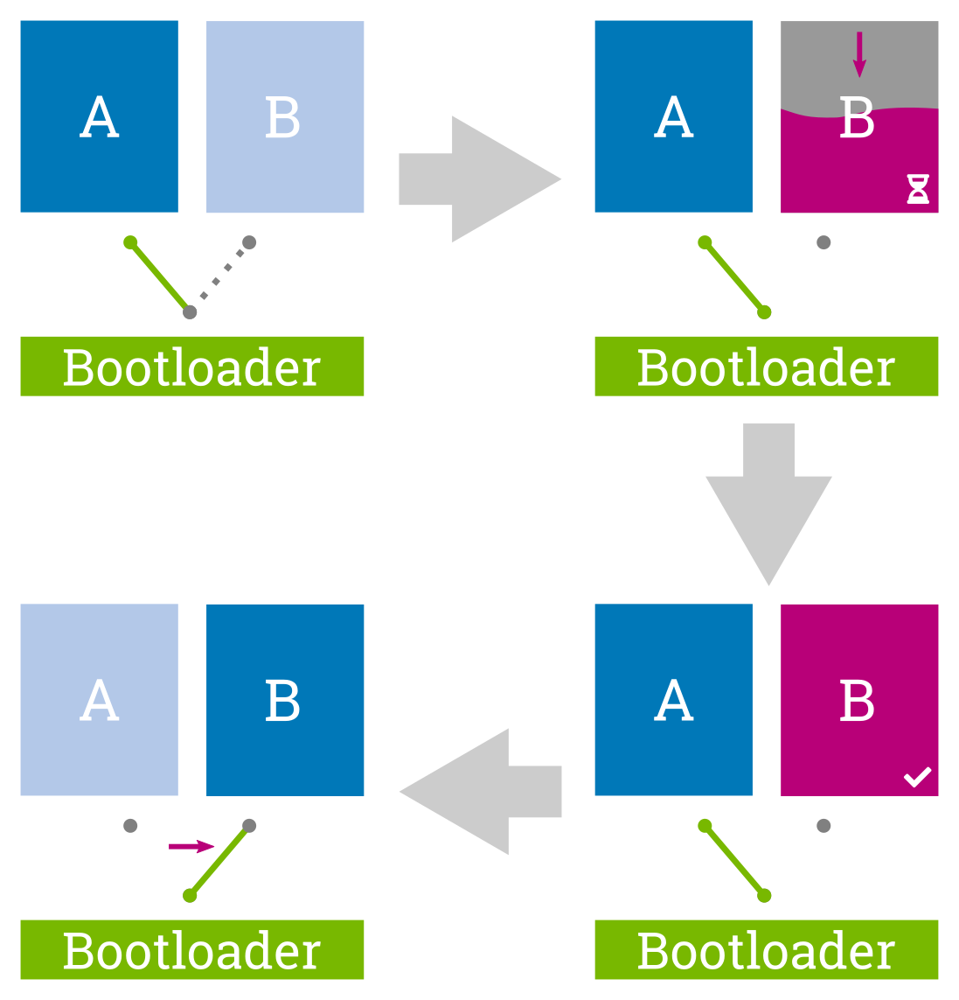
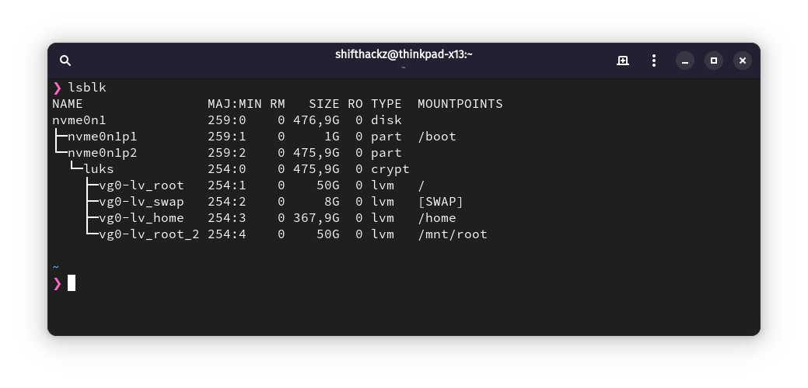
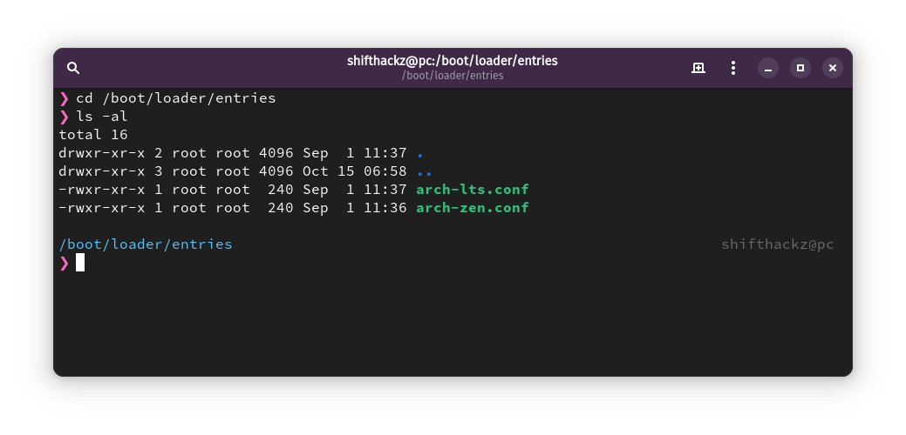
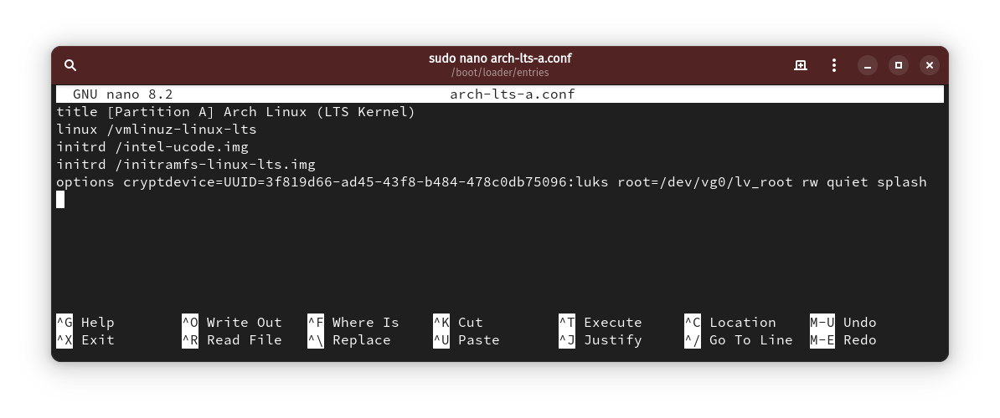
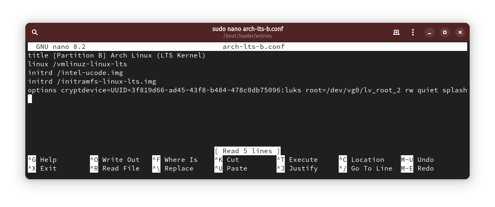
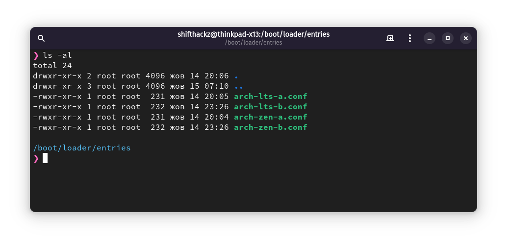
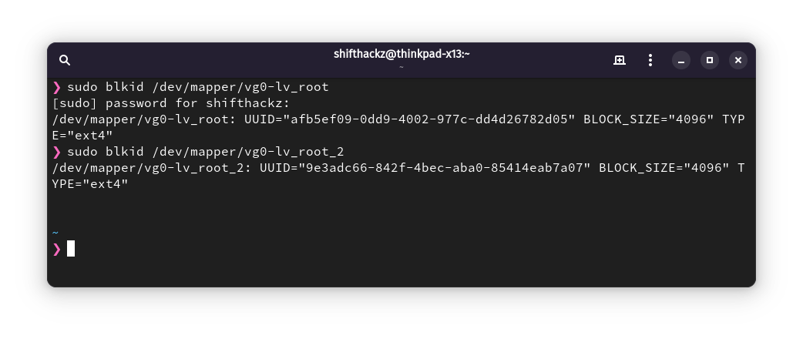
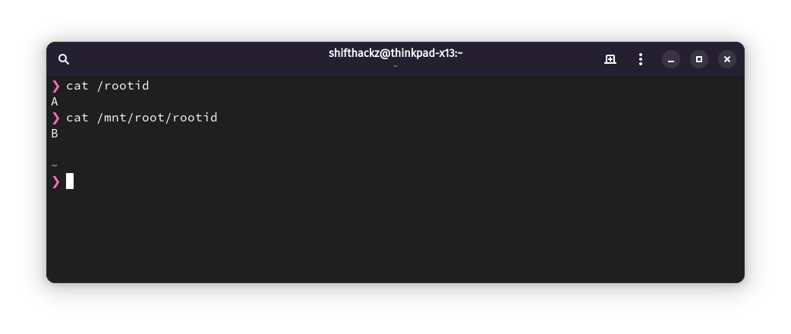

+++
title = "Implementation of custom A/B update and rootfs backup system on Arch Linux"
date = "2024-10-15"
tags = [
    "Linux",
    "Arch",
    "Backup",
    "Automation",
]
categories = [
    "Linux",
    "Software",
]
image = "header.png"
+++

## Introduction

An A/B update and backup system is a mechanism used primarily on Android devices to ensure safer and more reliable system updates. The approach involves having two partitions (A and B) for system data, allowing the device to switch between them during updates. Let's try to understand how it works and what makes it beneficial.

### How A/B Update System Works

- Two System Partitions: Devices are set up with two copies of key partitions (A and B), which contain the operating system and related files. Only one partition is active at a time, meaning the device is always running on either A or B.

- Non-Disruptive Updates: When an update is downloaded, it’s installed on the inactive partition (e.g., if you’re on A, it will be installed on B). This allows you to continue using the device while the update is being applied.

- Safe Switching: Once the update is complete, the system reboots into the updated partition (in this case, B). If something goes wrong during the boot, the system will automatically switch back to the previously working partition (A). This rollback mechanism is crucial for preventing a device from becoming unusable due to a failed update.

- Consistency and Speed: Updates are quicker because they don’t disrupt your device’s normal operations. You can use the device while the update is being installed in the background. Then, when you’re ready, you just need a quick reboot to switch partitions.

### Benefits of A/B Update System

- Safety: If the new update is corrupted or incompatible, the device can revert to the other partition. This makes system updates more reliable.

- Minimal Downtime: Updates are installed in the background, so you only need to reboot to complete the process. You don’t have to wait for the installation to happen during reboot.

- Seamless Experience: The device can handle switching automatically, often without the user needing to take additional steps.

### A/B Backup System

Although A/B primarily refers to system updates, a similar concept can apply to backup systems. For instance, some backup tools might use alternate partitions or snapshots to store backups, ensuring that you have a fallback option in case of system failures.

This approach is especially used in modern [Android system A/B OTA updates](https://source.android.com/docs/core/ota/ab), but it can also be found in other contexts where high reliability and system availability are crucial.

## Benefits of A/B specific to Arch Linux

Implementing an A/B update system on Arch Linux could offer several advantages, particularly for users who value stability, reliability, and quick recovery options. Here’s why this approach might be beneficial for Arch Linux specifically:

### Improved System Stability

- Rolling Release Model: Arch Linux is a rolling-release distribution, which means updates are frequent and bring both new features and potential changes that can lead to system instability. With an A/B system, you can update the inactive partition and quickly switch back to a stable setup if an issue arises.

- Reliability: An A/B system can help maintain system uptime and stability by allowing quick rollback to a previously working state if an update introduces a bug or compatibility issue.

### Safety in Testing and Experimentation

- Arch Users Are Often Power Users: Many Arch users like to customize and experiment with their setups. The A/B system would allow you to try new configurations or packages on one partition while keeping a safe, functional setup on the other. If something goes wrong, you can reboot into the stable environment without having to troubleshoot complex issues.

- Easy System Recovery: With a backup partition always available, users can test experimental or non-standard updates (such as kernel patches or desktop environment changes) with less risk. If an update fails or breaks the system, you can boot into the untouched partition and keep working.

### Quicker Update Rollbacks

- Effortless Reversion: Arch doesn’t have an inherent rollback feature built-in, so reverting to previous versions can be tedious. An A/B system would allow for quick switching between versions with no need to manually downgrade packages or restore from backups.

- Bootloader Integration: Since you use systemd-boot, the A/B update system could integrate well with this bootloader, allowing you to select which partition to boot into directly from the boot menu.

## Downside of A/B update and backup systems

The main downside of an A/B update and backup system is increase in disk space usage. An A/B system would require additional storage space, effectively doubling the space required for system partitions. For users with limited disk space, this could be a drawback.

## Implementing my own A/B update and backup system

I inspired the idea of an A/B update and backup system approach for backups and OS updates from Android and some immutable GNU/Linux distributions. I daily drive Arch Linux on my two own personal computers and prefer to have the latest updates. But on the other side I want to make my system as reliable as possible, and in case update ocassionaly break my system - I want to have a way to quickly rollback without doing install and configuration from scratch. 

### Understanding the requirements

First of all, I came up with the basic requirements that my custom A/B update and backup system must have:

1. Both A and B partitions should be bootable, including the ability to choose any partition (A or B) manually during boot.
2. Ability to use different kernel versions for both A or B partitions. 
3. Only the root / partition should be copied during A/B update or backup procedure. I have /home on separate partition and it should be untouched during backup process.
4. Solution should be compatible with LUKS encryption for security.
5. I want to have a single script for backup and restore operations (copy A to B, and copy B to A). 
6. Script should be able to detect the source and destination partitions automatically, without providing additional arguments.



### Choosing components

After understanding the requirements, the next important step is to find the right components that are able to meet those requirements and allow to implement the system. I have chosen `rsync` utility for doing backups as it is ideal for regular and incremental backups. It only copies changed files, making it efficient and faster for repeat backups. You can also easily exclude certain directories (like /home and /boot) and maintain a backup that is ready to be restored at the file level.

### Partitioning disk

I already had a working Arch Linux system with configured LUKS encrytion and separate partitions for root (`/`) and home (`/home`). For more details you can check my [Arch Linux install guide (UEFI + encrypted LVM)](https://blog.moroz.cc/post/arch-linux-install-guide-uefi--encrypted-lvm/).

So I needed to shrink the `/home` logical volume and create the second logical volume for the B root partition. My main root logical volume is 50Gb, so the second one should be exactly the same size. 

This step should not be perform directly from my installed Arch system, because we need to perform the shrink operation. I used Arch Linux live install media for all the partitioning operations.

#### Unlock the LUKS container. 

I have encrypted LUKS container on `/dev/nvme0n1p2`, so first need to decrypt it:


cryptsetup luksOpen /dev/nvme0n1p2 luks


#### Shrink the home logical volume

In my case the volume group is named as `vg0` and contains a logical volume `lv_home` for the `/home` partition. The full path to the home logical volume in my case is `/dev/mapper/vg0-lv_home`. It needs to be shrinked in 50Gb amount in size, so there will be enough space for the second root partition. This can be performed with the command:


lvresize -L -50G /dev/mapper/vg0-lv_home


After the shrink operation it is also recommended to run `resize2fs` and `e2fsck` to ensure that filesystem is healthy and resized correctly:


resize2fs /dev/mapper/vg0-lv_home
e2fsck -f /dev/mapper/vg0-lv_home


#### Create a second root partition

The last step of partitioning is to create a second "B" root partition. I decided to name the volume as `lv_root_2`, so the command is the following:


lvcreate -L 50G -n lv_root_2 vg0


Then the created partition should be formatted with exactly the same filesystem like already existing root partition. I already use ext4 filesystem, so the "B" root partition also should have ext4 filesystem.


mkfs.ext4 /dev/mapper/lv_root_2


Finally, the new partition layout of the system looks like this:



### Configure bootloader

In my case, I already use `systemd-boot` bootloader for my Arch Linux setup. It perfectly meets the requirements, as it allows booting different kernels. So to make the bootloader boot different kernels for different partitions (either "A" or "B") the existing boot entries for partition "A" should be duplicated and modified to use with partition B. 

The boot loader entries are stored at `/boot/loader/entries` directory, for ease of use navigate with `cd` into it:


cd /boot/loader/entries


Then let's see what bootloader entries do we have:


ls -al


I have two bootloader entries for existing parition "A" for loading `linux-zen` and `linux-lts` kernels that are stored in files `arch-zen.conf` and `arch-lts.conf` respectively. If you are using only one kernel version you will probaly have only one bootloader entry.



For convenience it is better to rename them to `arch-zen-a.conf` and `arch-lts-a.conf`:


sudo mv arch-zen.conf arch-zen-a.conf
sudo mv arch-lts.conf arch-lts-a.conf


After that I used `sudo nano arch-zen-a.conf` and `sudo nano arch-lts-a.conf` to modify this two files, added prefix `[Partition A]` to both titles that allows to understand what partition is used for the boot option.




Next both for of the files `arch-zen-a.conf` and `arch-lts-a.conf` should be duplicated for partition "B", it can be achieved by making a copy:


sudo cp arch-zen-a.conf arch-zen-b.conf
sudo cp arch-lts-a.conf arch-lts-b.conf


Than use similar command for "B" voluem entries `sudo nano arch-zen-b.conf`, `sudo nano arch-lts-b.conf` to change the title from "[Partition A]" to "[Partition B]" and change root partition from `/dev/vg0/lv_root` to `/dev/vg0/lv_root_2` in both of the files.




Finally the bootloader entries directory will look exactly like this for my usecase:



### Configure fstab

The fstab (File System Table) is a configuration file in Unix-like operating systems (like Linux) that defines how disk partitions, storage devices, and other file systems should be mounted at boot time. The file is located at `/etc/fstab` and is read by the system during the boot process.

For different root partitions "A" and "B" there will be different UUIDs for main and backup root partition:
- The main root partition is mounted at `/` mountpoint.
- I defined that the backup root partition will be mounted at `/mnt/root`. 

Considering that there are "A" (lv_root) and "B" (lv_root_2) partitions, there are 2 possible scenarios:
- If OS is booted from "A": 
  - the `/` is `lv_root` volume;
  - the `/mnt/root` is `lv_root_2`;
  - during the backup operation "A" will be copied/restored to "B".

- If OS is booted from "B":
  - the `/` is `lv_root_2` volume;
  - the `/mnt/root` is `lv_root`;
  - during the backup operation "B" will be copied/restored to "A".

I ended up with a solution of having different `fstab` files for "A" and "B" partition (`fstabA` and `fstabB` respectively), and it will be responsibility of the backup script to replace the main `fstab` file with either `fstabA` or `fstabB` depending on the scenario described above.

First of all there is need to identify UUIDs of `lv_root` and `lv_root_2` for fstab:


sudo blkid /dev/mapper/vg0-lv_root
sudo blkid /dev/mapper/vg0-lv_root_2


To sum up, in my case UUIDs are:
- For partition "A" (lv_root) - `afb5ef09-0dd9-4002-977c-dd4d26782d05`
- For partition "B" (lv_root_2) - `9e3adc66-842f-4bec-aba0-85414eab7a07`



Next, have a look at the original `/etc/fstab` file on my system:

```bash
# /dev/mapper/vg0-lv_root
UUID=afb5ef09-0dd9-4002-977c-dd4d26782d05       /               ext4            rw,relatime     0 1

# /dev/mapper/vg0-lv_home
UUID=911cf69d-2ecb-4f2f-a9d5-491f44418922       /home           ext4            rw,relatime     0 2
```

The partition "A" is already defined in it, so the partition B should be added by corresponding UUID, and the final look of the modified `/etc/fstab` file is the following:

```bash
# /dev/mapper/vg0-lv_root
UUID=afb5ef09-0dd9-4002-977c-dd4d26782d05       /               ext4            rw,relatime     0 1

# /dev/mapper/vg0-lv_home
UUID=911cf69d-2ecb-4f2f-a9d5-491f44418922       /home           ext4            rw,relatime     0 2

# /dev/mapper/vg0-lv_root_2
UUID=9e3adc66-842f-4bec-aba0-85414eab7a07       /mnt/root       ext4            rw,relatime     0 2
```

The next step is to make 2 copies of `/etc/fstab` file to `/etc/fstabA` and `/etc/fstabB`:


sudo cp /etc/fstab /etc/fstabA
sudo cp /etc/fstab /etc/fstabB


After duplicating the files, `fstabA` file is correct (as it has "A" partiton as root), but in `fstabB` file the partitions should be changed, so partition "B" is `/`, and "A" is `/mnt/root`. It is easy to do by just swapping UUIDs for corresponding mount in `/etc/fstabB` file, so the final look of the file is:

```bash
# /dev/mapper/vg0-lv_root_2
UUID=9e3adc66-842f-4bec-aba0-85414eab7a07       /               ext4            rw,relatime     0 1

# /dev/mapper/vg0-lv_home
UUID=911cf69d-2ecb-4f2f-a9d5-491f44418922       /home           ext4            rw,relatime     0 2

# /dev/mapper/vg0-lv_root_2
UUID=afb5ef09-0dd9-4002-977c-dd4d26782d05       /mnt/root       ext4            rw,relatime     0 2
```

After all the modifications are done it is recommended to reboot the computer, and make sure all partitions can be correctly mounted.

### Make partitions identifiable

One of the requirements for the backup script is to have it automatically detect the what is the currently used root partition, and what is the backup partition. To make the partitions identifiable, I decided to keep it simple and just create a text file `rootid` at the root of each partition, which contains corresponding partition letter (can be either "A" or "B").


sudo echo "A" >> /rootid
sudo echo "B" >> /mnt/root/rootid


As the result, script will be able to read 2 files `/rootid` and `/mnt/rootid` and explicitly detect what partition is used as root and backup.



### Implementing backup script

To properly make a working bootable backup the script should implement the following steps:

1. Identify the root and backup partition.
2. Determine the operation mode by identified partitions, the possible values are:
  - "AB" - when partition "A" is booted and should be copied to "B".
  - "BA" - when partition "B" is booted and should be copied to "A".
3. Perform the full backup for current root partition to backup partition using `rsync`
4. Replace the `fstab` file on backup partition with the correct variant:
  - for the "AB" mode use `fstabB`.
  - for the "BA" mode use `fstabA`.
5. Create default linux root filesystem symlinks on the backup root partition.

Let's do the step by step implementation of each operation.

#### Identify partitions and operation mode

It is straightforward and requires reading `/rootid` and `/mnt/root/rootid` files, and the use string concat to determine the operation mode:

```bash
boot_id=$(cat /rootid)
backup_id=$(cat /mnt/root/rootid)
mode="${boot_id}${backup_id}"
```

#### Perform the rsync backup

At this point I wrote `rsync` based command that is designed to backup mirror the root file system `/` to `/mnt/root`. 

```bash
rsync -aHAXiv --progress --inplace --delete --exclude={"/boot","/home","/dev","/proc","/sys","/tmp","/run","/mnt","/media","/lost+found","/rootid","/bin","/lib","/lib64","/sbin"} / /mnt/root
```

Let's break down each option to understand what it does and why:

- `-a` (Archive Mode): Enables archive mode, which is a combination of options `-rlptgoD`. It ensures that:
  - Recursive `-r`: The command will copy directories recursively.
  - Links `-l`: Symbolic links are copied as symbolic links.
  - Permissions `-p`: Preserves file permissions.
  - Modification Times `-t`: Keeps original file modification times.
  - Group `-g`: Maintains group ownership.
  - Owner `-o`: Retains owner information (requires root privileges).
  - Devices `-D`: Preserves device and special files.
- `-H`: Preserves hard links.
- `-A`: Preserves ACLs (Access Control Lists), which define more granular permissions than standard file permissions.
- `-X`: Preserves extended attributes, which can contain metadata for certain files and directories.
- `-i`: Displays a detailed list of changes for each file, providing more visibility into the operation.
- `-v`: Increases verbosity, giving you information about the files being transferred.
- `--progress`: Shows progress for each file during the transfer, useful for monitoring long operations.
- `--inplace`: Updates destination files in place, rather than creating a temporary file and moving it into place. This is useful for large files or if disk space is limited.
- `--delete`: Deletes files in the destination (/mnt/root) that no longer exist in the source (/). This makes the destination a true mirror of the source by removing any extra files.
- `--exclude={"/boot","/home","/dev","/proc","/sys","/tmp","/run","/mnt","/media","/lost+found","/rootid","/bin","/lib","/lib64","/sbin"}`: Excludes certain directories from being copied:
  - `/boot`: Boot-related files, which may not be necessary for the backup, especially if you’re using a separate /boot partition.
  - `/home`: User data, which might be backed up separately or is irrelevant for a root system backup.
  - `/dev`: Device files that dynamically represent hardware (e.g., /dev/sda), which do not need to be backed up.
  - `/proc` and `/sys`: Virtual filesystems representing system and process information, populated by the kernel at runtime and not meant to be copied.
  - `/tmp`: Temporary files, which don’t need to be included in a backup.
  - `/run`: Runtime data, which is also dynamically generated at boot.
  - `/mnt` and `/media`: These are typically used for mounting other filesystems, which do not need to be part of a root system backup.
  - `/lost+found`: Contains files recovered from file system errors; not necessary for a root backup.
  - `/rootid`: Identifier file for root and backup partitions.
  - `/bin`, `/lib`, `/lib64`, and `/sbin`: On modern Linux system those are symlinks and not the directories, so I decided to exclide them and make symlinks manually after backup.

#### Replace the fstab file

This is also kind of straightforward step that requires checking for the operation mode and replacing the `/mnt/root/etc/fstab/` file according to the rules:
- for the "AB" mode use `/mnt/root/etc/fstabB`.
- for the "BA" mode use `/mnt/root/etc/fstabA`.

The bash script snippet for this is the following:

```bash
fstab_path="/mnt/root/etc/fstab"

if [[ "$mode" == "AB" ]]; then
    echo "Patching fstab for AB mode..."
    rm /mnt/root/etc/fstab
    cp /mnt/root/etc/fstabB /mnt/root/etc/fstab
elif [[ "$mode" == "BA" ]]; then
    echo "Patching fstab for BA mode..."
    rm /mnt/root/etc/fstab
    cp /mnt/root/etc/fstabA /mnt/root/etc/fstab
else
    echo "Error: Unknown mode '$mode'."
    exit 1
fi
```

#### Create linux filesystem symlinks 

On many modern Linux distributions, including Arch Linux, `/bin`, `/lib`, `/lib64`, and `/sbin` are symbolic links, rather than separate directories. This change is part of the move towards a simplified filesystem layout that merges `/bin`, `/lib`, and `/sbin` with their counterparts in `/usr`:

- `/bin` → `/usr/bin`
- `/lib` → `/usr/lib`
- `/lib64` → `/usr/lib64`
- `/sbin` → `/usr/sbin`

This unification helps streamline the filesystem by centralizing executables and libraries within the /usr directory, reducing redundancy and simplifying maintenance. 

To create the symlinks after the backup was performed, this command snippet should be used:

```bash
echo "/bin -> /mnt/root/bin"
ln -s usr/bin /mnt/root/bin

echo "/lib -> /mnt/root/lib"
ln -s usr/lib /mnt/root/lib

echo "/lib -> /mnt/root/lib64"
ln -s usr/lib /mnt/root/lib64

echo "/bin -> /mnt/root/sbin"
ln -s usr/bin /mnt/root/sbin
```

#### Final script version

Finally I added some verbose logging messages and checks to the script to make it more stable and user-friendly. It is meant to be executed with sudo privileges, because it is making a full copy of root filesystem. The final version of the script is placed in `/opt/rootbackup.sh` and looks like this:


```bash
#!/bin/bash

echo "Starting backup script..."

# Step 1: Read the content of /rootid and /mnt/root/rootid
boot_id=$(cat /rootid)
backup_id=$(cat /mnt/root/rootid)
mode="${boot_id}${backup_id}"

echo "Boot partition ID: $boot_id"
echo "Backup partition ID: $backup_id"
echo "Operation mode: $mode"

# Step 2: Perform the rsync backup with progress and verbosity
echo "Starting rsync backup from / to /mnt/root..."
rsync -aHAXiv --progress --inplace --delete --exclude={"/boot","/home","/dev","/proc","/sys","/tmp","/run","/mnt","/media","/lost+found","/rootid","/bin","/lib","/lib64","/sbin"} / /mnt/root

if [ $? -eq 0 ]; then
    echo "Backup was successful."

    # Path to the fstab file
    fstab_path="/mnt/root/etc/fstab"

    if [[ "$mode" == "AB" ]]; then
        echo "Patching fstab for AB mode..."
        rm /mnt/root/etc/fstab
        cp /mnt/root/etc/fstabB /mnt/root/etc/fstab
    elif [[ "$mode" == "BA" ]]; then
        echo "Patching fstab for BA mode..."
        rm /mnt/root/etc/fstab
        cp /mnt/root/etc/fstabA /mnt/root/etc/fstab
    else
        echo "Error: Unknown mode '$mode'."
        exit 1
    fi

    # Final output to confirm changes
    echo "Successfully updated /mnt/root/etc/fstab."
    echo "Updated fstab contents:"
    cat "$fstab_path"

    # Links creation
    echo "Creating symlinks:"

    rm /mnt/root/bin
    rm /mnt/root/lib
    rm /mnt/root/lib64
    rm /mnt/root/sbin

    echo "/bin -> /mnt/root/bin"
    ln -s usr/bin /mnt/root/bin

    echo "/lib -> /mnt/root/lib"
    ln -s usr/lib /mnt/root/lib

    echo "/lib -> /mnt/root/lib64"
    ln -s usr/lib /mnt/root/lib64

    echo "/bin -> /mnt/root/sbin"
    ln -s usr/bin /mnt/root/sbin

else
    echo "Backup failed with rsync. Exiting."
    exit 1
fi

echo "Backup script completed."
```

### Running updates

After implementing all the steps for the A/B update and backup system, the typical update process is the following:

1. Run the backup script: `sudo /opt/rootbackup.sh`.
2. Do the full system update: `sudo pacman -Syu`

### Conclusion

Finally I created a custom A/B update and backup system that:

- Detects which root partition you are currently using (Partition A or B).
- Backs up the active root partition to the alternate root partition using rsync, ensuring that changes in your main root partition are mirrored to the backup partition.
- Updates /etc/fstab on the backup partition to prepare it for booting, with the correct root partition and mount points.
Efficient Incremental Backup with Rsync:

The script uses rsync to perform an incremental backup, which only copies changed files and allows for the `--inplace` option to save disk space during backup. Additionally, we exclude directories like `/home`, `/boot`, and others that don’t need to be part of the backup.
This approach ensures that the backup partition remains an up-to-date, bootable copy of your main system, while saving on both time and storage space.

With this setup, I have both peace of mind and flexibility. I can continue working on my system without worrying about software updates or configuration changes that might lead to a broken setup. And in the event of a problem, I have a ready-to-go recovery partition that will minimize downtime and restore your productivity quickly!
