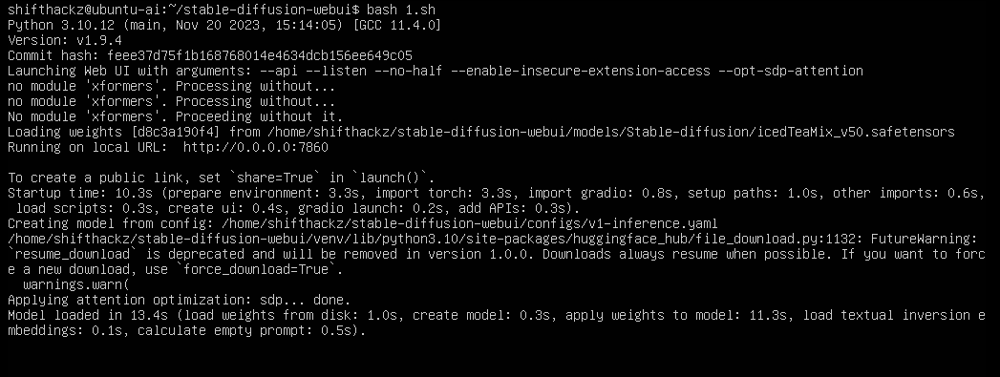

+++
title = "How to run Stable Diffusion in VM on AMD GPU (AUTOMATIC1111 + KVM + GPU Passthrough)"
date = "2024-06-01"
tags = [
    "AI",
    "AUTOMATIC1111",
    "Stable Diffusion",
    "KVM",
    "AMD",
    "ROCM",
    "GPU",
    "Virtio",
    "Ubuntu Server",
]
categories = [
    "Linux",
    "Hardware",
    "AI",
    "Virtualization",
]
image = "header.png"
+++

## Introduction 

Stable Diffusion is a deep learning, text-to-image model developed by Stability AI. It is primarily used to generate detailed images based on text prompts. The model belongs to the class of generative models called diffusion models, which iteratively denoise a random signal to produce an image. AUTOMATIC1111 refers to a popular web-based user interface (UI) implementation for interacting with Stable Diffusion. Developed by an individual or group under the pseudonym "AUTOMATIC1111", it provides a robust and user-friendly way to utilize Stable Diffusion's capabilities. 

### Why I run AUTOMATIC1111 inside VM

In one of my previous articles I mentioned that I use dual AMD-GPU custom desktop system with Arch Linux as main host OS. Personally for me, running AUTOMATIC1111 inside a KVM-based virtual machine with AMD GPU passthrough offers several key benefits:

1. **Portability**. As I use Arch Linux as my main host OS on different computers it is sometimes can be tricky to manage dependencies that are required to run AUTOMATIC1111. For example, at the time of writing this article (02.06.2024), AUTOMATIC1111 requires Python 3.10 and the bleeding edge Python version in the official arch repositories is 3.12. In case of running AUTOMATIC1111 inside a VM I can setup the dependencies once inside that VM, and I don't have to worry about messing the dependencies on each Arch update.

2. **Snapshot and Restore**. As I have a VM storage as single *.qcow2 file, I can backup it, transfer to my another machine or server in my homelab. It's also easy to keep my checkpoints, loras, etc inside a single VM, and in case I need to transfer AUTOMATIC1111 installation to another host machine, I need only to copy VM backup. There is no need to do the dependencies installation, models setup every time.

### Why I need AUTOMATIC1111


AUTOMATIC1111 software is crucial for me as I develop free and open source [SDAI - Stable Diffusion Android client application](https://github.com/ShiftHackZ/Stable-Diffusion-Android) that can connect to any AUTOMATIC1111 server or other supported AI Image generation provider. I need many different isolated AUTOMATIC1111 instances to perform testing of my android application. 

## Installation

### Create a new Linux VM

First we need to create a new Linux VM with GPU Passthrough of PCI devices to that VM. I already covered creation of VM in the article "[GPU PCI passthrough to Windows KVM on Arch Linux](https://blog.moroz.cc/post/gpu-pci-passthrough-to-windows-kvm-on-arch-linux/#setup-a-new-vm-and-install-windows-1011)", but this time I will use [Ubuntu Sever 22.04 LTS](https://releases.ubuntu.com/22.04/) as a OS for Guest VM. I have chosen Ubuntu Server 22.04 for the guest OS because for the moment of writing this article (02.06.2024) this is the latest release that is supported by proprietary AMD ROCM driver that is needed to run AI on the power of GPU.

### Update the OS packages

After installing the OS first thing you need to do is to update the system packages to the latest available versions.

```bash
sudo apt update
sudo apt upgrade
```

### Install needed dependencies


sudo apt install -y git python3-pip python3-venv python3-dev libstdc++-12-dev libgl1-mesa-glx


### Install AMD ROCM driver

I used official instructions from the [AMD documentation](https://rocm.docs.amd.com/projects/install-on-linux/en/latest/tutorial/quick-start.html) to install the ROCM driver. 

First, install headers and extras for the current kernel:


sudo apt install -y "linux-headers-$(uname -r)" "linux-modules-extra-$(uname -r)"


Then, ensure your current user is a part of `video` and `render` groups. To add the current user to the groups use command:


sudo usermod -a -G render,video $LOGNAME


Download installer deb package and install it:


wget https://repo.radeon.com/amdgpu-install/6.1.1/ubuntu/jammy/amdgpu-install_6.1.60101-1_all.deb
sudo dpkg -i amdgpu-install_6.1.60101-1_all.deb


Install the DKMS module and rocm packages:


sudo apt update
sudo apt install amdgpu-dkms rocm


Finally, reboot the VM:


sudo reboot


### Install AUTOMATIC1111 software

The most easy and convinient way is just to clone the official git repository. After cloning, navigate to the cloned directory.


git clone https://github.com/AUTOMATIC1111/stable-diffusion-webui
cd stable-diffusion-webui


Setup Python virtual environment:


python3 -m venv venv
source venv/bin/activate


Install python dependencies needed by AUTOMATIC1111:


pip3 install -r requirements.txt


Uninstall generic torch dependencies and replace them with ROCM:


pip3 uninstall torch torchvision
pip3 install torch torchvision torchaudio --index-url https://download.pytorch.org/whl/rocm6.0


### Create custom AUTOMATIC1111 launch script

I will use nano to create a new file `nano launch.sh`.

```bash
#!/bin/sh

source venv/bin/activate

export HSA_OVERRIDE_GFX_VERSION=10.3.0
export HIP_VISIBLE_DEVICES=0
export PYTORCH_HIP_ALLOC_CONF=garbage_collection_threshold:0.8,max_split_size_mb:512

python3 launch.py --api --listen --enable-insecure-extension-access --opt-sdp-attention
```

Then save the file `Ctrl + O` and exit nano `Ctrl + X`.

### Launch AUTOMATIC1111

Every time you need to launch AUTOMATIC1111 navigate to the cloned `stable-diffusion-webui` directory and launch created `launch.sh` script like in the following example:


cd stable-diffusion-webui
bash launch.sh


As the result, you will see that AUTOMATIC1111 running successfully.



## Conclusion

Stable Diffusion is a powerful model for generating images from text descriptions, and AUTOMATIC1111 is a user-friendly interface that makes it easier to use Stable Diffusion's capabilities effectively. Together, they enable a wide range of creative and practical applications in the realm of generative art and image synthesis. By leveraging a KVM-based virtual machine with AMD GPU passthrough, you can achieve a powerful, secure, and flexible environment for running AUTOMATIC1111 and harnessing the capabilities of Stable Diffusion efficiently.

## Reference

- [Ubuntu Sever 22.04 LTS Jammy](https://releases.ubuntu.com/22.04/)
- [AMD ROCM Documentation](https://rocm.docs.amd.com/projects/install-on-linux/en/latest/tutorial/quick-start.html)
- [AUTOMATIC1111](https://github.com/AUTOMATIC1111/stable-diffusion-webui)
- [SDAI - Stable Diffusion Android client application](https://github.com/ShiftHackZ/Stable-Diffusion-Android)
- [Custom stable-diffusion-webui launch script](https://gist.github.com/evshiron/8cf4de34aa01e217ce178b8ed54a2c43)
