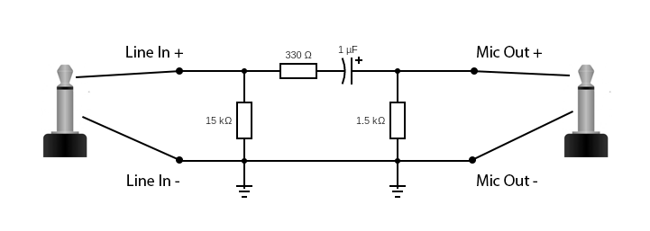
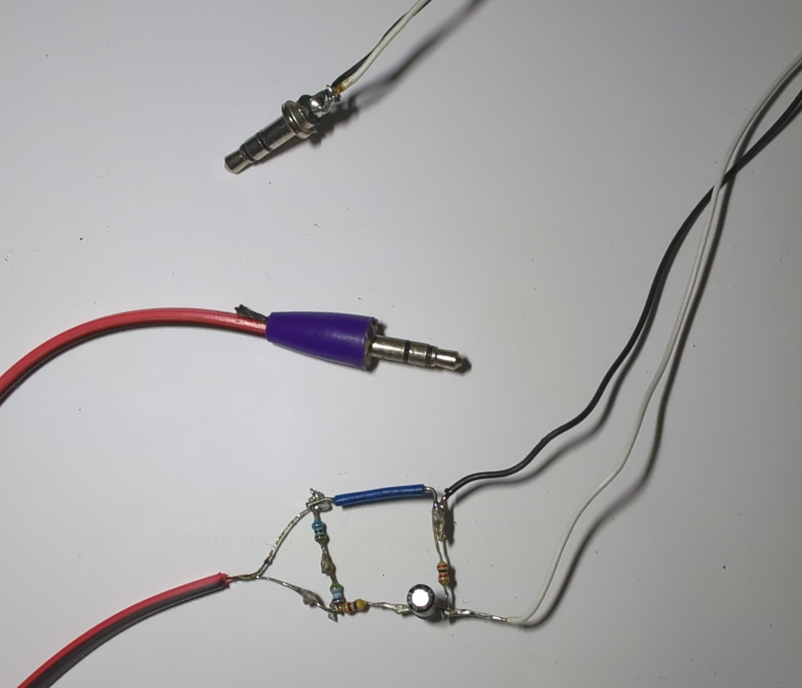
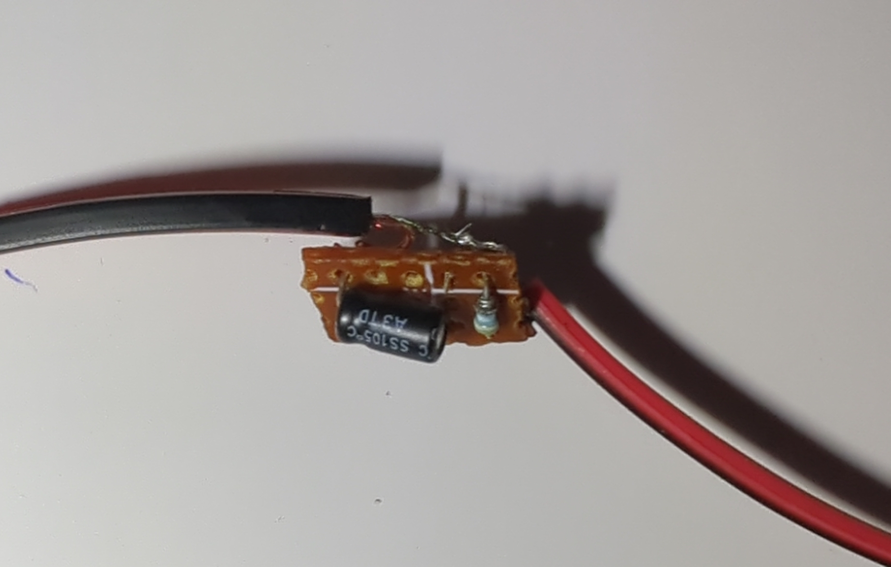
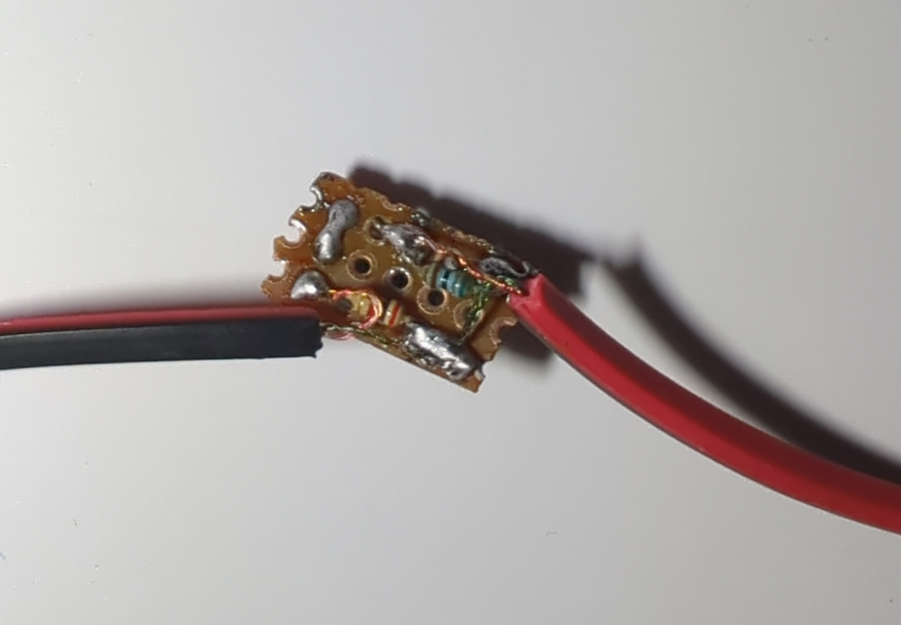
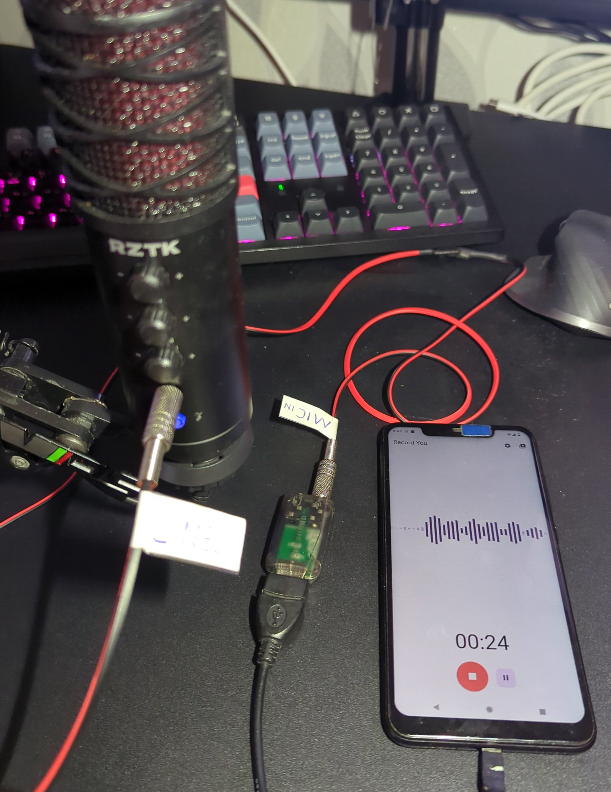
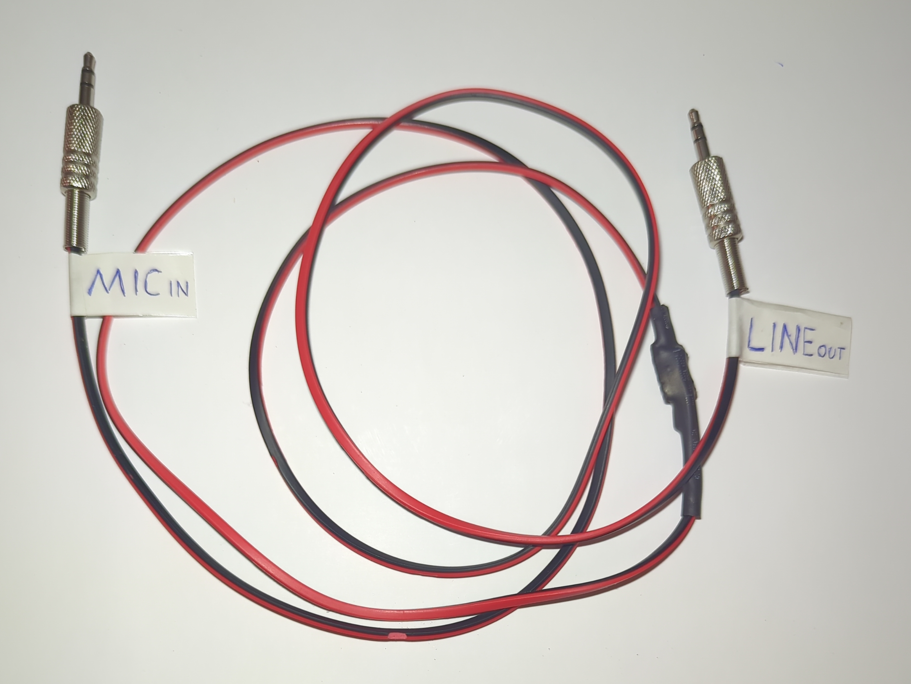

+++
title = "Making an adapter to connect 3.5mm sound jack line output to microphone input"
date = "2024-06-10"
tags = [
    "DIY",
    "Sound",
    "Adapter",
    "3.5mm jack",
    "Line Out",
    "Mic In",
]
categories = [
    "DIY",
    "Hardware",
]
image = "header.png"
+++

## Introduction

Connecting a line-out to a mic-in involves a bit more complexity than just using a standard 3.5mm aux cable due to differences in signal levels, impedance, and intended use. 

## Understanding the Differences

### Line-Out Characteristics:

- Signal Level: Higher voltage (approximately 1 volt RMS).
- Impedance: Typically around 100 ohms.
- Purpose: Designed to drive headphones, speakers, or other line-level inputs.

### Mic-In Characteristics:

- Signal Level: Lower voltage (approximately 1-10 millivolts).
- Impedance: Higher (typically around 600-10,000 ohms).
- Purpose: Designed for microphones, which produce a lower voltage signal.

> Connecting a line-out to a mic-in without appropriate signal attenuation can lead to severe audio quality issues and potential equipment damage. 

## Making the Line-Out to Mic-In adapter

There are many adapters for this purpose available at the online marketplaces. But I decided to make my own adapter to connect Line-Out to Mic-In, because I simply did not have time to wait adapter delivery and also had all needed components to make my own.

### Schematics

To build the adapter you will need some electic components:

- 2 x 3.5mm jack connectors (male)
- 1 x 1 uF capacitor
- 1 x 1.5 kOhm resistor
- 1 x 330 Ohm resistor (values in range 300 - 500 Ohm are fine)
- 1 x 15 kOhm resistor (values in range 11 - 20 kOhm are fine)
- Some wires, electric tape, soldering stuff, etc

I used this electic circuit schematics for my adapter:

### Assembling the device

There are two ways of assembling the device: 
- using surface-mount soldering method
- soldering on PCB

The first version of adapter was made for testing, so I used surface-mount method:

After I finished with testing of my adapter, I used a small piece of single-sided PCB to solder all the components to fit the scheme. 

> While I was making the adapter I did not have a single 15 kOhm resistor, so I used series connection of two 8 kOhm  resistors resistors.

### Testing

For testing my adapter I used my studio microphone with Line-Out interface and simple USB-audio card with Mic-In port that is connected to my phone. To test the adapter just connect everything and try to record something, as a result there should be voice from the studio microphone recorded by the phone.

### Final look

Finally I decided not to make any custom case for it (as adapter has really tiny PCB) and used termosetting to cover the PCB. The total length of cable is 1.5 meters, which I think is fine for most of the cases.

## Conclusion

Creating a DIY adapter to connect a line-out to a mic-in is not only feasible but also beneficial for cost savings and customization. With careful attention to signal levels and impedance, you can build an adapter that works effectively and meets your specific audio needs. 
