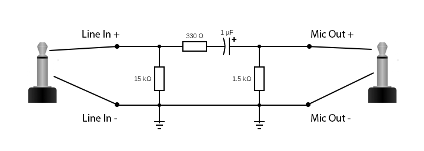
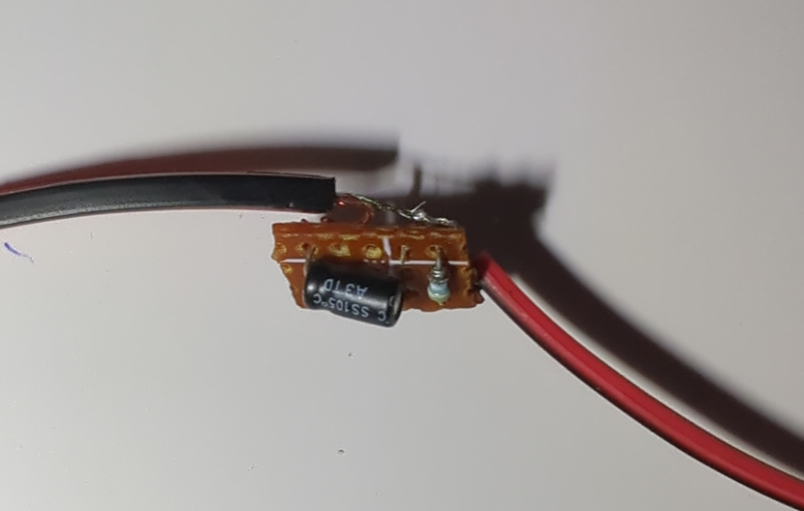
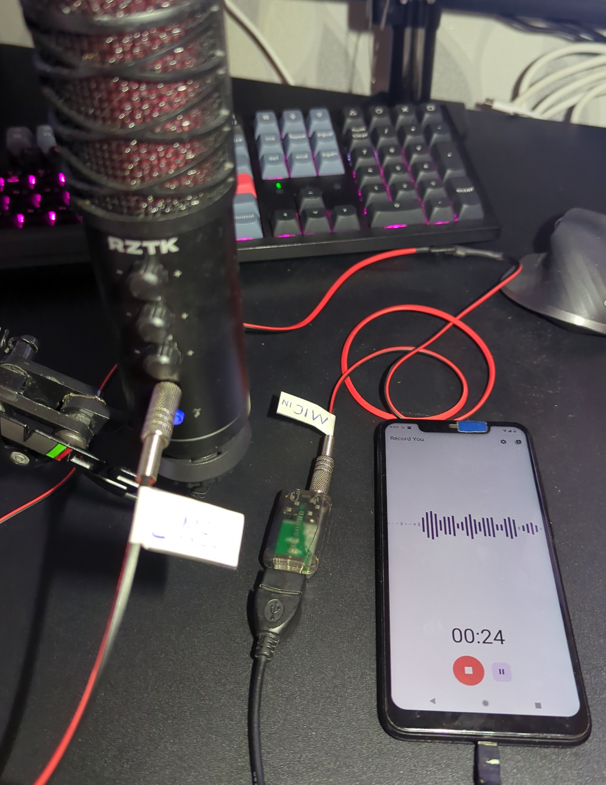

+++
title = "Саморобний адаптер для підключення лінійного виходу звукового роз’єму 3,5 мм до входу мікрофона"
date = "2024-06-10"
tags = [
    "Саморобні прилади",
    "Звук",
    "Адаптер",
    "3.5mm джек",
    "Лінійний вихід",
    "Міркофонний вхід",
]
categories = [
    "Саморобні прилади",
    "Обладнання",
]
image = "header.png"
+++

## Вступ

Підключення лінійного виходу до мікрофонного входу дещо складніше, ніж просто використання стандартного AUX кабелю 3,5 мм, через відмінності в рівнях сигналу, опорі та призначенні.

## Різниця між Line-Out та Mic-Int

### Line-Out характеристики:

- Рівень сигналу: вища напруга (приблизно 1 вольт RMS).
- Імпеданс: зазвичай близько 100 Ом.
- Призначення: призначений для управління навушниками, динаміками або іншими входами лінійного рівня.

### Mic-In характеристики:

- Рівень сигналу: нижча напруга (приблизно 1-10 мілівольт).
- Імпеданс: вищий (зазвичай близько 600-10 000 Ом).
- Призначення: Призначений для мікрофонів, які виробляють сигнал нижчої напруги.

> Підключення лінійного виходу до мікрофонного входу без відповідного ослаблення сигналу може призвести до серйозних проблем із якістю звуку та можливого пошкодження обладнання.

## Виготовлення Line-Out до Mic-In адаптера

На онлайн-ринках є багато адаптерів для цієї мети. Але я вирішив зробити свій власний адаптер для підключення лінійного виходу до мікрофонного входу, тому що я просто не мав часу чекати доставки адаптера, а також мав усі необхідні компоненти, щоб зробити свій власний.

### Електрична схема

Для створення адаптера вам знадобляться деякі електричні компоненти:

- 2 x 3,5 мм роз'єми (штекер)
- 1 х 1 мкФ конденсатор
- 1 резистор 1,5 кОм
- 1 резистор 330 Ом (значення в діапазоні 300 - 500 Ом підходять)
- 1 резистор 15 кОм (значення в діапазоні 11 - 20 кОм підходять)
- Деякі дроти, ізоляційна стрічка, тощо

Я використовував цю електричну схему для свого адаптера:

### Збірка пристрою

Існує два способи складання пристрою:
- методом поверхневої пайки
- пайка на платі

Перша версія адаптера була зроблена для тестування, тому я використовував метод поверхневого монтажу:

Після того, як я закінчив тестування свого адаптера, я використав невеликий шматок односторонньої друкованої плати, щоб спаяти всі компоненти відповідно до схеми.

> Поки я робив адаптер, у мене не було жодного резистора номіналом 15 кОм, тому я використовував послідовне з'єднання двох резисторів по 8 кОм.

### Тестування

Для тестування свого адаптера я використовував свій студійний мікрофон з інтерфейсом Line-Out та USB-аудіокарту з портом Mic-In, яка підключена до мого телефону. Для перевірки адаптера просто підключив все та спробував щось записати, в результаті телефоном має бути записаний голос зі студійного мікрофона.

### Остаточний вигляд

Я вирішив не робити корпусу для пристрою (оскільки адаптер має справді крихітну друковану плату) і використав термоусадку для фіксації та ізоляції друкованої плати. Загальна довжина кабелю становить 1,5 метра.

## Висновок

Створення адаптера своїми руками для підключення лінійного виходу до мікрофонного входу не тільки можливо, але й вигідно для економії коштів і налаштування. Приділяючи особливу увагу рівням сигналу та опору, ви можете створити адаптер, який буде ефективно працювати та відповідатиме вашим конкретним потребам у аудіо.
