+++
title = "Assembling a PiKVM v2 device for remote KVM over IP control of a computer or server"
date = "2024-03-29"
tags = [
    "DIY",
    "KVM",
    "KVM over IP",
    "PiKVM",
    "Raspberry PI",
    "GPIO",
    "HDMI",
    "USB",
    "VNC",
    "VPN",
    "Tailscale",
]
categories = [
    "DIY",
    "Hardware",
]
image = "header.jpg"
+++

## Introduction to KVM over IP

KVM over IP (Keyboard, Video, Mouse over IP) is a technology that allows remote access and control of a computer or server through a network connection. It enables users to manage the server's or PC's console as if they were physically present at the machine, regardless of their location. 

### How it works

- **Hardware Device**: KVM over IP typically involves a hardware device installed on the server or integrated into the server's hardware. This device connects to the server's keyboard, video, and mouse ports.

- **Network Connection**: The KVM over IP device is then connected to the network, allowing remote access to the server.

- **Access Software**: Users can access the server's console remotely using specialized software provided by the KVM over IP device manufacturer. This software allows users to view the server's screen, control the keyboard and mouse input, and interact with the server as if they were physically present.

- **Security Features**: KVM over IP solutions often come with security features such as encryption and authentication to ensure secure remote access to the server.

### Advantages over software remote desktop

- **Low-Level Access**: KVM over IP provides low-level access to the server's console, allowing users to interact with the server or PC at the BIOS level and during the boot process. This level of access is not typically available with software remote desktop solutions, which operate within the operating system environment.

- **Operating System Independence**: Since KVM over IP operates at a hardware level, it is independent of the server's operating system. This means it can be used to troubleshoot and manage servers even if the operating system is unresponsive or malfunctioning.

- **Out-of-Band Management**: KVM over IP provides out-of-band management capabilities, allowing administrators to remotely access and manage servers even if the network or operating system is down. This can be crucial for troubleshooting and maintenance tasks.

- **Performance**: KVM over IP solutions often offer better performance compared to software remote desktop solutions, especially for tasks that require low-latency and high-resolution video output.

- **No Software Installation Required**: Since KVM over IP is a hardware-based solution, it does not require any software installation on the server side, which can simplify deployment and maintenance.

## Hardware solutions overview

### Commercial KVM switches

There are plenty of KMV over IP devices available on the market, but they have some disatvantages in case you need some sort of solution for personal use, which includes this key points:

- **Cost**: Commercial hardware KVM solutions typically involve higher upfront costs compared to open-source solutions, as they often come with additional features and support services.

- **Non-free software**: Most of the KVM switches that are manufactured for production use in server rooms and critical infrastructure datacenters are bundled with closed source software that has proprietary license.

### PiKVM

The best solution for the personal home-lab server room or remote management of the PC is [PiKVM](https://pikvm.org/) - an open and inexpensive IP-KVM solution based on [Raspberry Pi](https://www.raspberrypi.com/products/) single board ARM computer.

The [PiKVM](https://pikvm.org/) device has many useful features to control remote machine, for example:

- Storage simulation: this allows you to attach local *.iso file to the remote machine, it allows you to reinstall any OS remotely.

- USB removal/insertion simulation.

- ATX power control.

If you want to have a [PiKVM](https://pikvm.org/) device for yourself there are 2 options:

- Order a pre-built device on the official website.

- Buy one of the Raspberry Pi boards that are [supported](https://docs.pikvm.org/v2/) as well as some components and assemble the DIY device. 

## Building own PiKVM v2 device

I decided to build PiKVM v2 device myself, as there are no delivery of pre-built devices available for my country. Also DIY build gives more flexibility: you can build device according to needed features, you can choose whatever components you want.

### Choosing components

After investigating the PiKVM official documentation it's obvious that the best version to build is PiKVM v2. To assemble the device I used this list of hardware components:

- 1 x [Raspberry Pi 4 Model B](https://www.raspberrypi.com/products/raspberry-pi-4-model-b/) with 2 Gb of RAM.
- 1 x [Power adapter GAN 65W PD](https://prom.ua/ua/p2056074929-blok-zhivlennya-gan.html?product_id=2056074929&category_ids=71109)
- 1 x [HDMI USB video capture card](https://www.aliexpress.com/item/1005001880861192.html?spm=a2g0o.order_list.order_list_main.11.6b4f1802HEgPtC)
- 1 x Kingston SD Card 32 Gb 10 class.
- 2 x USB-A to USB-C cables (to build cusom power cable).
- 1 X HDMI male-male cable.
- 1 x 80mm FAN (for active cooling).

### Building cusom power cable

To be able to operate the remote machinve wiht our DIY KVM device computer should be able to recognize our device as HID USB device that will be treated by the computer just like another keyboard or mouse (the computer keyboard and mouse are also HID device). 

The problem with Raspberry Pi 4 Model B board - it has only one USB-C port that is able to act as a HID device and that port is also used to power the device. To fix this there is workaround that requires tou build a special cable that can simultanously act as USB Device for the target host and receive external power from the power adapter.

To build this custom power cable you need 2 x **USB-A male to USB-C male** cables. I recommend choosing good quality cables because board requires 3 amp current power. The process of building cable includes this steps:

1. Take the first cable and cut the isolation. Leave the data line wires (green and white) as is, and cut the power +5V (red) and ground (black) wires.

2. Take the second cable and cut it completely. You need only the USB-A part of it. 

3. Solder power +5V (red) wire of the second USB-A cable part with the power +5V (red) wire of the USB-C cable part.

4. Solder all of the 3 ground (black) wires of all the cable parts together.

5. Isolate everything with the electric tape. 

So the USB-C connector should be plugged in Raspberry Pi board, USB-A connector of the second cable (the one with power wired) should be plugged in power adapter, and the USB-A connector of the first cable (the one with data wires) should be plugged to the PC you want to control. For better understanding there is a cable soldering scheme below.

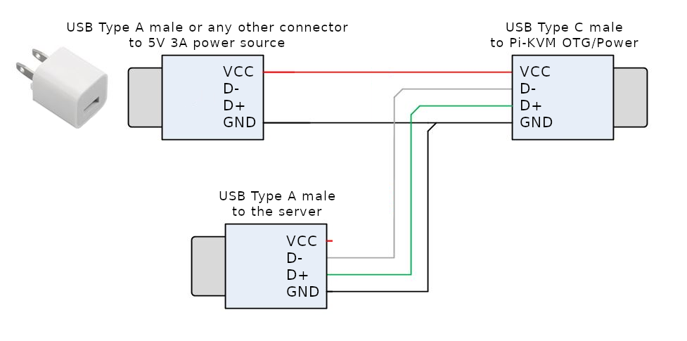

Also I recommend this video on YouTube from the PiKVM developer which explains the full process of making this custom cable.



<!-- https://www.youtube.com/watch?v=uLuBuQUF61o -->

Here is the photo of cable I built. I labeled all the sides of the cable for myself to avoid mix up when connecting the hardware. The black USB-A cable should go to the power adapther, white USB-A cable should be connected to the computer, and the USB-C connector is for Raspberry Pi board.

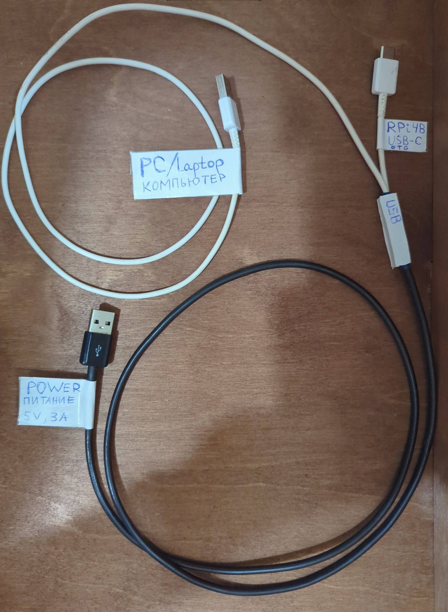

### Assemble device in a custom case

The components I use to build the device include external HDMI video signal capture card that should be connected to the specific USB port of the Raspberry Pi board. For my needs the device should be portable, so there is a risk of using the wrong port if I should connect the card every time. Considering this, the official Raspberry Pi case is not an option, also it costs too much in my opinion. So I decided to assamble the device in a single case for better portability and plug & play experience, every time I need to use it with another PC I simply need connect HDMI and USB cables to it.

Also it's not a secret that Rasperry Pi boards can get overheated when working in extreme CPU load conditions or with 24/7 uptime. Taking that to account, I decided to construct a case in a way that all of the hardware will be cooled with 80mm fan.

Unfortunately, I have no 3D printer to engineer and create a good quality case that will look like manufactured one. My case is fully hand made. I used mostly some old pieces of plastic panels that I had at the time. 

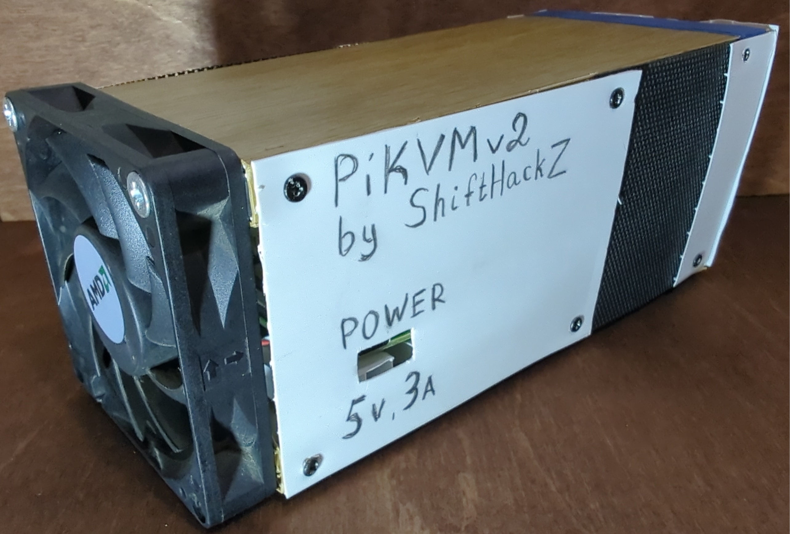

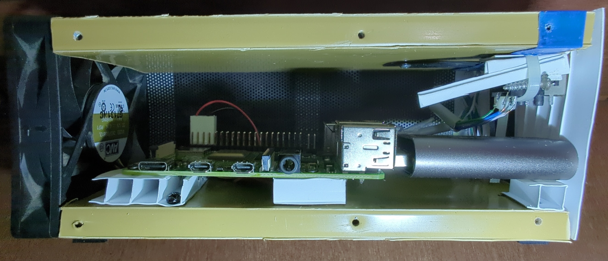

The fan can be connected to the appropriate GPIO pins on the board. For that I used pin #2 for +5v (red wire) and pin #6 for ground (black wire) to power the fan.


I used native connector that fan already had, but I had to place the pins on that connector in the correct order.

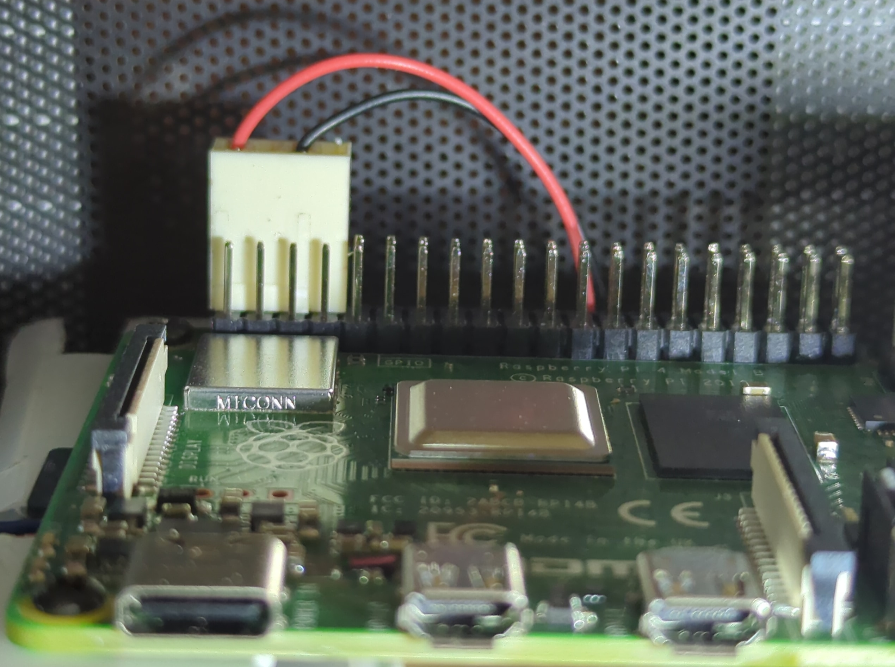

Also I decided to include the RJ-45 Ethernet port on the side, because the quality of stream is better and the latency is less when using cable internet connection instead of Wi-Fi. For that I made a custom cable extension and mounted the port near the HDMI input.

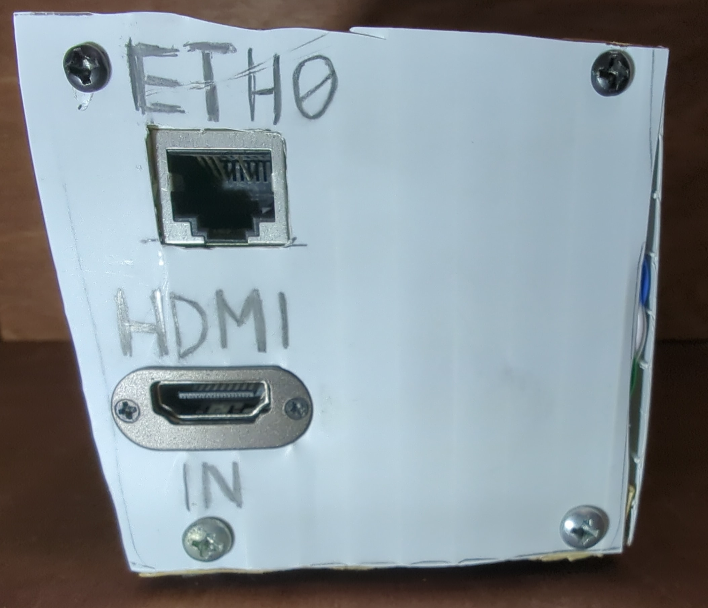

### Flashing PiKVM OS

In order for Raspberry Pi to be able to act as a hardware KVM device the open source PiKVM OS should be flashed to the SD Card. 

The correct image of the PiKVM OS that is suitable for particular Raspberry Pi model can be found on [PiKVM Flashing OS](https://docs.pikvm.org/flashing_os/) page. In my case I downloaded DIY PiKVM V2 Platform, Raspberry Pi 4 for USB Dongle image. Because it matches the hardware I used (Raspblerry Pi 4 Model B and HDMI USB Video capture card). 

To flash the OS image to the SD card there is the [RPI Imager](https://github.com/raspberrypi/rpi-imager) software availabe. As I am happy Arch Linux user (btw), I intalled it from official [rpi-imager](https://archlinux.org/packages/extra/x86_64/rpi-imager/) package:


sudo pacman -S rpi-imager


Then connect your SD card to the computer. As my computer does not have any built-in card reader I use micro-SD to USB-A adapter.

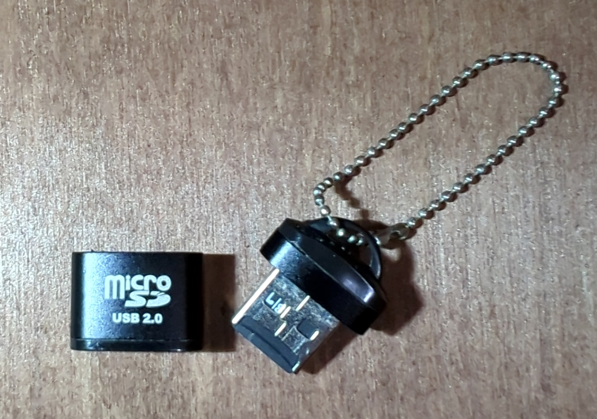

To flash the downloaded image follow this steps:

1. Open the RPI Imager.

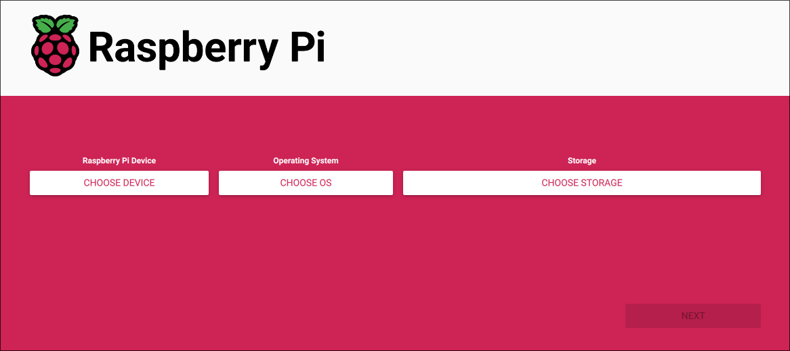

2. Press "Choose device" and select the model of your Raspberry Pi board. I selected "Raspberry Pi 4" here.

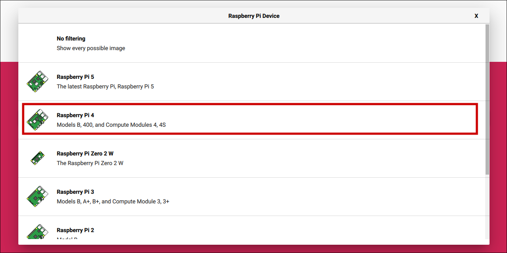

3. Click "Choose OS", scroll down to the bottom and select "Use custom image" option. Then in the file picker select the downloaded PiKVM image.

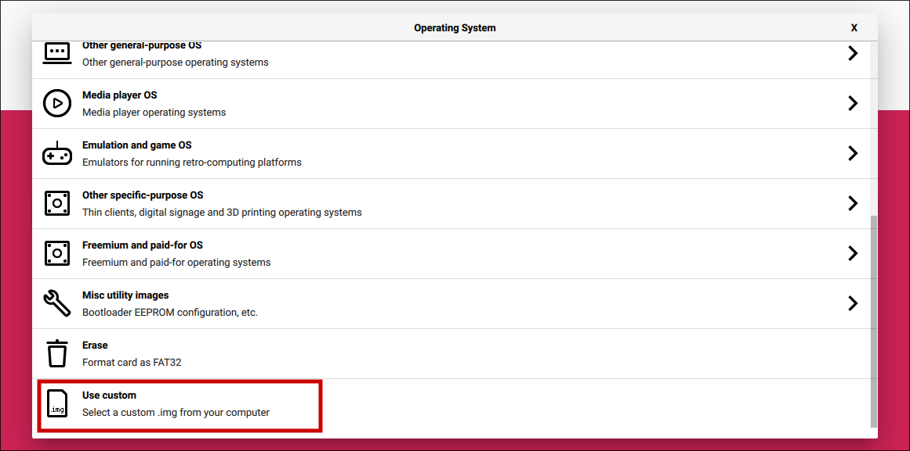

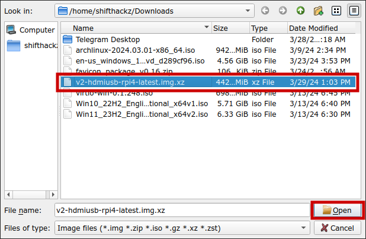

4. Click "Choose storage" and select your SD-card. Be careful to select the correct device here because RPI imager will format the selected device.

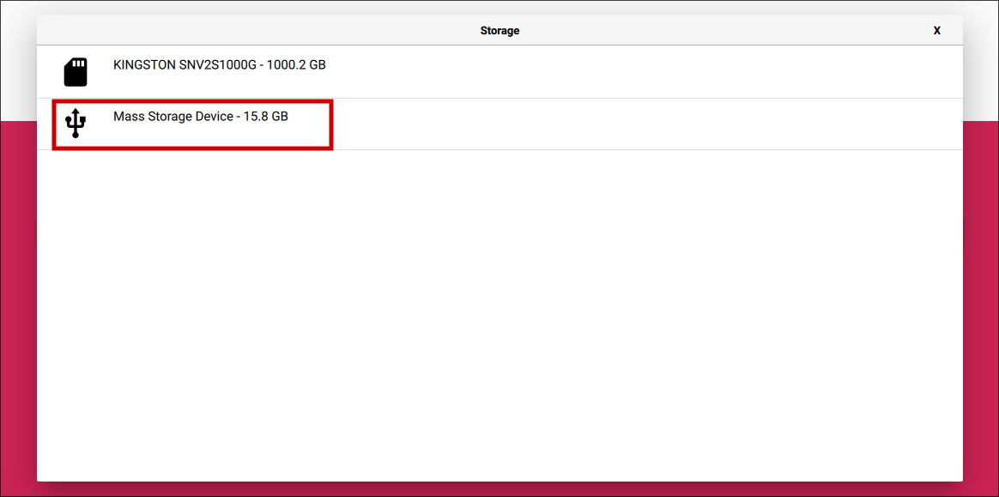

5. Ensure all fields are set correctly, then click next. 

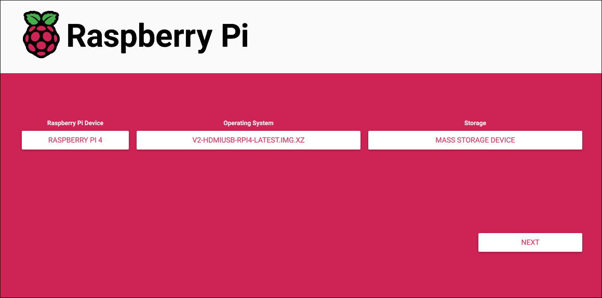

6. You will see a modal dialog asking if you want to customize some settings, click "NO".

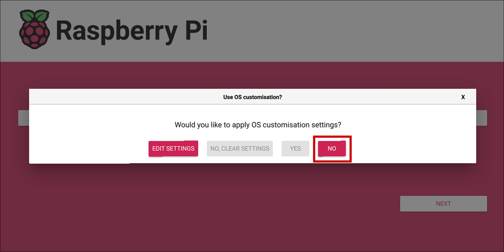

7. Finally confirm the device flash process and wait until RPI Imager finished flashing and validating the image.

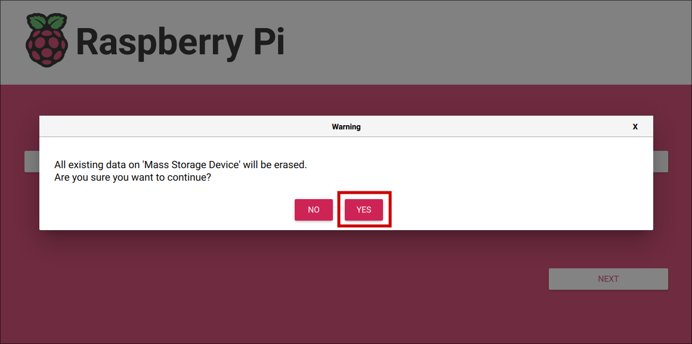

### Configuring Wi-Fi connection (optional)

As I mentioned earlier, it is always better to use Ethernet RJ-45 internet connection because it is more reliable and results in better video stream performance and lower latency. However as I want the device to be portable so I can take it with me and connect to another PC laptop, there might be no available Ethernet RJ-45 connection. For that purpose I set the Wi-Fi credentials of the "Mobile Hotspot" network of my Android phone that I always have with me, so when Raspberry Pi board boots without Ethernet cable connected, it will use its built-in Wi-Fi adapter and connect to my Android phone.

To setup Wi-Fi follow this steps:

1. Connect the SD-card to the computer.

2. You will see that SD-card has more that one partition, you need to mount the first partition, which is called "PIBOOT".

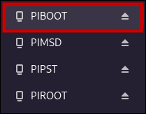

3. Look for the file `pikvm.txt` in the root folder of the "PIBOOT" partition. If the file doest not exist - create it manually, in case file already exists don't delete any configurations from it you need to add 2 parameters to the bottom of the file.

4. Add 2 parameters to the end of the file. Replace the credentials in the example to match your Wi-Fi network credentians.

```bash
WIFI_ESSID='my_wifi_network'
WIFI_PASSWD='the_most_secure_password_ever'
```

5. Save the file. Then safely unmount the partition and eject the SD-card. Install the SD-card to the board.

### First boot

It is important step, because during the first boot PiKVM OS initializes the necessary settings and generates the unique SSH keys and security certificates. 

First boot steps:

1. Install the SD-card with flashed PiKVM OS to the Raspberry Pi board.

2. Connect the Raspbery Pi board to your Wi-Fi router using Ethernet RJ-45 cable. If you don't have ability to use Ethernet during the first boot, you can configure Wi-Fi credentials (as shown in previous step), but before booting make sure that the Wi-Fi network is available.

3. Boot the Raspberry Pi board. To do this connect the 5V 3A power source to the USB-C port of the board.

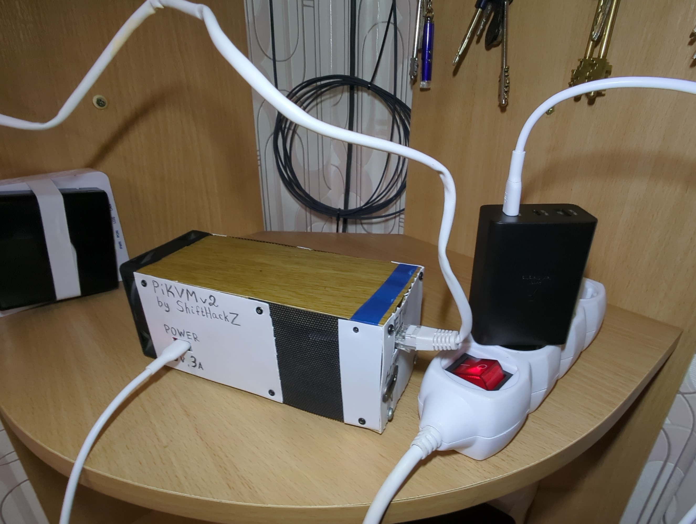

4. Wait some time until the PiKVM OS finishes the first boot initialization. This process may take up to 10 minutes. 

> 🔴 **IMPORTANT:** do not unplug the power cable from Rasperry Pi board until the first boot initialization is finished.

5. After first boot process is finished, PiKVM device will connect to the network and get Local IP address in the Local network of your router. To detect what IP address was obtained by the PiKVM you can go to your router admin settings page, and look for the connected devices.

In my case board obtained IP address `192.168.0.222`, so I will use it in the all follwing exampels. In your case IP-address will be different.

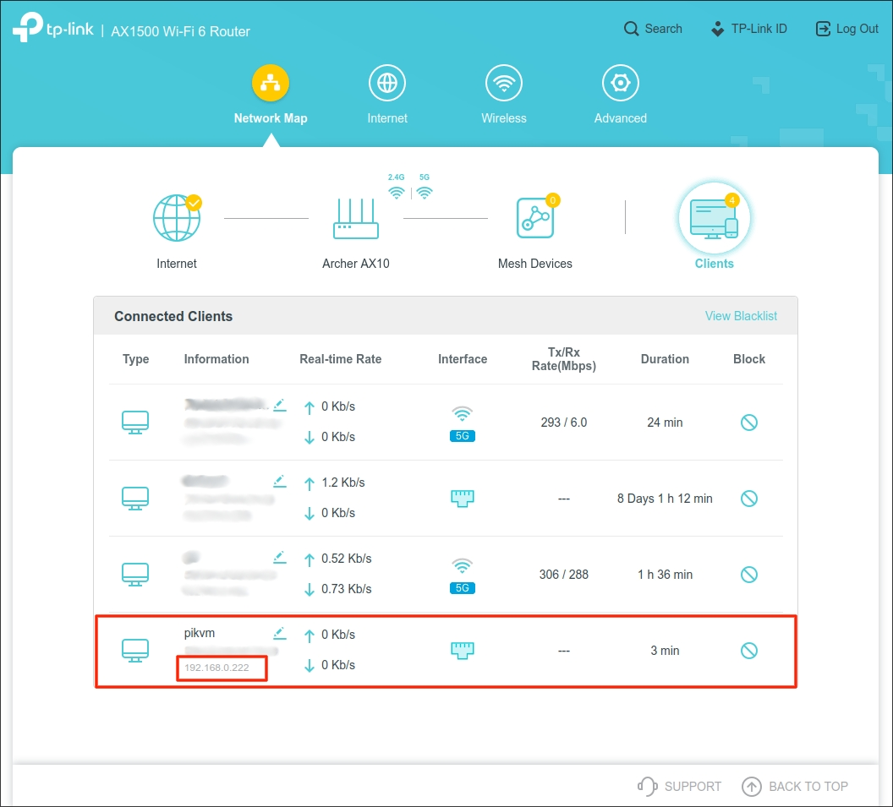

6. Then you need a computer or smartphone that is connected to the same Local network as PiKVM device. Open the web browser and navigate to the IP-addres url `https://192.168.0.222`. The default credentials are login `admin` with password `admin`.

7. Change the default passwords to keep your device secure. There is a detailed description on how to do this in the [PiKVM documentation](https://docs.pikvm.org/v2/#first-launch-and-usage).

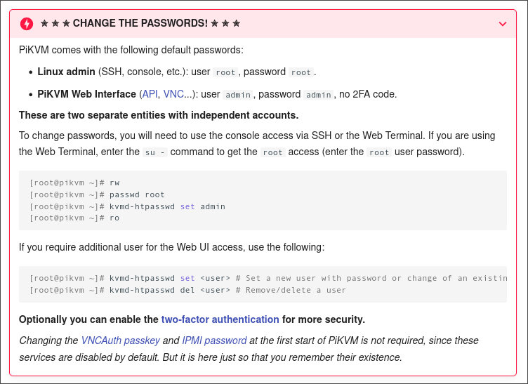

### Updating the PiKVM OS software

PiKVM OS is open source operating system based on Arch Linux. It is important to egularly update your PiKVM OS to receive security updates and new features. Like on any Linux system update is done via the terminal, you can use either ssh shell or the Terminal in PiKVM web browser interface. 

To update the OS do the following:

1. Open the terminal in the PiKVM web interface. Alternatively you can use ssh connection.

2. Obtain the root access by typing `su -` command and entering the root password.

3. Run the `pikvm-update` command and wait until process finished. Please make sure your PiKVM device does not lose power and internet connection during the update process.

### Setting up Tailscale VPN (optional)

There can be some edge case situations with not being able to have the access to the same Local network with PiKVM board, for example when I have PiKVM connected to my home server, and I am physically not at home and I need remote access to my server. 

Also considering that I want my PiKVM device to be as portable as possible, I also want to be able to borrow my PiKVM device to someone, so that person can take it and connect to their home PC and local network, and I can connect to that PC remotely and help reinstalling OS for example.

The [Tailscale VPN](https://tailscale.com/) is a free tool (for the personal use) that can be used as a solution to the cases I described above. It allows to access PiKVM from the Internet. To setup it follow this steps:

1. Open the terminal in the PiKVM web interface. Alternatively you can use ssh connection.

2. Install tailscale systemd service by entering this command sequence to the terminal:

```bash
su -
rw
pacman -S tailscale-pikvm
systemctl enable --now tailscaled
tailscale up
```

3. The terminal will show a link that you need to copy and follow in your web browser. After following the link login or sign up to Tailscale VPN, and finally your PiKVM device will be attached to that account. 

4. Install the Tailscale Client to the system you want to use (not the PC you want to control over the PiKVM) and connect it to the VPN. To do this follow the instructions [here](https://tailscale.com/download).

5. After setting up client on your system visit [Tailscale Admin Page](https://login.tailscale.com/admin/machines). If you did everything correctly you should see your PiKVM device and the system that is used for the remote connection to PiKVM.

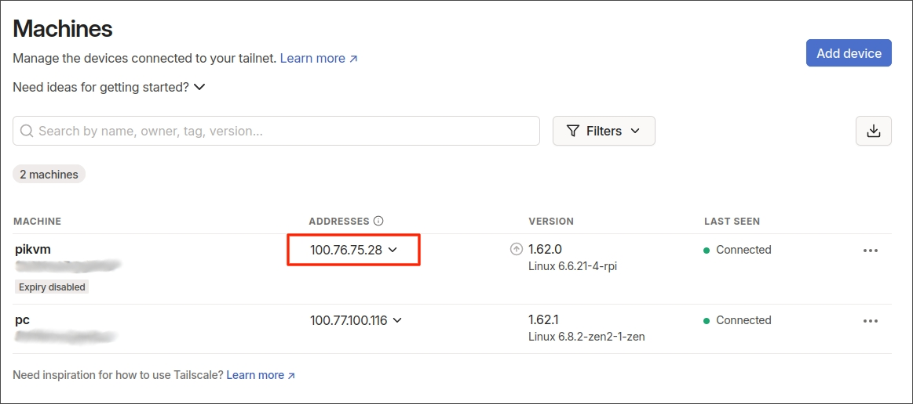

In the screenshot above I highlighted the example of IP address that should be used in the browser to connect to the PiKVM remotely.

6. Make sure you disable expiration for the PiKVM device. To do this clich "three dots" icon on the right side of your PiKVM device in list and select the "Disable key expiry" option.

After setup is complete, every time the PiKVM device is booted it will be automatically connected to the VPN network, so if I need remote access to it from anywhere, I can just connect my laptop to the same VPN and manage my PiKVM device.

## How to use PiKVM device to control PC / Laptop / Server

This is the istruction for using PiKVM board as a portable device. To assemble the connection you need to have: **PiKVM** device, **machine** you want to control, custom power cable and adapter, Ethernet RJ-45 cable, HDMI cable.

1. Take the **Ethernet RJ-45** cable and connect it to the **PiKVM** device and your **Wi-Fi router**.

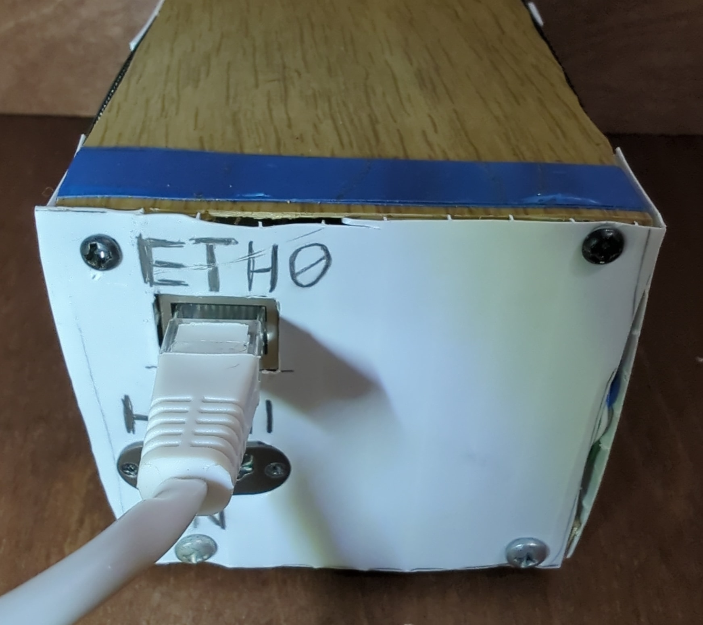
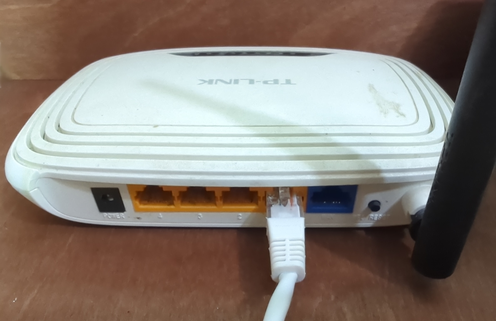
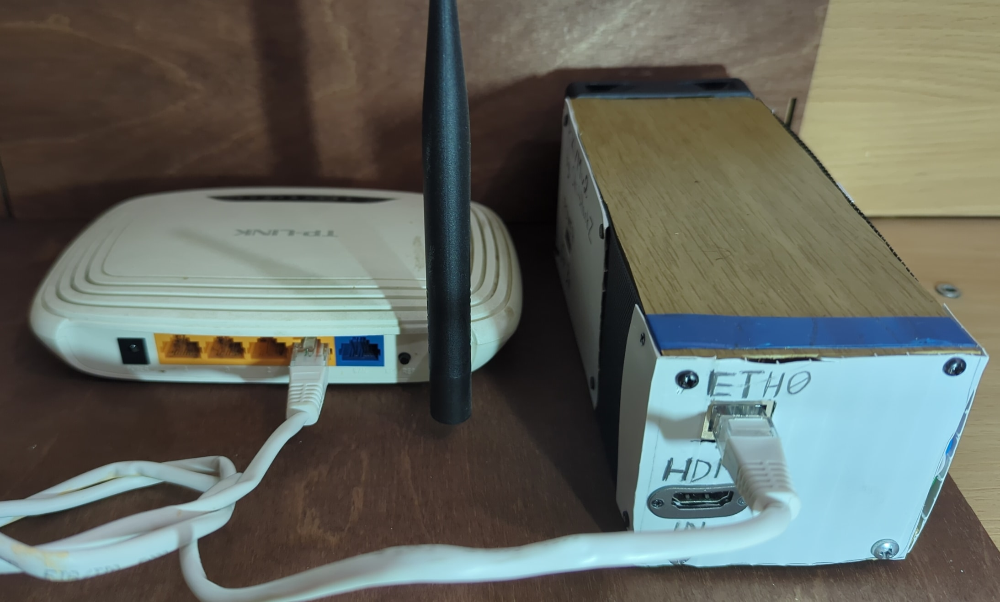

2. Take the **HDMI** male to male cable and connect it to the **PiKVM** device and the **machine** you want to control.

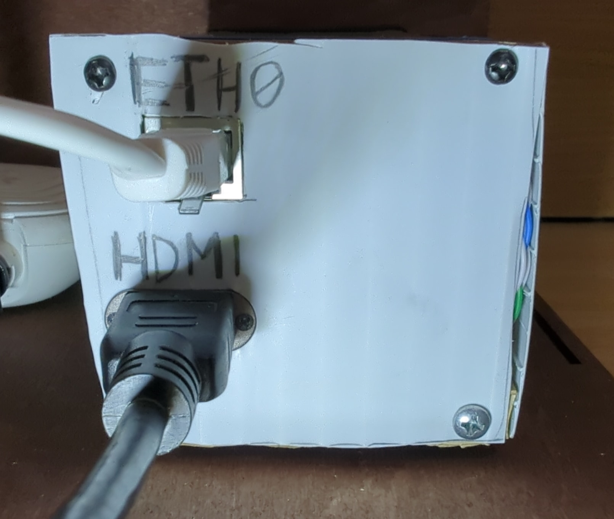
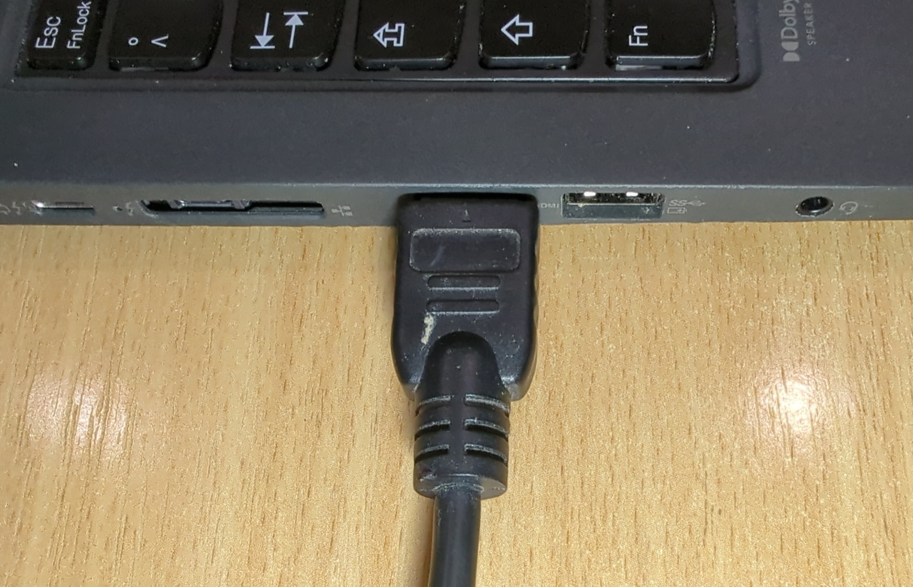
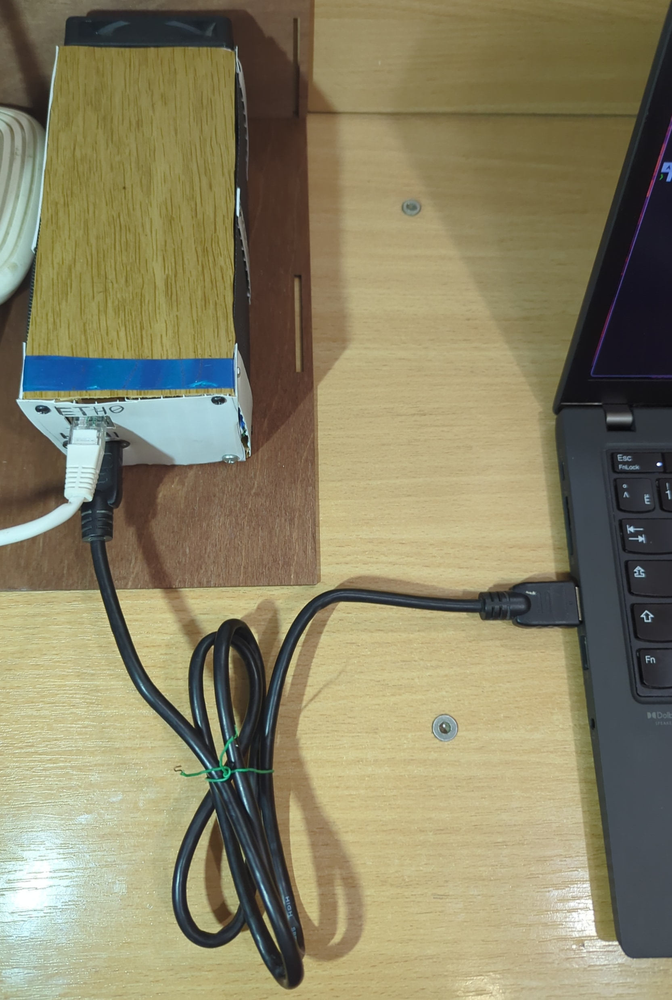

3. Take the custom power cable and connect:
    - **USB-C** connector to the **PiKVM** device.
    - **USB-A** connector labeled _"PC/Laptop"_ to the **machine** you want to control.
    - **USB-A** connector labeled _"Power"_ to the **power adapter**.

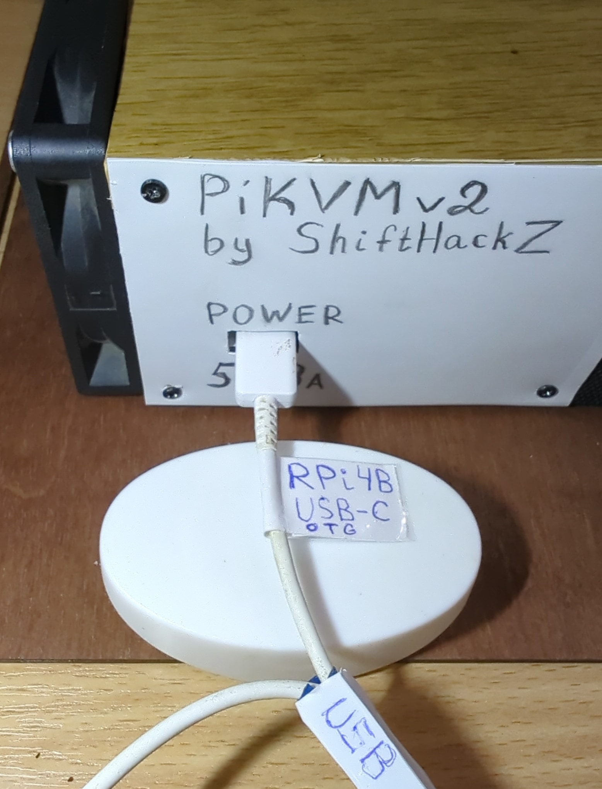
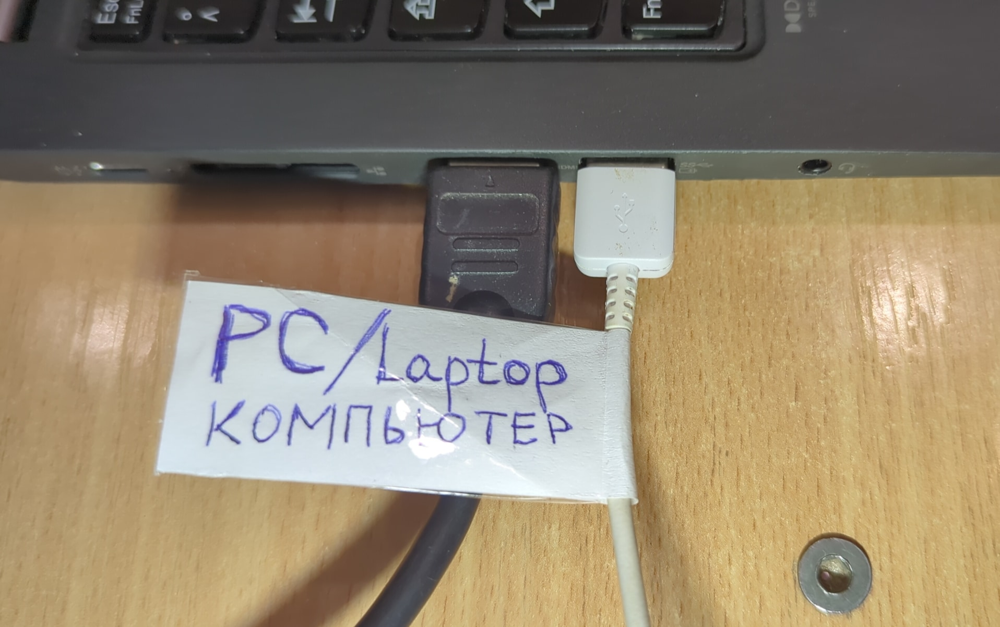
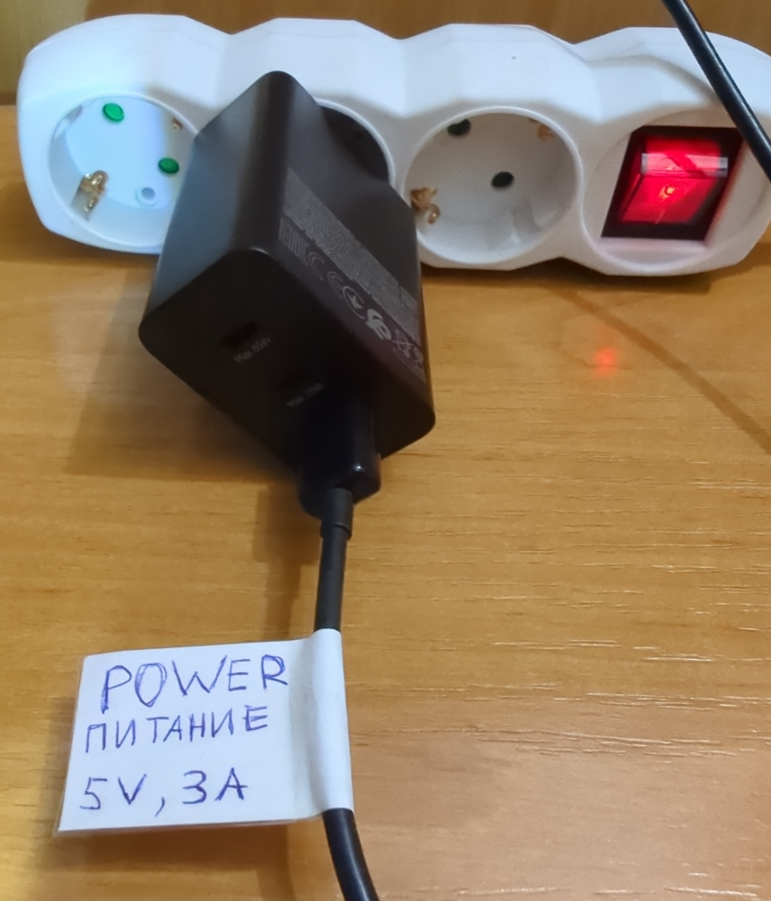

4. Plug the **power adapter** to the electric outlet. The **PiKVM** device should boot and connect to the network.

5. Power up the machine you want to control.

After that you should be able to connect to the **PiKVM** device and control your **machine**.

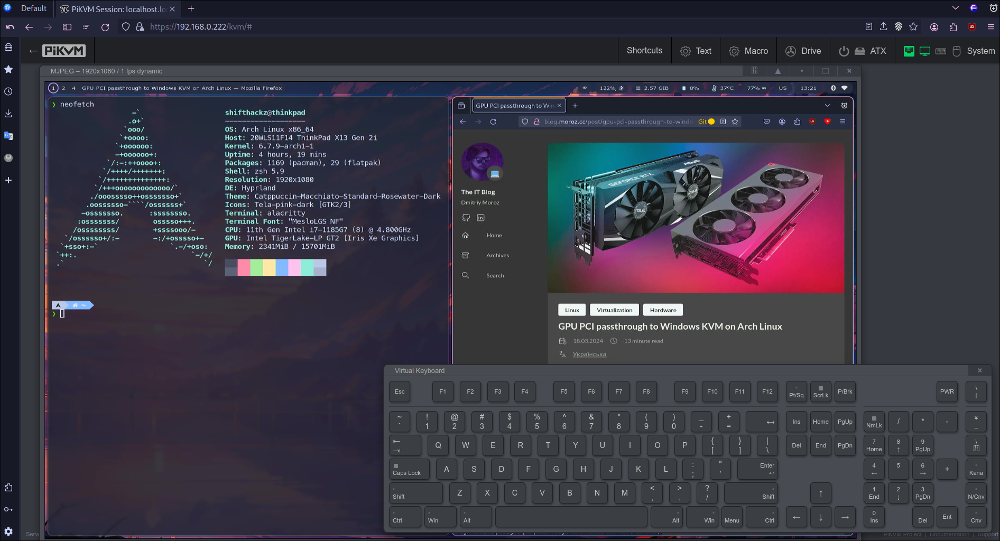

## Conclusion

As a result of this project the portable KVM over IP device was assembled that has many useful features:

- Device can use both Ethernet and Wi-Fi connection.
- Device can be fully managed remotely using VPN.
- Device assembled in a custom unique hand made case and uses active cooling that prevents the device from overheat so it can be safely used 24/7.
