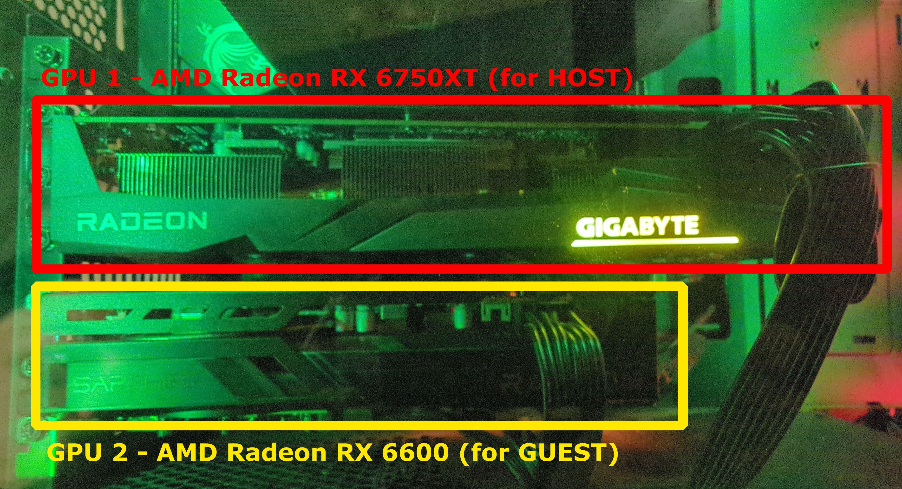
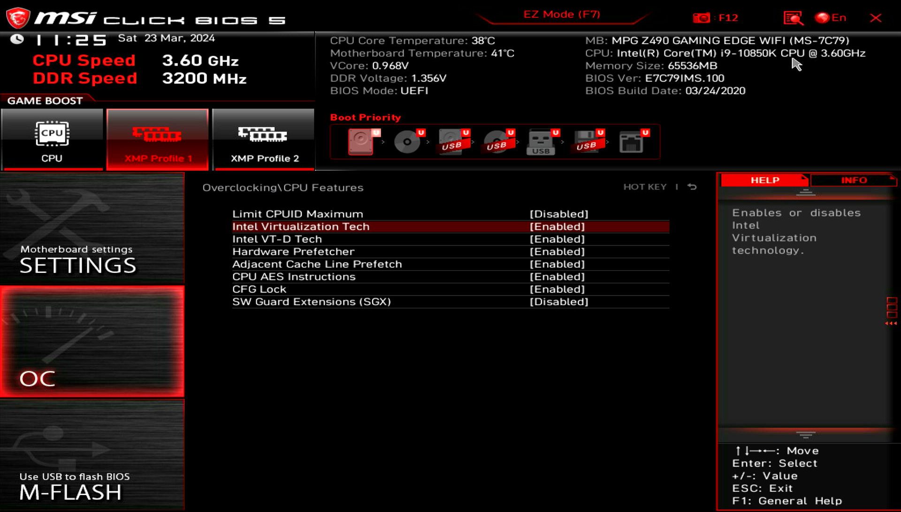
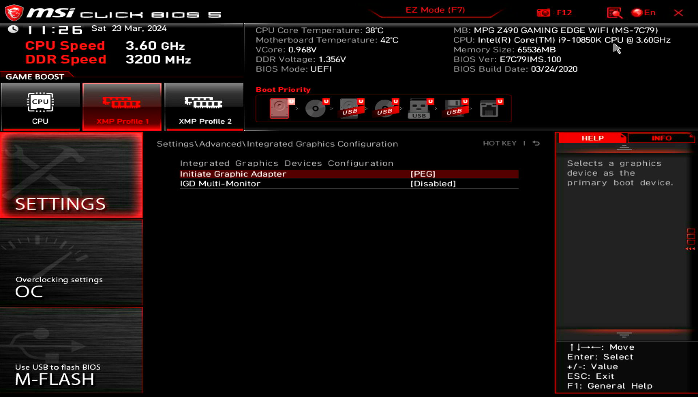
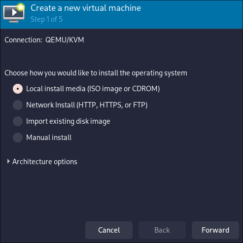
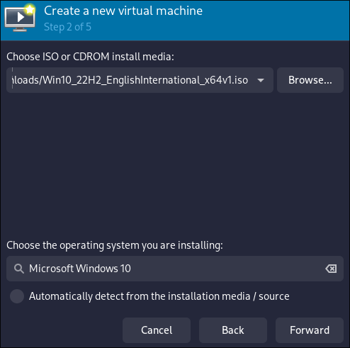
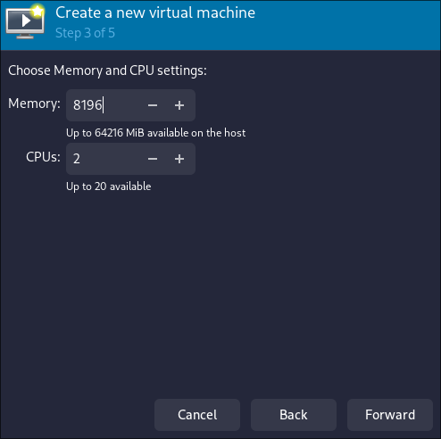
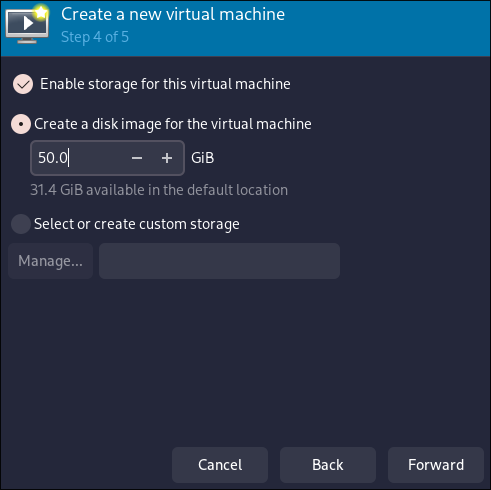
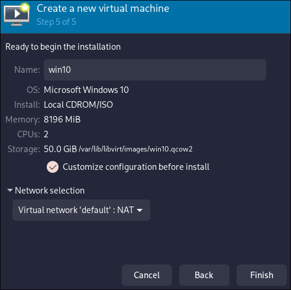
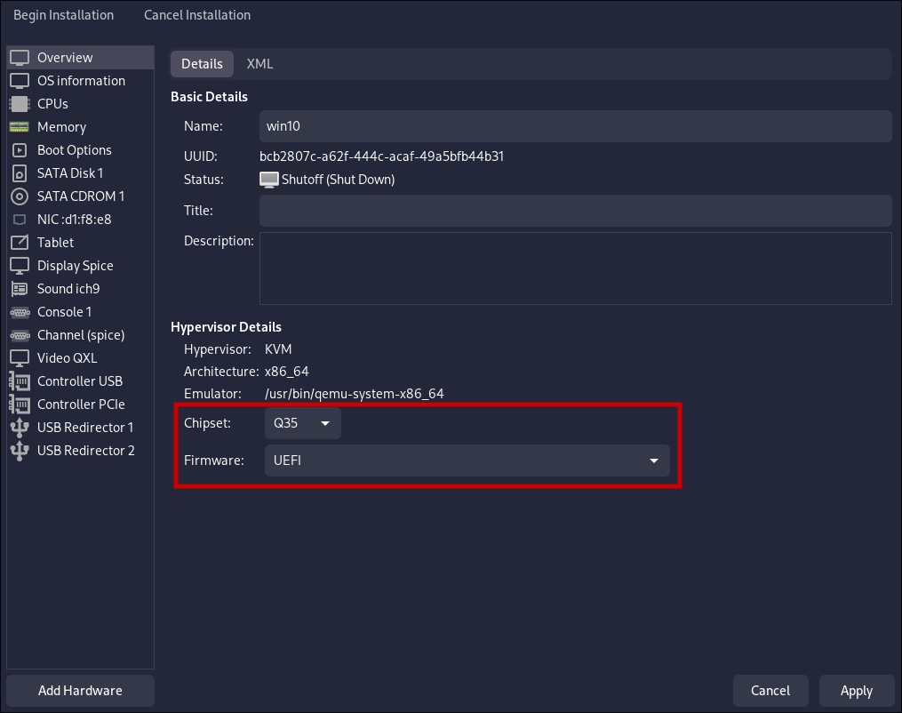
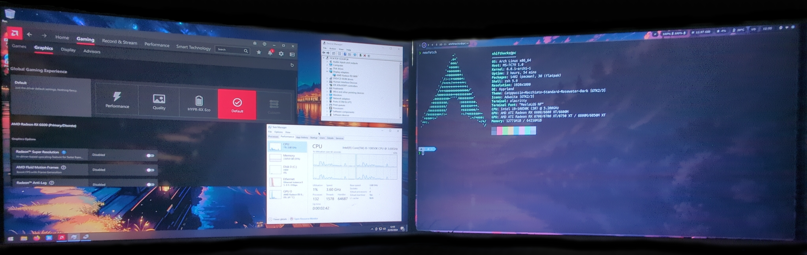

+++
title = "GPU PCI passthrough to Windows KVM on Arch Linux"
date = "2024-03-18"
tags = [
    "Linux",
    "KVM",
    "Virtualization",
    "PCI Passthrough",
    "GPU",
    "IOMMU",
    "VT-d",
    "AMD-Vi",
    "VFIO",
]
categories = [
    "Linux",
    "Virtualization",
    "Hardware",
]
image = "header.webp"
+++

## Introduction

GPU passthrough in KVM (Kernel-based Virtual Machine) refers to the process of directly assigning a physical GPU (Graphics Processing Unit) to a virtual machine running on a KVM hypervisor. This allows the virtual machine to have exclusive access to the GPU, essentially bypassing the hypervisor's virtualization layer.

For many people this can sound complicated, but with Linux and KVM it's actually easy and setup includes this 5 steps:

1. **Identifying the GPU**. The first step is to ensure that the GPU you want to passthrough is compatible with your hardware and supports the necessary features for passthrough. This often requires VT-d (Intel Virtualization Technology for Directed I/O) or AMD-Vi (AMD Virtualization I/O) support on the CPU, as well as an IOMMU (Input-Output Memory Management Unit) on the motherboard.

2. **Configuring the Host**. You'll need to configure the host system to enable IOMMU, VT-d, or AMD-Vi in the BIOS/UEFI settings, as well as load necessary kernel modules and drivers.

3. **Isolating the GPU**. The GPU intended for passthrough needs to be isolated from the host operating system so that it can be exclusively assigned to the virtual machine. This is typically done by blacklisting the GPU driver from loading on the host.

4. **Configuring the Virtual Machine**. Within the KVM setup, you configure the virtual machine to use the passthrough GPU. This involves specifying the GPU as a PCI device to be passed through to the VM.

5. **Driver Installation**. Once the GPU is passed through to the virtual machine, you install the necessary drivers within the guest operating system just as you would on a physical machine.

## Hardware requirements

It is important to mention that this kind of setup requires your computer hardware to meet some requirements.

### CPU

Your CPU must support hardware virtualization extensions such as Intel VT-x (Intel Virtualization Technology) or AMD-V (AMD Virtualization). Additionally, for GPU passthrough, you'll need support for Intel VT-d (Intel Virtualization Technology for Directed I/O) or AMD-Vi (AMD Virtualization I/O) extensions, which allow direct access to I/O devices from virtual machines.

### Motherboard

Your motherboard must have an IOMMU (Input-Output Memory Management Unit) that supports PCIe device isolation and passthrough. Most modern motherboards have this feature, but you should check your motherboard's specifications to ensure compatibility.

### GPU

The GPU you must support UEFI. Ideal choice is a GPU that supports the necessary features for passthrough, such as AMD's Radeon Pro or Nvidia's Quadro series GPUs, as consumer-grade GPUs may have limitations or require workarounds.

Also if you want the ability to use your host Linux OS at the same time with the guest Windows OS you need to have 2 GPU (one for host, another for guest) and it is recommended to have 2 monitors. 

If your CPU has built-in graphics unit and your motherboard has video output, it may be fine to have only 1 external PCI GPU. In that case the PCI GPU is passed to the VM, and Linux host uses CPU graphics for output.

## GPU Passthrough setup

### Review your hardware

The very first step for the setup is to review the hardware you have. If you want achieve the same setup as in my example make sure you have 2 GPUs (at least one should be external PCI GPU).

My hardware specifications are:

- **Motherboard**: [MSI MPG z490 Gaming Edge WiFi](https://www.msi.com/Motherboard/MPG-Z490-GAMING-EDGE-WIFI)
- **CPU**: [Intel Core i9-10850K](https://ark.intel.com/content/www/us/en/ark/products/205904/intel-core-i9-10850k-processor-20m-cache-up-to-5-20-ghz.html)
- **GPU 1**: [AMD Radeon RX 6750XT](https://www.amd.com/en/products/graphics/amd-radeon-rx-6750-xt) (for Linux **HOST**)
- **GPU 2**: [AMD Radeon RX 6600](https://www.amd.com/en/products/graphics/amd-radeon-rx-6600) (for Windows **GUEST**)
- **Monitors**: 2 x FullHD 1920x1080 @ 75 Hz 



### Install and configure KVM

This guide is written assuming you already have a working Linux system with installed and configured KVM (libvirt) and the software to manage your VMs (virt-manager, virt-viewer). 

If you don't have KVM installed yet, see my another guide: [How to install KVM on Arch Linux](http://blog.moroz.cc/post/how-to-install-kvm-on-arch-linux).

### Modify motherboard BIOS settings

In order for KVM to work on your system Virtualization Technology should be enabled. It may be named differently depending on your motherboard/CPU manufacturer, but usually it is VT-D for Intel and AMD-Vi for AMD respectively.



If you have a setup with the integrated CPU graphics you also will need to change the graphics initialization priority. It is needed to prevent your external GPU initialization on BIOS POST startup, and delegate a video signal to integrated GPU instead. In my case I don't need this step, as I have 2 external PCI GPUs.



### Enable IOMMU

> IOMMU is a generic name for Intel VT-d and AMD-Vi.

To enable IOMMU in the Linux system you should pass the correct boot kernel parameter. Adding the kernel boot parameters may be different, depending on what bootloader you are using.

If are using:

- **Intel CPU** - add flags: `intel_iommu=on iommu=pt`
- **AMD CPU** - add flags: `iommu=pt`

In AMD case kernel detects if IOMMU should be on from BIOS, and `iommu=pt` prevents Linux from processing devices that can't be passed through.

#### Option 1: GRUB

If you are using grub as your bootloader, you can modify your kernel parameters in file `/etc/default/grub` and append the flags to `GRUB_CMDLINE_LINUX` parameters, for example:

```bash
...
GRUB_CMDLINE_LINUX="quiet splash intel_iommu=on iommu=pt"
...
```
Then save the file and re-generate your GRUB config with the command:


sudo grub-mkconfig -o /boot/grub/grub.cfg


#### Option 2: Systemd Boot

If you are using the systemd boot bootloader, you need to edit your boot entry file. In my case this file is located at `/boot/loader/entries/arch.conf`.

Kernel parameters should be appended to the end of `options` parameter like this:

```bash
...
options rw quiet splash intel_iommu=on iommu=pt
...
```

After you added the correct kernel parameters to your bootloader, `reboot` your computer.

### Reviev your IOMMU groups

An IOMMU (Input-Output Memory Management Unit) group is a logical grouping of devices that are controlled by the same IOMMU. The primary purpose of an IOMMU group is to facilitate device isolation and management in virtualized environments, particularly when using technologies like GPU passthrough.

It is important that you have only devices related to the GPU your intend to pass through in the same IOMMU group. Because if you have something else, it should be also passed to the VM or otherwise passthrough will not work.

You can use the following script to verify your iommu groups:

```bash
#!/bin/bash
shopt -s nullglob
for g in $(find /sys/kernel/iommu_groups/* -maxdepth 0 -type d | sort -V); do
    echo "IOMMU Group ${g##*/}:"
    for d in $g/devices/*; do
        echo -e "\t$(lspci -nns ${d##*/})"
    done;
done;
```

You need to save the script contents to some file (for example `iommu.sh`) and make this file executable (`chmod +x iommu.sh`), then you can just run it using `./iommu.sh`.

In my case IOMMU groups are:

```bash
IOMMU Group 0:
	00:00.0 Host bridge [0600]: Intel Corporation Comet Lake-S 6c Host Bridge/DRAM Controller [8086:9b33] (rev 05)
IOMMU Group 1:
	00:01.0 PCI bridge [0604]: Intel Corporation 6th-10th Gen Core Processor PCIe Controller (x16) [8086:1901] (rev 05)
	01:00.0 PCI bridge [0604]: Advanced Micro Devices, Inc. [AMD/ATI] Navi 10 XL Upstream Port of PCI Express Switch [1002:1478] (rev c0)
	02:00.0 PCI bridge [0604]: Advanced Micro Devices, Inc. [AMD/ATI] Navi 10 XL Downstream Port of PCI Express Switch [1002:1479]
	03:00.0 VGA compatible controller [0300]: Advanced Micro Devices, Inc. [AMD/ATI] Navi 22 [Radeon RX 6700/6700 XT/6750 XT / 6800M/6850M XT] [1002:73df] (rev c0)
	03:00.1 Audio device [0403]: Advanced Micro Devices, Inc. [AMD/ATI] Navi 21/23 HDMI/DP Audio Controller [1002:ab28]

...

IOMMU Group 18:
	07:00.0 VGA compatible controller [0300]: Advanced Micro Devices, Inc. [AMD/ATI] Navi 23 [Radeon RX 6600/6600 XT/6600M] [1002:73ff] (rev c7)
IOMMU Group 19:
	07:00.1 Audio device [0403]: Advanced Micro Devices, Inc. [AMD/ATI] Navi 21/23 HDMI/DP Audio Controller [1002:ab28]
...
```

> Ensure that the GPU and its associated devices are not grouped with other critical system devices (e.g., USB controllers, Ethernet controllers) that you do not intend to pass through to the virtual machine. Having the GPU in its own isolated IOMMU group is crucial for reliable passthrough.

In this case the **AMD RX 6600 GPU** that I want to pass to VM has 2 devices **07:00.0** and **07:00.1**, each in separate IOMMU groups **18** and **19**, and no other devices are in groups **18** and **19**. Than means I can passthrough it with no problem.

If we look at the devices for **AMD RX 6750 XT** which are **03:00.0** and **03:00.1** in IOMMU group **1**, there are also some PCI birdge devices, which in theory does not prevent passthrough this GPU as well as long as you also pass this PCI bridges to VM. The real problem would be if for example IOMMU group **1** contained some brand another PCI device (like USB bridge or sound card).

In case you have more devices than you need in IOMMU group with the GPU you could try:

- If your motherboard has many PCI Express slots, try to install GPU in different PCIE slots and see if it helps.
- In case you can not find optimal IOMMU group with no extra devices, you can patch your Linux kernel with **ACS Override** patch (but it is out of scope for this article).

### Isolate your GPU

Isolating the GPU refers to the process of ensuring that the GPU is exclusively available for use by a specific virtual machine, typically through binding it to the VFIO (Virtual Function I/O) driver. This process involves several steps to prevent the GPU from being used by the host operating system or other virtual machines:

- **Unbinding from Host Driver**. Initially, the GPU is typically bound to a driver used by the host operating system for normal graphics operations. To isolate the GPU, this binding needs to be undone so that the GPU can be claimed by the VFIO driver. This step effectively detaches the GPU from the host OS.

- **Binding to VFIO Driver**. Once unbound from the host driver, the GPU is then bound to the VFIO driver, which allows it to be passed through to the virtual machine. The VFIO driver provides the necessary functionality for direct device assignment (DDA) in virtualized environments, ensuring that the GPU is accessible to the virtual machine.

Isolating means that after you boot your host Linux system you can not use the isolated GPU (which is bound to `vfio` driver), you can only use it to pass to the VM.

To isolate the GPU you need to know the deice IDs of your GPU video and audio PCI output device. You can use `iommu.sh` script from previous step to get this information. In my case the device IDs are: `1002:73df` and `1002:ab28`.

#### VFIO Early load

To load vfio early and bind the necessary GPU to vfio create a config at `/etc/modprobe.d/vfio.conf` which in my case looks like this:

```bash
softdep amdgpu pre: vfio-pci
options vfio-pci ids=1002:73ff,1002:ab28 disable_vga=1 kvm.ignore_msrs=1
```

Here the line `softdep amdgpu pre: vfio-pci` allows `vfio-pci` driver to be forced to load before the `amdgpu` driver, I need this because I have 2 external PCI GPUs of the same manufacturer, and this allows to bind RX 6600 GPU to `vfio-pci` driver and then bind RX 6750 XT to the `amdgpu` driver. 

In your case if you have NVidia gpu then `vfio-pci` should be loaded before the `nvidia` (proprietary) or before the `nouveau` (free) driver.

#### Initramfs configuration

In my case I use `mkinitcpio` as initramfs builder. To configure mkinitcpio edit the `/etc/mkinitcpio.conf` file.

Add the necessary modules to the `MODULES` array:

```bash
...
MODULES=(vfio_pci vfio vfio_iommu_type1)
...
```

Then ensure you have `modconf` hook defined in the `HOOKS` array:

```bash
...
HOOKS=(... modconf ...)
...
```

Save the file, and then execute a command for initramfs regeneration:


sudo mkinitcpio -P


After that, you need to reboot the computer to apply changes.

### Setup a new VM and install Windows 10/11

Now it is a time to setup a new VM and install a new Windows system. I recommend setup and install Windows without any passed PCI devices, and add them to the VM later after installation is finished.

All the setup is easier to do using the `virt-manager` graphical application.

1. Open the `virt-manager` application.

2. Click "New Virtual Machine".

3. Select Local install media. Ususally it should be Windows 10/11 iso file which can be downloaded from microsoft website. 



4. Browse to your Windows 10/11 `iso`. It is recommended that your iso to be located somewhere in your home user folder to avouid file permission problems. Also it is important to make sure to identify the OS as "Windows 10" or "Windows 11" at the bottom field.



5. Allocate CPU and Memory. Be sure to reserve at least 2 CPU cores and some RAM for your linux **host** system to handle networking and some other stuff. In my case I allocated 2 CPU cores and 8 Gb of RAM to the VM, you can allocate more if you want.



6. Enable storage for this virtual machine and Create a disk image. I recommend to give at least 50 Gb for the Windows VM.



Then **DO NOT CLICK FINISH**, and do the following:

- Ensure Customize Configuration before install is checked.
- Give your VM a name.
- Under network selection, select Host device [your device ID] -> Source Mode -> Bridge or NAT).
- Now you can click Finish.



- Ensure to select the **Q35** chipset in the "Overview" and the **UEFI** firmware. GPU Passthrough will not work on BIOS firmware, it requires to use the **UEFI**.



Then click on "Begin Installation" and install Windows as usual, after you have the system installed proceed to the next step.

### Adjust specific VM settings

There is a need to add some flags that allow to hide the fact that you are using VM from the GPU drivers installer. 

To edit the VM settings make sure your VM is not running and type this command in terminal:


sudo virsh edit win10


where you should replace `win10` with your actual VM name.

Then do the following XML file modifications in the editor:

- Add `<vendor_id state='on' value='randomid'/>` to the `<hyperv>` section.
- Add `<kvm><hidden state='on'/></kvm>` to the `<features>` section.

As the result the structure should be like this:

```bash
...
<features>
  ...
  <hyperv>
    ...
    <vendor_id state='on' value='randomid'/>
    ...
  </hyperv>
  <kvm>
    <hidden state='on'/>
  </kvm>
  ...
</features>
...
```

### Passthrough GPU to the VM

In the `virt-manager` applcation open your VM settings and navigate to your VM settings and here need to add 2 PCI host devices related to the GPU you intend to passthrough.

1. Click "Add PCI Passthrough Devices".

2. Click "Add Hardware".
    
3. Select PCI Host Device

Scroll down until you find the GPU you want to pass through. The ID's should match your outputs from earlier. For example, in my case: 
    
- `0000:07:00:0` Advanced Micro Devices, Inc. [AMD/ATI] Navi 23 [Radeon RX 6600/6600 XT/6600M]
- `0000:07:00:1` Advanced Micro Devices, Inc. [AMD/ATI] Navi 21/23 HDMI/DP Audio Controller [1002:ab28]
    
You need to do this twice for the GPU's video and audio device respectively.

Then if you have a second monitor try to plug it to the video output of the GPU you passed to the VM and boot the VM, if everything is set up correctly you should see the VM video output on the separate monitor.

### Install GPU drivers

After you successfully booted your Windows VM with external GPU working it's time to download and install latest drivers from your GPU manufacturer.

- [Official Nvidia GPU drivers](https://www.nvidia.com/download/index.aspx?lang=en)
- [Official AMD GPU drivers](https://www.amd.com/en/support)

## Conclusion

Configured Windows VM with GPU passthrough can handle specific graphical apps (like gaming or video editing) with a near native performance, and as a result allows to use your host Linux system and a Windows guest system at the same time.



Benefits of GPU passthrough in KVM include:

- Improved Performance: By directly accessing the physical GPU, the virtual machine can achieve near-native performance for graphics-intensive tasks such as gaming, video editing, and 3D rendering.

- Reduced Overhead: Since the virtual machine bypasses the hypervisor's virtualization layer for GPU operations, there's less overhead compared to traditional GPU virtualization techniques like GPU emulation or virtual GPU (vGPU) solutions.

- Support for GPU-accelerated Workloads: GPU passthrough enables virtual machines to leverage hardware acceleration for tasks that rely on GPU processing power, leading to faster execution times and improved efficiency.

- Compatibility with GPU-specific Software: Certain applications and workflows require direct access to a physical GPU, which may not be possible with virtual GPU solutions. GPU passthrough allows such software to run seamlessly within a virtualized environment.

- Enhanced Gaming Experience: Gamers can benefit from GPU passthrough by running games within a virtual machine with minimal performance degradation, enabling them to utilize hardware-accelerated graphics without dual-booting or dedicating a separate physical machine for gaming.
