+++
title = "How to make ThinkPad LTE Modem work on Arch Linux using FCC unlock"
date = "2023-12-13"
tags = [
    "Linux",
    "Hardware",
    "4G",
    "LTE",
    "Modem Manager",
    "mmcli",
    "FCC",
    "Quectel",
    "Quectel EM120R",
]
categories = [
    "Linux",
    "Networking",
    "Hardware",
]
image = "header.jpg"
+++

## Introduction

It's neat to have a laptop with both WiFi and LTE, as this actually provides a reserved connectivity channel. ThinkPads are generally well-supported on Linux, and many users successfully use LTE modems on these laptops without any additional configuration. However, some newer models are bundled with Quectel LTE modems that have FCC lock.

## FCC Lock

### What is FCC Lock

The FCC lock is a software lock integrated in WWAN modules shipped by several different laptop manufacturers like Lenovo, Dell, or HP. This locks prevents the WWAN module from being put online until some specific unlock procedure (usually a magic command sent to the module) is done. You can read more details about the FCC lock/unlock procedure <a href="https://modemmanager.org/docs/modemmanager/fcc-unlock/" target="_blank">here</a>.

### How OS handles FCC Unlock

On Windows based system FCC unlock is usually done by the driver provided by modem or laptop manufacturer. On Linux systems Modem Manager is used to operate the WWAN modem, and actually has some pre-defined scripts for certain well-known WWAN modems. In some cases manufacturer provides the FCC unlock scripts, especially when it comes to ThinkPads that are designed to be Linux-compatible in the first place. But as each modem has different way of FCC unlock procedure, the FCC unlock procedure is not enabled by default and user should manually enable FCC unlock script for the exact modem model and revision. This is the reason why LTE does not work out-of-box in Linux system, which may confuse some users.

## FCC Unlock example

I have **Lenovo ThinkPad X13 Gen2** with **Intel CPU** running Arch Linux, so this example shows how to perfom FCC unlock procedure with this exact laptop and OS environment. This procedure is quite similar for other Lenovo ThinkPad series laptops, but with your equipment procedure may be slightly different, so consider investigating manufacturer website or special forums regarding your exact hardware.

### Detect WWAN modem model

First of all let's detect the exact model of LTE modem that is installed in laptop. This can be done with terminal command:


lspci


It will actually print all the PCI devices in your system and you can look for the LTE modem in the output. In my case LTE modem was the last in the output.

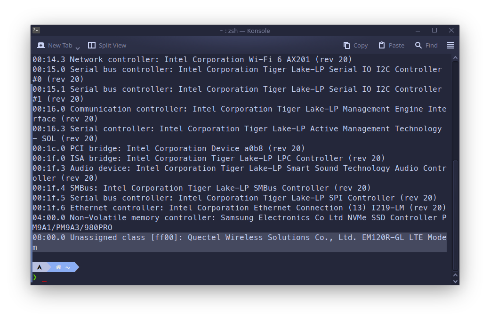

```bash
...
08:00.0 Unassigned class [ff00]: Quectel Wireless Solutions Co., Ltd. EM120R-GL LTE Modem
...
```

### Install Modem Manager package

Make sure you have installed `modemmanager` package, because it's essential requirement to have it in order for LTE connectivity to work on your Linux system. 

Depending on your distribution, install command may be different.

- For Arch-based systems:


sudo pacman -S modemmanager


- For Debain-based systems:


sudo apt install modemmanager


- For Fedora-based systems:


sudo dnf install modemmanager


After that enable the ModemManager.service in systemd, it can be done with command:


sudo systemctl enable --now ModemManager.service


### Find the FCC Unlock script

This step requires investiagting online to get the FCC Unlock script from the manufacturer. If there is no script from the manufacturer try to look on some forum pages or subreddits regarding your laptop/modem. 

In my case I have **Quectel EM120R-GL** WWAN modem, and luckily the FCC unlock script is bundled with Modem Manager itself. I found the location of pre-defined script on <a href="https://modemmanager.org/docs/modemmanager/fcc-unlock/#fcc-unlock-procedures-in-modemmanager--1184-1" target="_blank">this page</a>. 

The location of the pre-defined script for my modem is `/usr/share/ModemManager/fcc-unlock.available.d/1eac:1001`, and to make FCC unlock performing automatically with start of the ModemManager.service it's enough to link this script to the `/etc/ModemManager/fcc-unlock.d`, so the command to do so look like:


sudo ln -snf /usr/share/ModemManager/fcc-unlock.available.d/1eac:1001 /etc/ModemManager/fcc-unlock.d


After this you can restart ModemManager.service:


sudo systemctl restart ModemManager.service


and try to connect to your LTE network, in case it not works try rebooting your computer.

## Connecting to the LTE network

To perform connection to the LTE networks you can either use `modemmanager` in your terminal, or use some graphical settings tools provided by NetworkManager in KDE/Gnome. You can read detailed info how to perform mobile broadband connections on this <a href="https://wiki.archlinux.org/title/Mobile_broadband_modem#Connection" target="_blank">arch wiki page</a>.

I will show both terminal and graphical way on my system.

### Terminal only method

First you need to know the index of the WWAN modem. To do this, list all the available WWAN modems using `mmcli` like this:


mmcli -L


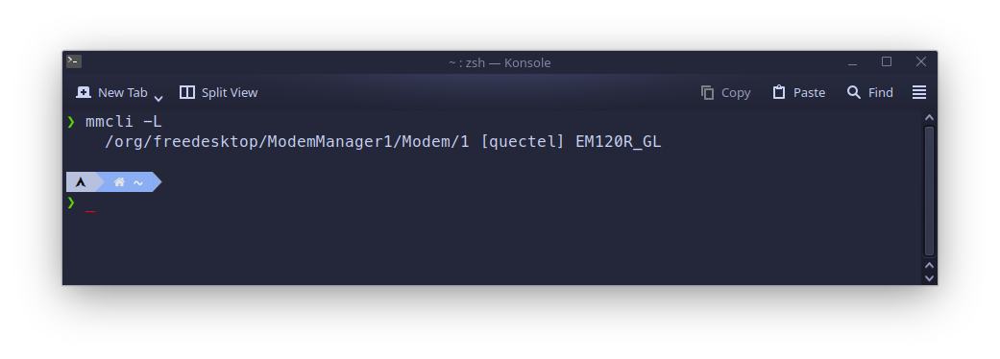

In the output look for the string `/org/freedesktop/ModemManager1/Modem/1`, the modem index is at the end, in my case it is `1`. So this index should be used in all the below commands.

Next, you can try connecting to LTE network, but you need to know what settings are required for your Internet Service Provider to perform connection. In my case only `apn=internet` is enough, so command to connect is:


mmcli -m 1 --simple-connect="apn=internet"


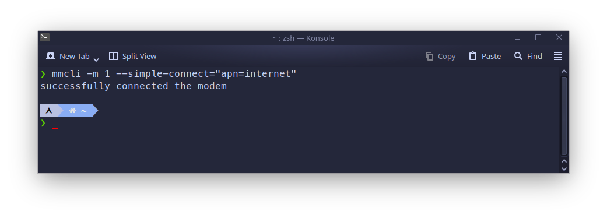

If connection successful, try browsing the internet, or just do `ping 8.8.8.8` in terminal to ensure you are online.

After you done browsing, you can disconnect from LTE network using command:


mmcli -m 1 --simple-connect="apn=internet"


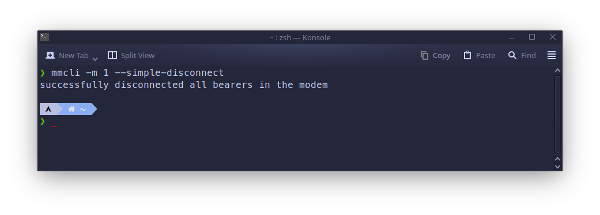

### Graphical method

This method requires to have use desktop environment like KDE or Gnome, and have NetworkManager as the primary way of network setup in your Linux system. In this example I will show how to setup it on KDE Plasma 5.27.10.

First of all go to the **System Settings** app, and open the **Connections** section.

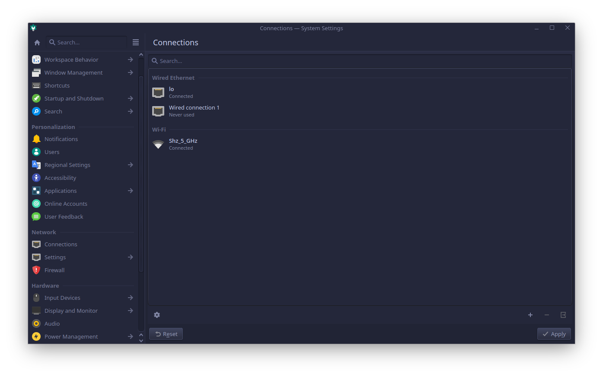

Press the `+` add button, and select `Mobile Broadband` connection type in the opened dialog.

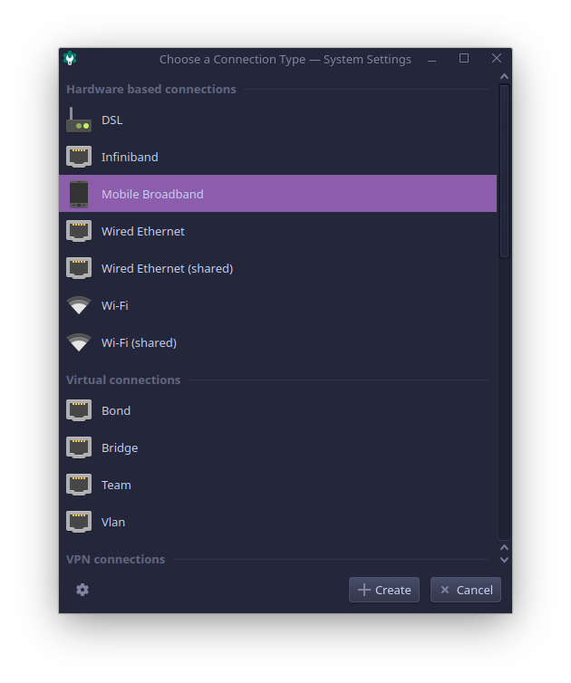

In the next dialog you can select specific modem for this connection, but as I have only one WWAN modem in my system, I will leave `Any GSM device` selection as is.

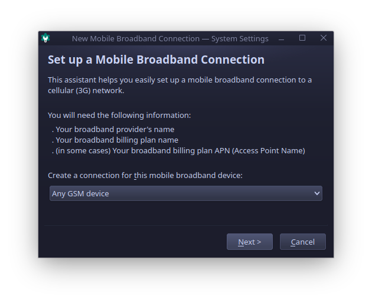

Next, select your ISP provider country.

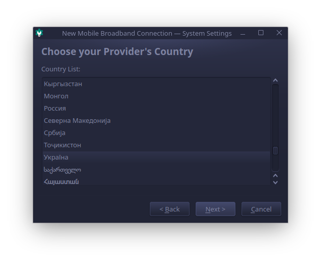

Select your ISP provider, or you can enter the name manually if it's not listed.

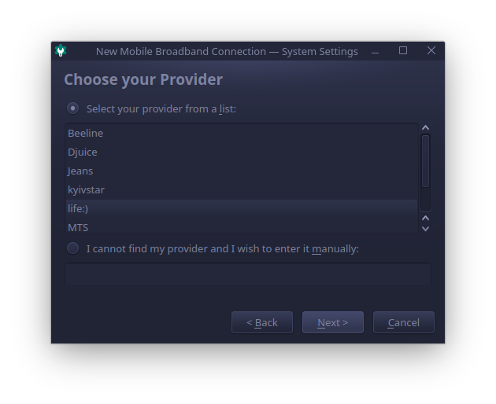

On this step select your tariff plan, and ensure you enter correct APN, in my case it is "internet".

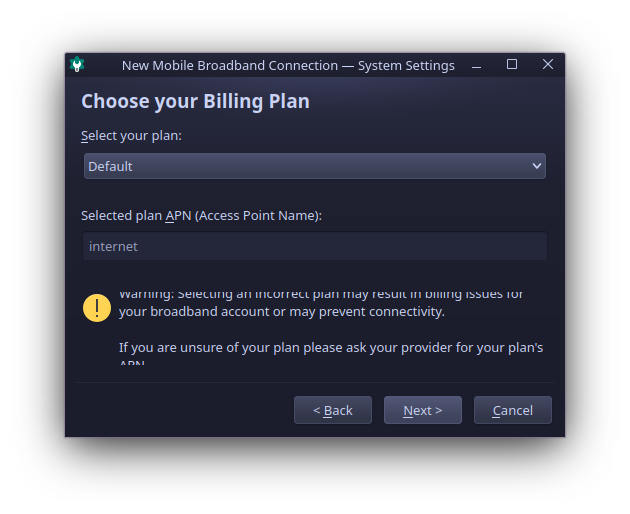

After all the information was entered, you should see success window.

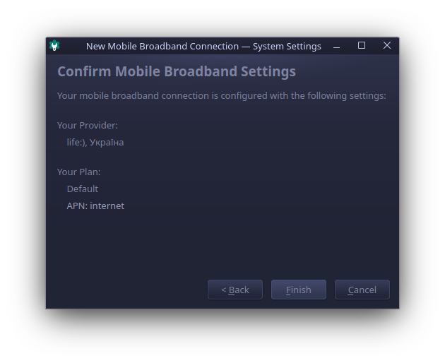

KDE makes it easy to connect the LTE network and monitor its' state from the tray icon. Find the profile you just created and click connect, when you are online it should display connected status like on screenshot.

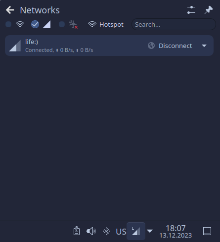

## Conclusion

So if you don't have your LTE modem working out-of-box after installing Linux consider checking if it has FCC lock and look online for the unlock script. In case you have exactly the same **Quectel EM120R** modem like I have, you can just use the same FCC script from example.
