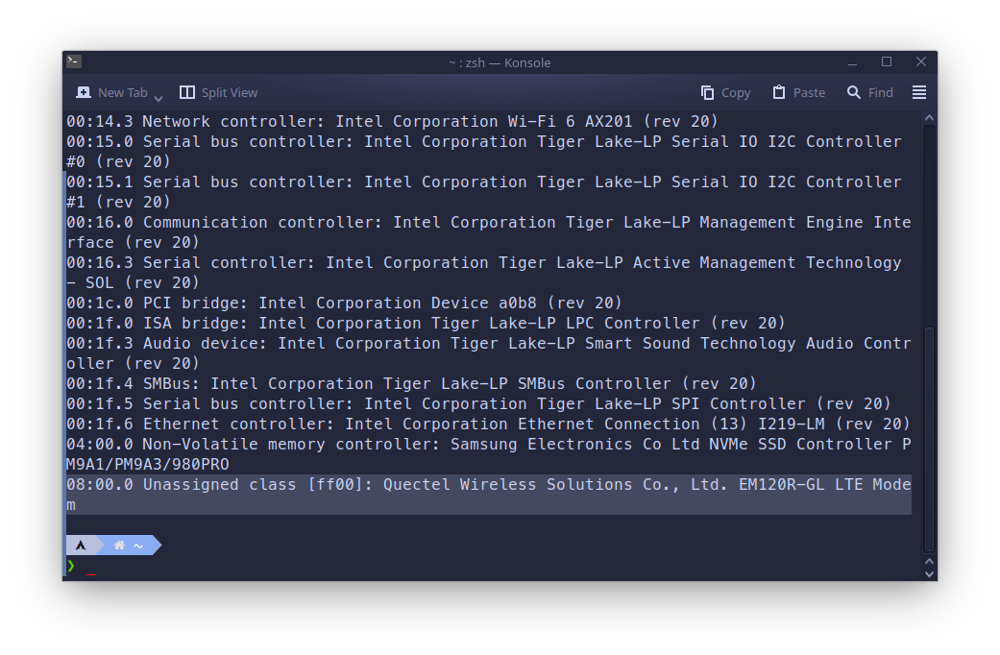
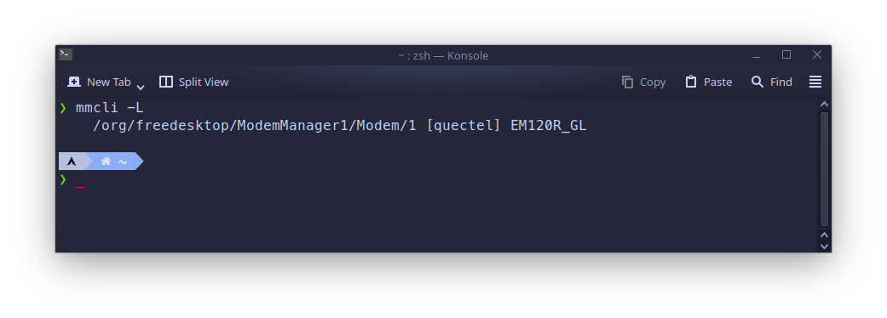
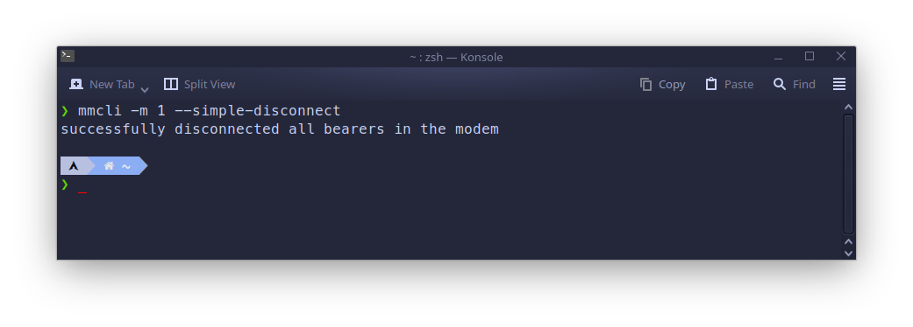
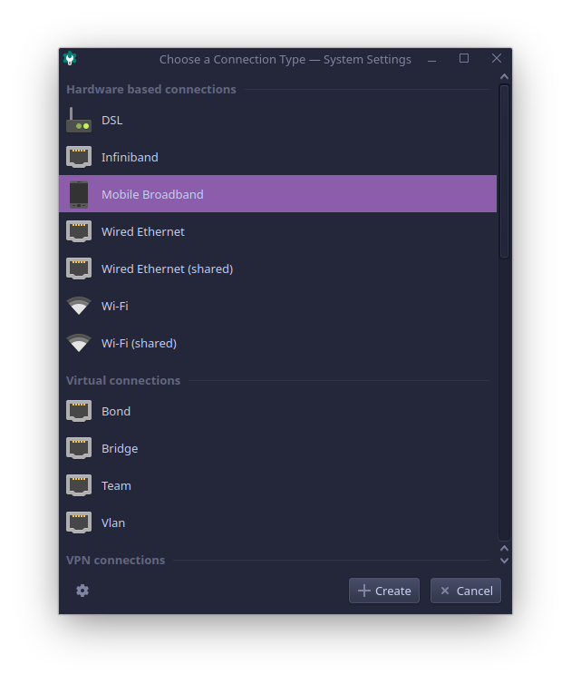
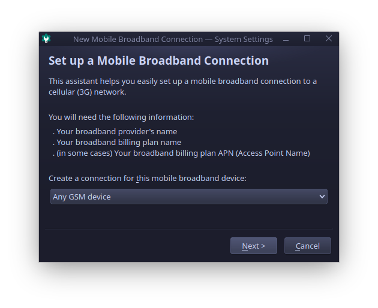
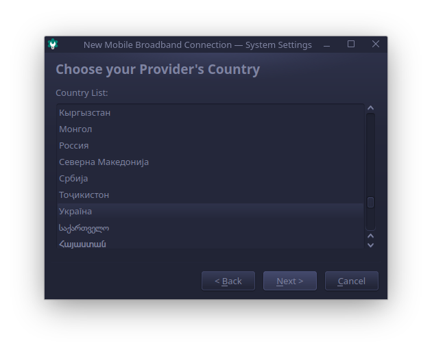
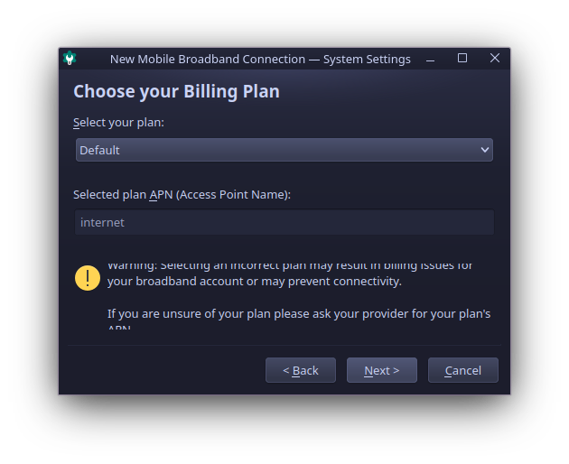
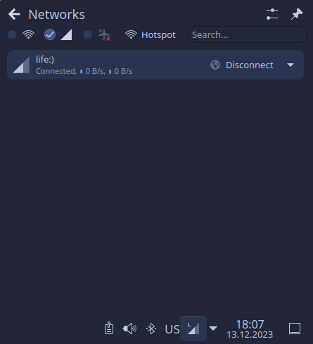

+++
title = "Налаштування LTE модему вбудованного в ноутбук ThinkPad на Arch Linux за допомогою FCC unlock"
date = "2023-12-13"
tags = [
    "Linux",
    "Обладнання",
    "4G",
    "LTE",
    "Modem Manager",
    "mmcli",
    "FCC",
    "Quectel",
    "Quectel EM120R",
]
categories = [
    "Linux",
    "Мережі",
    "Обладнання",
]
image = "header.jpg"
+++

## Введення 

Добре мати ноутбук з Wi-Fi та LTE одночасно, оскільки це фактично забезпечує зарезервований канал підключення до інтернету, що особливо актуально зараз в реаліях 2023 року під час масових перебоїв із зв'язвом. Ноутбуки серії ThinkPad, як правило, мають підтримку Linux, і багато користувачів успішно використовують модем LTE на цих ноутбуках без додаткової конфігурації. Однак деякі нові моделі поєднуються з модемами Quectel LTE, які мають блокування FCC (FCC lock).

### Блокування FCC

### Що таке блокування FCC?

Блокування FCC - це блокування на рівні програмного забезпечення, інтегроване в модулі WWAN, що постачаються декількома різними виробниками ноутбуків, такими як Lenovo, Dell або HP. Це блокування не дозволяє підключення модулю WWAN до мереді інтернет, поки не буде зроблена певна процедура розблокування (як правило, послідовність команд, що надсилається на модуль драйвером). Детальніше про процедуру блокування/розблокування FCC ви можете прочитати <a href="https://modemmanager.org/docs/modemmanager/fcc-unlock/" target="_blank">тут</a>.

### Як ОС обробляє розблокування FCC

У системах Windows розблокування FCC зазвичай виконується драйвером, що постачається виробником модему або ноутбука. У Linux системах Modem Manager використовується для забезпечення роботи модему WWAN і насправді має кілька заздалегідь визначених скриптів FCC розблокування для певних відомих модемів WWAN. У деяких випадках виробник постачає скрипти розблокування FCC, особливо це стосується ноутбуків серії ThinkPad, які розроблені в першу чергу бути повністю сумісними з Linux. Але оскільки кожен модем має різний спосіб процедури розблокування FCC, то вона не ввімкнена за замовчуванням, і користувач має вручну включити сценарій розблокування FCC для точної моделі модему. Саме з цієї причини LTE не працює за змовчуванням в системі Linux, що може заплутати деяких користувачів.

## Приклад розблокування FCC

Я маю **Lenovo ThinkPad X13 Gen2** з процесором **Intel** з операційною системою Arch Linux, тож даний приклад підходить саме для цього обладнання. Ця процедура досить схожа на інші ноутбуки серії Lenovo ThinkPad, але для вашого обладнання може дещо відрізнятися. Краще за все звернутися на веб-ресурси виробника або на профільні форуми для пошуку точної інформації.

### Визначення моделі модему

Перш за все, слід дізнатися точну модель модему LTE ноутбука. Це можна зробити за допомогою команди:


lspci


Команда виведе всі PCI пристрої у системі, тож можна відшукати там модем. У моєму випадку модем LTE був останнім у списку.



```bash
...
08:00.0 Unassigned class [ff00]: Quectel Wireless Solutions Co., Ltd. EM120R-GL LTE Modem
...
```
### Встановлення Modem Manager

Переконайтеся, що ви встановили пакет `modemmanager`.

В залежності від вашого Linux дістрибутива, команда може відрізнятися.

- Для ситем на базі Arch:


sudo pacman -S modemmanager


- Для ситем на базі Debian:


sudo apt install modemmanager


- Для ситем на базі Fedora:


sudo dnf install modemmanager


Після цього треба увімкнути ModemManager.Service в SystemD, це можна зробити за допомогою команди:


sudo systemctl enable --now ModemManager.service


### Пошук скрипта для розблокування FCC

Цей крок вимагає передбачає пошук скрипта розблокування FCC від виробника або на деяких профільних форумах що стосується вашого конкретного обладнання (ноутбука/модема).

У моєму випадку модель модему **Quectel EM120R-GL**, на щастя, скрипт розблокування FCC постачається з ModemManager. Точний скрипт вдалося знайти на <a href="https://modemmanager.org/docs/modemmanager/fcc-unlock/#fcc-unlock-procedures-in-modemmanager--1184-1" target="_blank"> цій сторінці</a>.

Скрипт в моєму випадку розташовано в `/usr/share/ModemManager/fcc-unlock.available.d/1eac:1001`, тож щоб застосовувати FCC розблокування автоматично із запуском сервіса ModemManager.service достатньо зробити його лінк до `/etc/ModemManager/fcc-unlock.d`, наприклад:


sudo ln -snf /usr/share/ModemManager/fcc-unlock.available.d/1eac:1001 /etc/ModemManager/fcc-unlock.d


Далі треба перезапустити ModemManager.service:


sudo systemctl restart ModemManager.service


та спробувати підключитися до LTE, якщо не спрацює то спробувати перезавантажити комп'ютер.

## Підключення до LTE мережі

Для здійснення підключення до мереж LTE ви можете використовувати або `modemmanager` у вашому терміналі, або скористатися графічними інструментами налаштувань, наданими NetworkManager у KDE/Gnome. Детальну інформацію щодо виконання мобільних бездротових підключень ви можете знайти на цій <a href="https://wiki.archlinux.org/title/Mobile_broadband_modem#Connection" target="_blank">сторінці вікі Arch Linux</a>.

Я продемонструю обидва методи (через термінал та графічний інтерфейс) на своїй системі.

### Підключення LTE через термінал

Спочатку вам потрібно знати індекс WWAN-модема. Для цього виведіть список всіх доступних WWAN-модемів за допомогою `mmcli` так:


mmcli -L




У виводі знайдіть рядок `/org/freedesktop/ModemManager1/Modem/1`, індекс модема знаходиться в кінці, у моєму випадку це `1`. Цей індекс слід використовувати в усіх командах нижче.

Далі ви можете спробувати підключитися до мережі LTE, але вам потрібно знати налаштування, які необхідні для вашого постачальника Інтернет-послуг для здійснення підключення. У моєму випадку достатньо лише `apn=internet`, отже, команда для підключення така:


mmcli -m 1 --simple-connect="apn=internet"



Якщо підключення вдале, спробуйте переглянути Інтернет або просто виконайте `ping 8.8.8.8` в терміналі, щоб переконатися, що ви онлайн.

Після завершення перегляду ви можете відключитися від мережі LTE за допомогою команди:


mmcli -m 1 --simple-connect="apn=internet"




### Підключення через графічні налаштування

Цей метод передбачає використання робочого середовища, такого як KDE або Gnome, і наявність NetworkManager як основного засобу налаштування мережі у вашій системі Linux. У цьому прикладі я покажу, як це налаштувати в KDE Plasma 5.27.10.

По-перше, перейдіть до програми **Налаштування системи** та відкрийте розділ **Підключення**.


Натисніть кнопку `+` для додавання та оберіть тип підключення `Mobile Broadband` у відкритому діалозі.



У наступному діалозі ви можете обрати конкретний модем для цього підключення, але оскільки у моєї системі є лише один WWAN-модем, я залишу вибір `Any GSM device` без змін.



Далі оберіть країну свого постачальника Інтернет-послуг.



Оберіть свого постачальника Інтернет-послуг, або введіть назву вручну, якщо він не вказаний у списку.


На цьому етапі оберіть свій тарифний план та переконайтеся, що ви правильно ввели APN, у моєму випадку це "internet".



Після введення всієї інформації ви повинні побачити вікно успішного завершення.


KDE спрощує підключення до мережі LTE та моніторинг її стану з іконки лотка. Знайдіть профіль, щойно створений, і натисніть "Підключити". Коли ви будете онлайн, статус підключення повинен відображати "Підключено", як на знімку екрану.



## Висновок

Отже, якщо ваш модем LTE не працює одразу після встановлення Linux, перевірте чи наявне у нього блокування FCC, і шукайте в Інтернеті скрипт для розблокування. У разі, якщо у вас саме такий модем як у мене, **Quectel EM120R**, ви можете використовувати той же скрипт розблокування FCC що показано у прикладі.
