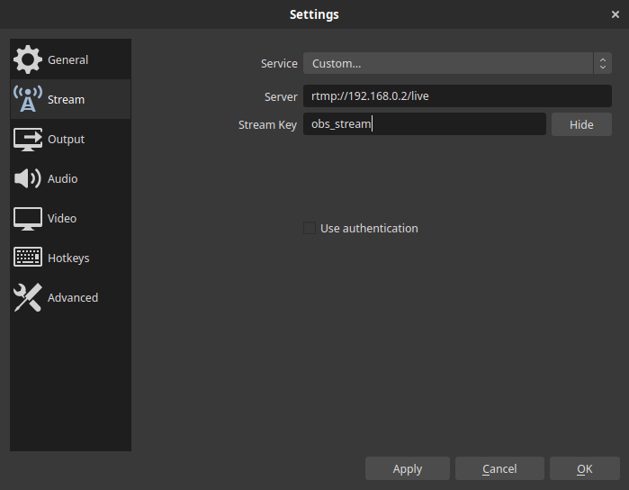
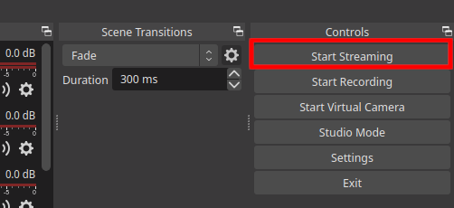
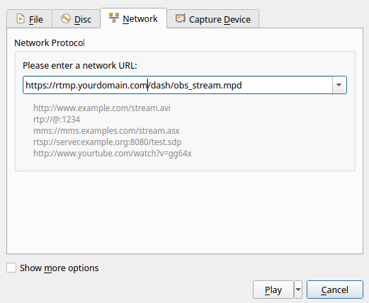

+++
title = "Deploying an RTMP server for streaming using Nginx RTMP"
date = "2022-07-20"
tags = [
    "Linux",
    "Server",
    "RTMP",
    "Nginx",
    "HLS",
    "DASH",
]
categories = [
    "Linux",
    "Multimedia",
]
image = "header.jpeg"
+++

## Introduction

Currently, there are many platforms for online video content streaming, such as YouTube, Twitch, and others. They use the RTMP protocol (Real-Time Messaging Protocol) to broadcast streaming video over the Internet. While these platforms have powerful video streaming capabilities, in some cases independence from the streaming platform and its rules makes perfect sense.

In this article, I will provide instructions on the deployment of the RTMP service based on Nginx-RTMP, which will allow receiving an RTMP stream from the streamer's computer, and converting it to modern HLS and DASH formats for viewing in the receiver program.

## Prerequisites

To deploy the RTMP service, you need to have:

- A clean virtual machine or physical server based on the Linux OS.
- A computer for streaming.

To work outside the local network, in the global Internet:

- Dedicated IP address.
- Domain.

The instructions will use a VPS based on Debian 11.

## Working with Nginx-RTMP

### Installation

First of all, you need to install `nginx` and `libnginx-mod-rtmp` packages. To do this, you need to execute the following commands:

```bash
sudo apt update
sudo apt install nginx libnginx-mod-rtmp
```

### Set up RTMP service

Once installed, you need to configure the Nginx web server to listen on port 1935 to receive the RTMP stream. To do this, you need to edit the file `/etc/nginx/nginx.conf`:


sudo nano /etc/nginx/nginx.conf


At the end of the file, you need to add the configuration of the RTMP server:

```bash
...
rtmp {
    server {
        listen 1935;
        chunk_size 4096;
        allow publish 127.0.0.1;
        allow publish 192.168.0.0/24;
        deny publish all;

        application live {
            live on;
            record off;

            hls on;
            hls_path /var/www/html/stream/hls;
            hls_fragment 3;
            hls_playlist_length 60;

            dash on;
            dash_path /var/www/html/stream/dash;
        }
    }
}
...
```

An explanation of the important aspects of this configuration:

- `listen 1935` - specifies the port on which the RTMP server is running.
- `chunk_size 4096` - sets the block size, 4 KB each.
- `allow publish [IP / Subnet]` - each line specifies an IP or subnet that is allowed to send the RTMP stream to the server.
- `deny publish all` - prohibits receiving RTMP stream from all other addresses/networks.
- `application live` - configuration for converting RTMP to HLS and DASH formats, where `hls_path` and `dash_path` indicate paths to directories for placing playlists.
- `live on` - allows you to receive data via a video stream.
- `record off` - disables recording of the video stream to a file on the disk.

### Set up streaming HLS, DASH

Next, you need to deploy a virtual host that will allow access to HLS or DASH streams via the HTTP/HTTPS protocol.

First, you need to create two directories for storing video stream fragments for HLS and DASH:

```bash
sudo mkdir -p /var/www/html/stream/hls
sudo mkdir -p /var/www/html/stream/dash
```

And also establish the owner and rights:

```bash
sudo chown -R www-data:www-data /var/www/html/stream
sudo chmod -R 755 /var/www/html/stream
```

For the virtual host to work, you need to create a new configuration file (for example `rtmp`) in the `/etc/nginx/sites-available` directory:


sudo nano /etc/nginx/sites-available/rtmp


The `rtmp` host file consists of the following:

```bash
server {
    listen 443 ssl;
    listen 80;
    server_name rtmp.yourdomain.com;
    ssl_certificate /etc/ssl/yourdomain.crt;
    ssl_certificate_key /etc/ssl/yourdomain.key;
    ssl_protocols SSLv3 TLSv1 TLSv1.1 TLSv1.2;

    location / {
        add_header Access-Control-Allow-Origin *;
        root /var/www/html/stream;
    }
}

types {
    application/dash+xml mpd;
}
```

Explanation for this configuration:
- Replace `rtmp.yourdomain.com` with your domain.
- If you want to use SSL, also write the certificate and key files under the paths `/etc/ssl/yourdomain.crt` and `/etc/ssl/yourdomain.key`.
- If you don't want to use SSL, remove the lines starting with `ssl` and `listen 443 ssl` from the file.

In order for all the configurations to take effect, you need to enable the virtual host and restart Nginx:

```bash
sudo ln -s /etc/nginx/sites-available/rtmp /etc/nginx/sites-enabled/
sudo service nginx restart
```

## Broadcasting in OBS Studio

The best suited program for broadcasting is [OBS Studio](https://obsproject.com/uk).

First of all, it is necessary to create a scene, adjust the sound, and the appearance of the broadcast.

To configure streaming parameters, you need to go to Settings and select the Stream tab. The following parameters must be set there:

- Service: **Custom**
- Server: **rtmp://rtmp.yourdomain.com/live** (instead of domain, you can specify IP, for example _http://11.22.33.44/live_)
- Stream Key: **obs_stream**

Example settings:



To start a video broadcast, you need to click Start Streaming in the main window of the program:



## Viewing the broadcast

The broadcast can now be viewed using any application that supports the HLS and DASH protocols. The easiest way would be to watch in VLC by opening the link to the stream. 

To begin with, let's understand how a link to streams is formed in the configured service:

- HLS: `{protocol}://{domain}/hls/{stream key}.m3u8`
- DASH: `{protocol}://{domain}/dash/{stream key}.mpd`

For example, if you deployed a service at the address `rtmp.yourdomain.com` that uses SSL, and in the OBS settings you specified the `obs_stream` key, then in this case the links will be as follows:

```
https://rtmp.yourdomain.com/hls/obs_stream.m3u8
https://rtmp.yourdomain.com/dash/obs_stream.mpd
```

To view in VLC, you need to press Ctrl + N, or go to the menu Media > Open Network Stream, specify a link to one of the formats, and press Play.



## Conclusions

In this way, you can create your own broadcasting service, which will be independent of popular services.

Advantages of such a solution:

- Privacy and full control over the infrastructure, guarantee that the flow data is not stored.
- You do not need to follow the rules of the service (for example, a ban on broadcasting certain content).

But there are certain disadvantages:

- Such a solution requires certain server resources.
- The owner needs to spend time and money on maintaining and maintaining the security of his infrastructure.
