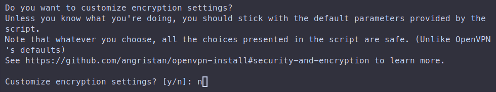
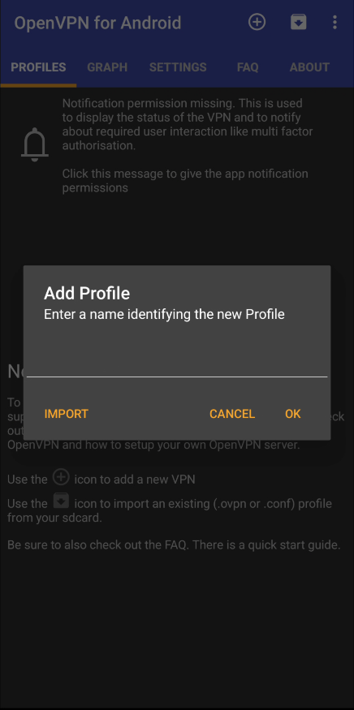

+++
title = "Easy deploy OpenVPN service on any Linux server using custom script"
date = "2024-06-06"
tags = [
    "Debian",
    "VPN",
    "OpenVPN",
    "Automation",
]
categories = [
    "Linux",
    "Networking",
    "Cybersecurity",
]
image = "header.png"
+++

## OpenVPN overview

OpenVPN is a popular open-source software application that implements virtual private network (VPN) techniques for creating secure point-to-point or site-to-site connections. It is widely used for its flexibility, strong security, and ability to traverse network address translators (NATs) and firewalls. An OpenVPN server, in particular, is a server configured to handle OpenVPN connections, allowing clients to connect securely over a network, typically the Internet.

### Key Features of OpenVPN Server

1. Encryption and Security:

- OpenVPN uses robust encryption methods to secure data transmission. It supports various encryption algorithms such as AES (Advanced Encryption Standard), which is widely trusted for its security.
- It uses SSL/TLS for key exchange, ensuring that even if the connection is intercepted, the data cannot be easily decrypted.

2. Cross-Platform Compatibility:

- OpenVPN is compatible with multiple operating systems, including Windows, Linux, macOS, iOS, and Android. This makes it a versatile choice for a wide range of devices.

3. Authentication:

- It supports multiple authentication methods, including username/password, certificate-based, and multi-factor authentication (MFA). This flexibility allows for enhanced security tailored to different use cases.

4. Configurability and Flexibility:

- OpenVPN can be configured to run on any port, using either TCP or UDP, which helps it avoid network restrictions and makes it easier to penetrate firewalls.
- It supports both site-to-site VPNs, which connect entire networks, and client-to-server VPNs, which connect individual devices to a network.

5. Scalability:

- OpenVPN can be scaled to support a large number of users and complex network configurations, making it suitable for both small businesses and large enterprises.

6. Open Source:

- Being open-source means that the software's code is publicly available for review, making it more transparent and allowing the community to contribute to its security and development.

7. Support for Various Network Topologies:

- It can be used in routed or bridged configurations and can create secure connections over NAT.

8. Bypass Restrictions:

- OpenVPN is effective at bypassing network restrictions, making it a popular choice for users in regions with heavy internet censorship.

### Advantages and Disadvantages

**Advantages:**

- High security with strong encryption and various authentication options.
- Flexibility in configuration and adaptability to different network environments.
- Compatibility with multiple operating systems and devices.
- Being open-source ensures transparency and community-driven improvements.

**Disadvantages:**

- Initial setup and configuration can be complex, especially for users without networking experience.
- Performance can be impacted by factors such as server load and network latency.
- Requires maintenance and updates to ensure ongoing security and functionality.

## Installation

### Obtain install script

The easiest way to install OpenVPN service on any Linux OS is using custom [openvpn-install script](https://github.com/angristan/openvpn-install). 

First, login to your remote server using SSH, then download a script and make it executable:


wget https://raw.githubusercontent.com/angristan/openvpn-install/master/openvpn-install.sh
sudo chmod +x openvpn-install.sh


### Deploy OpenVPN service

Run the installation script, also make sure running it with root privileges:


sudo ./openvpn-install.sh


The script is interactive, and next install steps require you just answering the questions, or leaving the default answer.

#### Define listen address

It is a LAN network address that OpenVPN service will bind and listen. 

#### Define public IP address

It is a public internet IP address of your server. The script assuming you have static global IP.

#### Set up IPv6 support

As I don't have IPv6 support neither in my LAN, nor my internet provider supprots it, I will just disable IPv6.

#### Define listen port

You can choose any port that OpenVPN service will bind and listen incoming connections.

#### Define protocol

It is recommended to use UDP unless you need TCP for some specific configurations or due to limitations on your server networking stack.

#### Choose primary DNS serveer

Here you can choose any public known DNS resolver, or even define your custom DNS server. I recomment using OpenDNS resolver.

#### Disable compression

It is highly recommended not to use compression due to known security limitations.

#### Customize encryption settings

At this step you can customize encryption settings if you need some specific tweaks, but is's also fine to use pre-defined configuration.

#### Verify parameters

After you defined all the parameters, you can scroll your terminal and verify your answers to the wizard. If everything is ok, just press any button to continue installation.

#### Setup first client

It is required step to create at least one client configuration.

First, define the client name:

Next, you have an option to protect *.ovpn configuration with password:

### Download client configuration

The most secure way is to use SFTP connection to your filesystem server, you can use a single command in local terminal to download it:


scp shifthackz@192.168.0.37:/home/shifthackz/pixel7pro.ovpn ~


Where you should replace with your values:

- `shifthackz@192.168.0.37`: here define your server user and IP address.
- `/home/shifthackz/pixel7pro.ovpn`: this is a path of file on REMOTE server.
- `~`: this is a destination download folder path on LOCAL computer (in my case ~ is current user home directory).

Then transfer this file to the device that you want to use as client to connect to your openvpn server.

### Test client connection

In this example I will connect to my VPN network using Android phone. First, transfer downloaded *.ovpn file to your phone, and import it.

After that try to open some website in browser and verify that internet connection works. In addition try to check your IP address on some public IP checker websites, you should have public IP address of OpenVPN server. Also you should be able to access some local device in the same LAN as OpenVPN sever.

## Conclusion

Overall, OpenVPN server is a powerful tool for creating secure, flexible, and reliable VPN connections, making it a popular choice for both individuals and organizations looking to protect their data and network communications.
