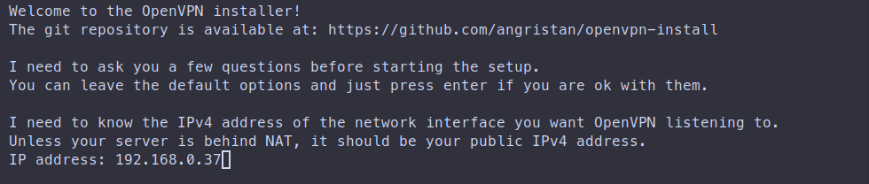
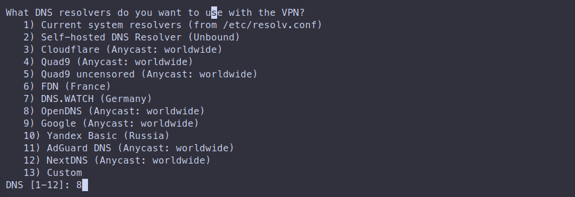
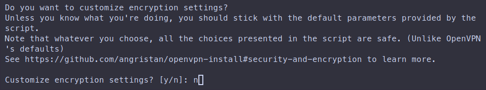
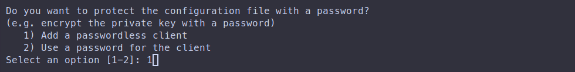
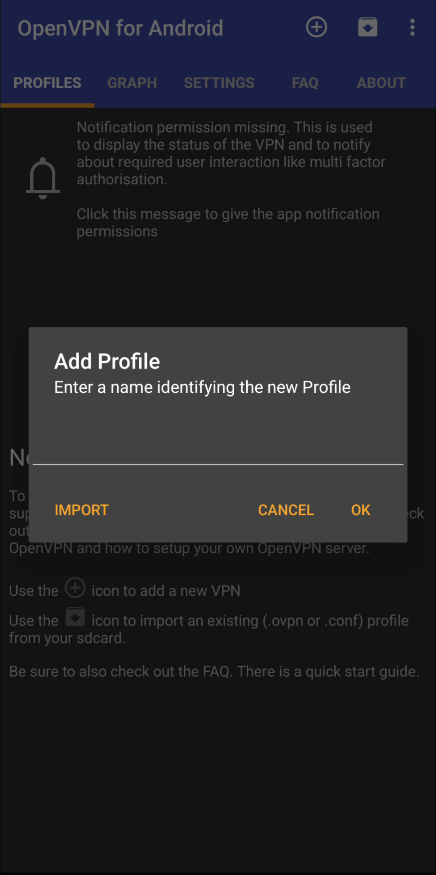
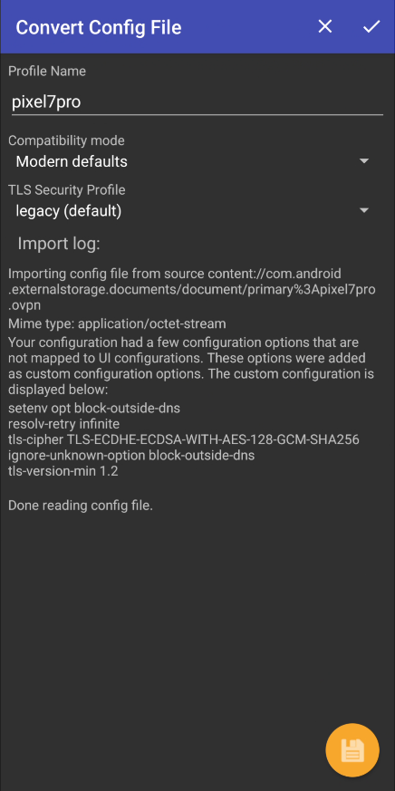

+++
title = "Розгортання служби OpenVPN на будь-якому сервері Linux за допомогою скрипта"
date = "2024-06-07"
tags = [
    "Debian",
    "VPN",
    "OpenVPN",
    "Автоматизація",
]
categories = [
    "Linux",
    "Мережі",
    "Кібер-безпека",
]
image = "header.png"
+++

## Огляд OpenVPN

OpenVPN — це популярне програмне забезпечення з відкритим кодом, яке реалізує методи віртуальної приватної мережі (VPN) для створення безпечних з’єднань «точка-точка» або «сайт-сайт». Він широко використовується завдяки своїй гнучкості, надійній безпеці та здатності проходити транслятори мережевих адрес (NAT) і брандмауери. Зокрема, сервер OpenVPN — це сервер, налаштований для обробки підключень OpenVPN, що дозволяє клієнтам безпечно підключатися через мережу, як правило, через Інтернет.

### Основні характеристики OpenVPN

1. Шифрування та безпека:

- OpenVPN використовує надійні методи шифрування для безпечної передачі даних. Він підтримує різні алгоритми шифрування, такі як AES (Advanced Encryption Standard), який користується широкою довірою через його безпеку.
- Він використовує SSL/TLS для обміну ключами, гарантуючи, що навіть якщо з'єднання перехоплено, дані не можуть бути легко розшифровані.

2. Кросплатформна сумісність:

- OpenVPN сумісний з кількома операційними системами, включаючи Windows, Linux, macOS, iOS і Android. Це робить його універсальним вибором для широкого діапазону пристроїв.

3. Автентифікація:

- Він підтримує кілька методів автентифікації, включаючи ім'я користувача/пароль, на основі сертифіката та багатофакторну автентифікацію (MFA). Ця гнучкість забезпечує підвищену безпеку, адаптовану до різних випадків використання.

4. Конфігурація та гнучкість:

- OpenVPN можна налаштувати для роботи на будь-якому порту за допомогою TCP або UDP, що допомагає уникнути мережевих обмежень і спрощує проникнення через брандмауери.
- Він підтримує як мережі VPN типу "сайт-сайт", які з'єднують цілі мережі, так і мережі VPN "клієнт-сервер", які підключають окремі пристрої до мережі.

5. Масштабованість:

- OpenVPN можна масштабувати для підтримки великої кількості користувачів і складних конфігурацій мережі, що робить його придатним як для малих, так і для великих підприємств.

6. Відкритий код:

- Відкритий код означає, що код програмного забезпечення є загальнодоступним для перегляду, що робить його більш прозорим і дозволяє спільноті робити внесок у його безпеку та розвиток.

7. Підтримка різних мережевих топологій:

- Його можна використовувати в маршрутизованих або мостових конфігураціях і створювати безпечні з'єднання через NAT.

8. Обхід обмежень:

- OpenVPN ефективно обходить мережеві обмеження, що робить його популярним вибором для користувачів у регіонах із жорсткою інтернет-цензурою.

### Переваги та недоліки

**Переваги:**

- Високий рівень безпеки з надійним шифруванням і різними параметрами автентифікації.
- Гнучкість конфігурації та адаптованість до різних мережевих середовищ.
- Сумісність з кількома операційними системами та пристроями.
- Відкритий вихідний код забезпечує прозорість і вдосконалення, керовані спільнотою.

**Недоліки:**

- Початкове налаштування та налаштування можуть бути складними, особливо для користувачів без досвіду роботи в мережі.
- На продуктивність можуть впливати такі фактори, як завантаження сервера та затримка мережі.
- Вимагає обслуговування та оновлень для забезпечення постійної безпеки та функціональності.

## Встановлення

### Завантаження скрипта

Найпростіший спосіб інсталювати послугу OpenVPN на будь-якій ОС Linux – це використовувати спеціальний [скрипт інсталяції openvpn](https://github.com/angristan/openvpn-install).

Спочатку увійдіть на віддалений сервер за допомогою SSH, потім завантажте сценарій і зробіть його виконуваним:


wget https://raw.githubusercontent.com/angristan/openvpn-install/master/openvpn-install.sh
sudo chmod +x openvpn-install.sh


### Розгорніть службу OpenVPN

Запустіть інсталяційний сценарій, також переконайтеся, що він запущений з правами root:


sudo ./openvpn-install.sh


Сценарій є інтерактивним, і наступні кроки встановлення вимагають лише відповісти на запитання або залишити відповідь за умовчанням.

#### Визначте адресу прослуховування

Це мережева адреса локальної мережі, яку служба OpenVPN прив’язуватиме та прослуховуватиме.

#### Визначте публічну IP-адресу

Це загальнодоступна IP-адреса вашого сервера в Інтернеті. Сценарій припускає, що у вас статичний глобальний IP.

#### Налаштування підтримки IPv6

Оскільки я не маю підтримки IPv6 ні в моїй локальній мережі, ні мій інтернет-провайдер не підтримує її, я просто вимкну IPv6.

#### Визначте порт прослуховування

Ви можете вибрати будь-який порт, який служба OpenVPN буде прив’язувати та прослуховувати вхідні з’єднання.

#### Визначте протокол

Рекомендується використовувати UDP, якщо вам не потрібен TCP для певних конфігурацій або через обмеження мережевого стеку вашого сервера.

#### Виберіть основний сервер DNS

Тут ви можете вибрати будь-який загальнодоступний відомий розпізнавач DNS або навіть визначити власний DNS-сервер. Я рекомендую використовувати резолвер OpenDNS.

#### Вимкнути стиснення

Настійно не рекомендується використовувати стиснення через відомі обмеження безпеки.

#### Налаштування параметрів шифрування

На цьому кроці ви можете налаштувати параметри шифрування, якщо вам потрібні певні налаштування, але також добре використовувати попередньо визначену конфігурацію.

#### Перевірте параметри

Після того, як ви визначили всі параметри, ви можете прокрутити термінал і перевірити свої відповіді майстру. Якщо все в порядку, просто натисніть будь-яку кнопку, щоб продовжити встановлення.

#### Налаштування конфігурації клієнта

Необхідний крок для створення принаймні однієї конфігурації клієнта.

Спочатку визначте ім'я клієнта:

Далі у вас є можливість захистити конфігурацію *.ovpn паролем:

### Завантажте конфігурацію клієнта

Найбезпечнішим способом є використання SFTP-з’єднання з сервером вашої файлової системи, ви можете скористатися однією командою в локальному терміналі, щоб завантажити його:


scp shifthackz@192.168.0.37:/home/shifthackz/pixel7pro.ovpn ~


Де слід замінити своїми значеннями:

- `shifthackz@192.168.0.37`: тут визначте користувача вашого сервера та IP-адресу.
- `/home/shifthackz/pixel7pro.ovpn`: це шлях до файлу на ВІДДАЛЕНОМУ сервері.
- `~`: це шлях до цільової папки завантаження на ЛОКАЛЬНОМУ комп’ютері (у моєму випадку ~ це домашній каталог поточного користувача).

Потім передайте цей файл на пристрій, який ви хочете використовувати як клієнт для підключення до вашого сервера openvpn.

### Перевірте підключення клієнта

У цьому прикладі я буду підключатися до своєї мережі VPN за допомогою телефону Android. Спочатку перенесіть завантажений файл *.ovpn на свій телефон та імпортуйте його.

Після цього спробуйте відкрити якийсь веб-сайт у браузері та переконайтеся, що підключення до Інтернету працює. Крім того, спробуйте перевірити свою IP-адресу на деяких загальнодоступних веб-сайтах перевірки IP-адреси, у вас повинна бути публічна IP-адреса сервера OpenVPN. Також ви повинні мати доступ до деяких локальних пристроїв у тій самій локальній мережі, що й сервер OpenVPN.

## Висновок

Загалом сервер OpenVPN є потужним інструментом для створення безпечних, гнучких і надійних VPN-з’єднань, що робить його популярним вибором як для окремих осіб, так і для організацій, які прагнуть захистити свої дані та мережеві комунікації.
