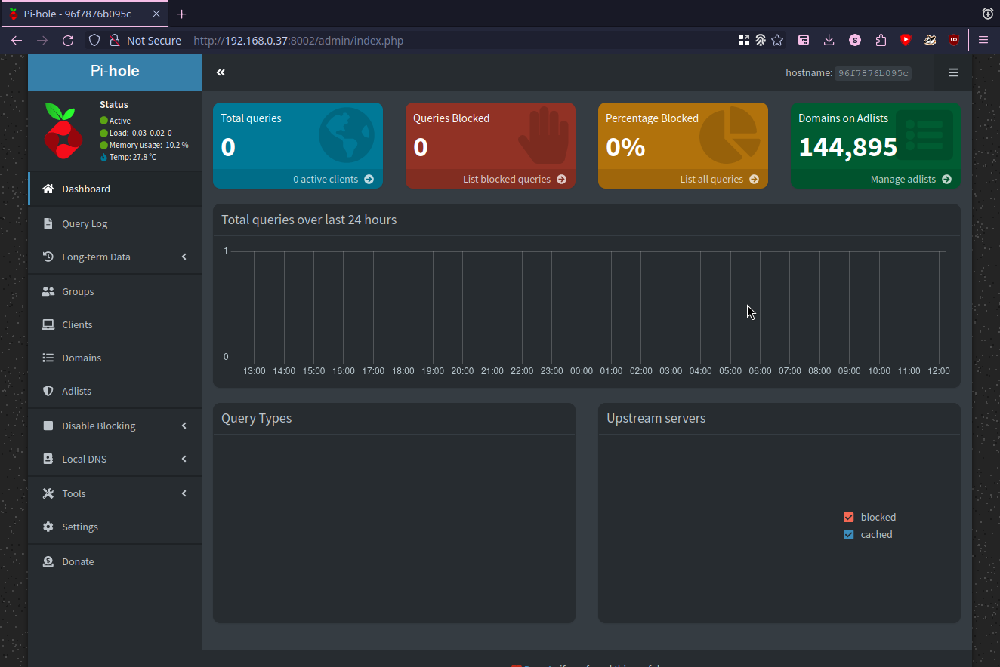
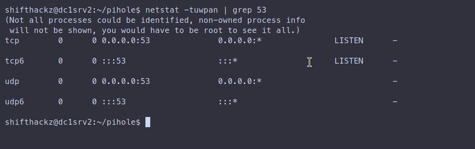
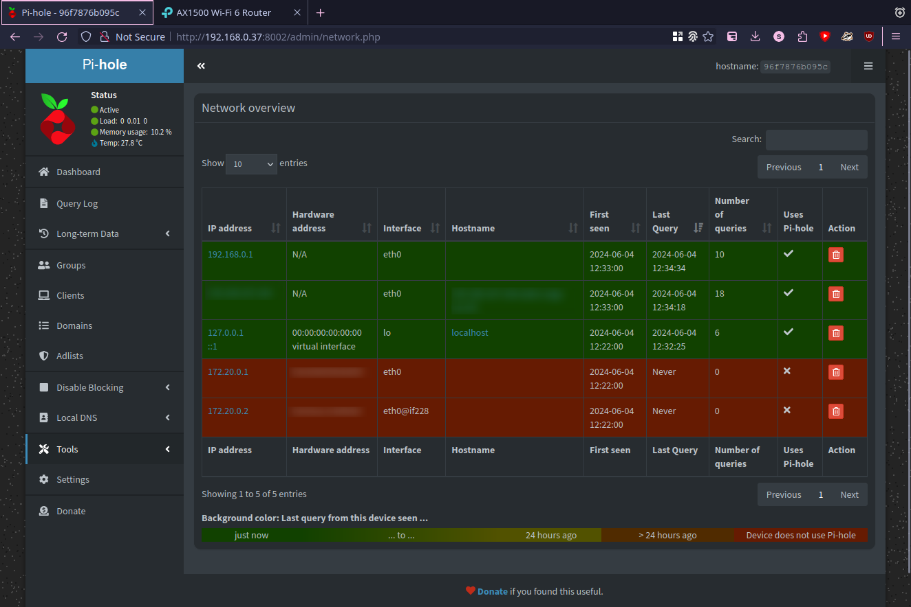

+++
title = "How to deploy Pi-hole as a docker container in local network to block ads"
date = "2024-06-04"
tags = [
    "Docker",
    "Docker Compose",
    "Containerization",
    "Pi-hole",
    "DNS",
    "Homelab",
    "Ad block",
]
categories = [
    "Linux",
    "Networking",
    "Cybersecurity",
]
image = "header.png"
+++

## Introduction

Pi-hole is a network-wide ad blocker that acts as a DNS sinkhole. It is designed to block advertisements and trackers at the network level, meaning any device connected to your network can benefit from it without needing additional software.

### What is Pi-hole?

Pi-hole is an open-source software project that serves as a DNS (Domain Name System) sinkhole. It is typically run on a low-power device, like a Raspberry Pi, but can also be installed on other hardware or within virtual machines. It intercepts DNS requests from devices on your local network and filters out domains known to serve ads, tracking, and malicious content.

### Reasons for using Pi-hole

1. Network-wide Ad Blocking: Unlike browser-based ad blockers, Pi-hole blocks ads for every device on your network, including smartphones, tablets, smart TVs, and other IoT devices.

2. Enhanced Privacy: By blocking trackers, Pi-hole helps to protect your privacy across all devices. It prevents your data from being sent to third-party tracking services.

3. Improved Performance: Since ads and trackers are blocked before they are downloaded, pages can load faster, and there is reduced bandwidth usage.

4. Centralized Management: Pi-hole offers a web-based interface where you can view statistics, add custom block or allow lists, and manage settings, making it easy to control and monitor ad blocking for the entire network.

5. Device Compatibility: Pi-hole works with any device that uses your network's DNS, making it a versatile solution for ad blocking.

### Can Pi-hole Block Ads?

Yes, Pi-hole can block ads effectively. It maintains a list of known ad-serving domains and blocks DNS requests to these domains. When a device on your network requests an ad domain, Pi-hole intercepts the request and prevents the ad content from being loaded. This results in fewer ads being displayed across all devices on the network, regardless of the application or browser being used.

### Pi-hole features

- DNS Requests: Devices on your network send DNS requests to translate domain names (like example.com) into IP addresses.

- Filtering: Pi-hole compares these DNS requests against its blocklists. If the domain is known to serve ads or track users, Pi-hole blocks the request.

- Sinkholing: Blocked requests are redirected to a "sinkhole," typically an IP address that does nothing, ensuring the ad or tracker is not loaded.

- Permitting: If the domain is not on the blocklist, Pi-hole forwards the request to an upstream DNS server (such as Google's DNS or your ISP's DNS) and returns the result to the requesting device.

## Installation

### Deploy as a docker container

Create a `docker-compose.yml` file with the following configuration:

```yaml
services:
  pihole:
    container_name: pihole
    image: pihole/pihole:latest
    ports:
      - "53:53/tcp"
      - "53:53/udp"
      - "8002:80/tcp"
    environment:
      TZ: 'Europe/Kiev'
      WEBPASSWORD: 'pihole'
    volumes:
      - './etc-pihole:/etc/pihole'
      - './etc-dnsmasq.d:/etc/dnsmasq.d'
    restart: unless-stopped
```

Explanation of important configuration parameters:

- `53:53/tcp` and `53:53/udp`: Binding both TCP and UDP 53 port of container to the same 53 port of host.
- `8002:80/tcp`: Binding 80 port of container to 8002 port of host, as the result web intarface will be available at 8002 port.
- `TZ: 'Europe/Kiev'`: Setting correct timezone (your timezone might be different).
- `WEBPASSWORD: 'pihole'`: Setting a password for admin interface.
- `volumes` section: Binding configuration folders from container to local folders so they persist in case container gets updated, etc.

After saving the file, start the container:


docker compose up -d


### Check the admin interface

Then use the host IP of your server in the local network, and navigate to url with the port in your browser, (I am using url `http://192.168.0.37:8002/admin` in this example). You should see the pihole login page:


Enter the password defined in config earlier, then you should be able to log in:



### Ensure port 53 is bound

It is recommended to check if port 53 is listened by your server host machine. To check it ssh into your server and run command:


sudo netstat -tuwpan | grep 53


If port is listening, you should see output like this:



### Define your Pi-hole DNS server as primary in your router

To actually make use of your Pi-hole service for all the devices in the local network you should set you Pi-hole sever as a primary DNS server in the router settings. Use IP address of your host server (in my case 192.168.0.37) in the router setting. This procedure is different for every router, so I just show the result here:


After that you should see some queries in Pi-hole admin interface:



## Conclusion

Pi-hole is a powerful tool for network-wide ad blocking, offering enhanced privacy, improved performance, and centralized control over DNS filtering. It is recommended for anyone looking to reduce ads and trackers across all devices in their home or small office network.
