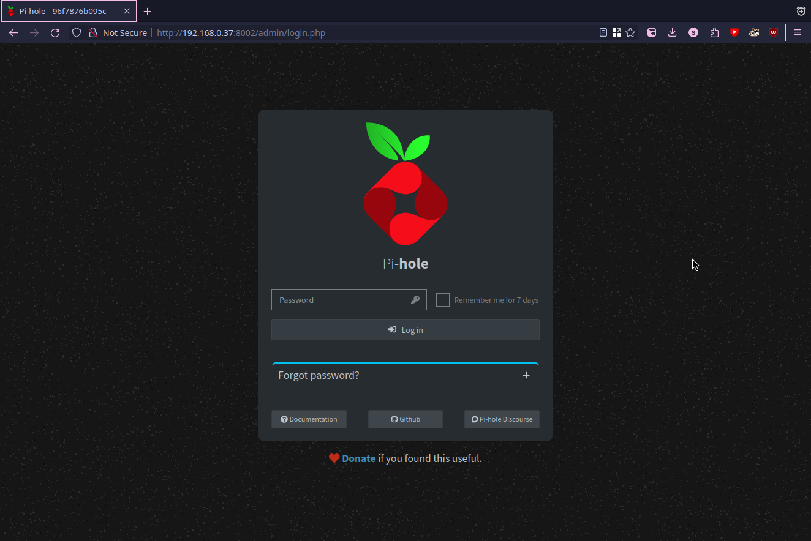
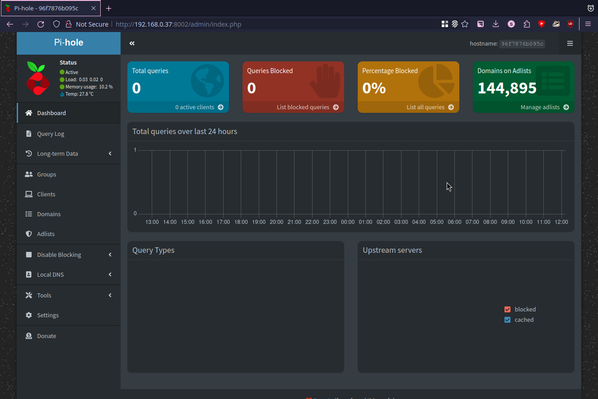
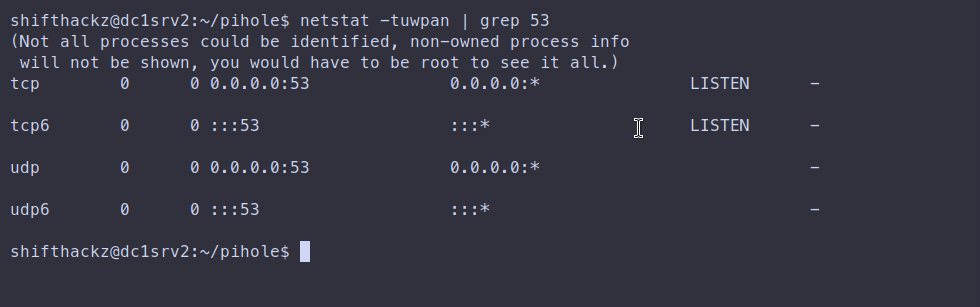
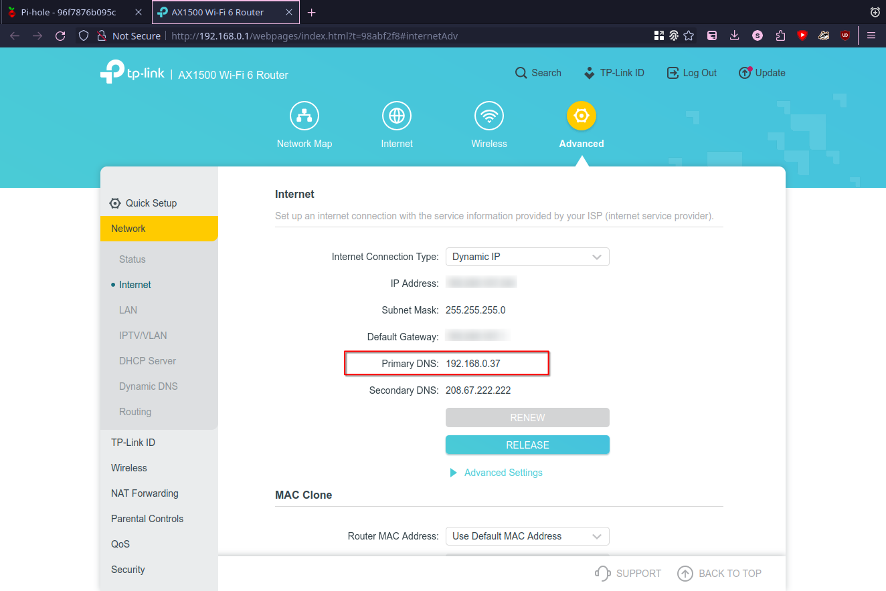
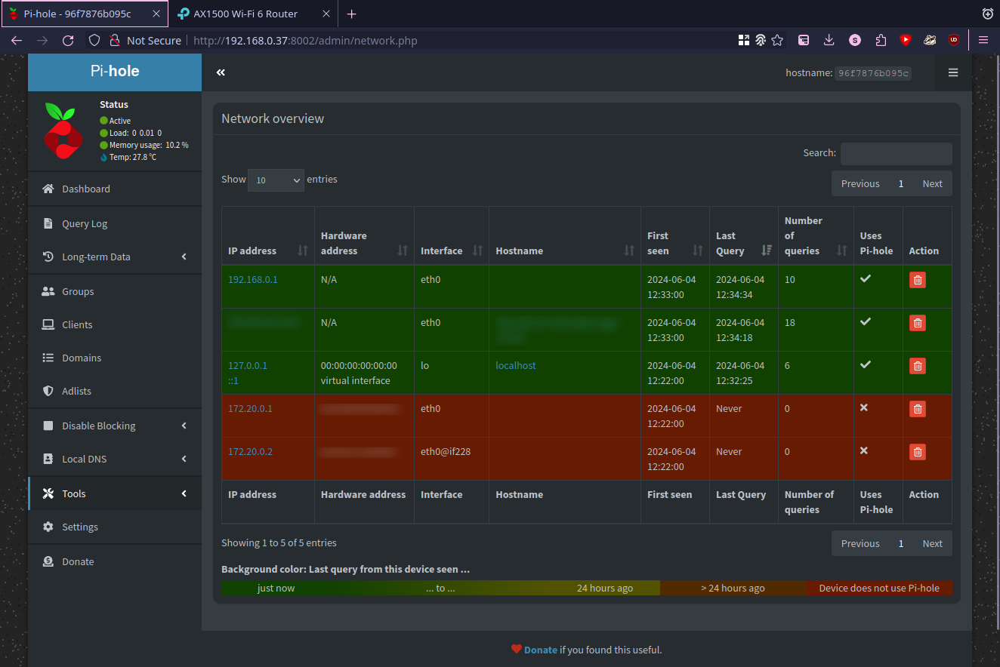

+++
title = "Як розгорнути Pi-hole як докер-контейнер у локальній мережі для блокування реклами"
date = "2024-06-04"
tags = [
    "Docker",
    "Docker Compose",
    "Containerization",
    "Pi-hole",
    "DNS",
    "Homelab",
    "Блокування реклами",
]
categories = [
    "Linux",
    "Мережі",
    "Кібер-безпека",
]
image = "header.png"
+++

## Вступ

Pi-hole — це загальномережеве блокування реклами, яке діє як воронка DNS. Він призначений для блокування реклами та трекерів на рівні мережі, тобто будь-який пристрій, підключений до вашої мережі, може використовувати його без додаткового програмного забезпечення.

### Що таке Pi-hole?

Pi-hole — це проект програмного забезпечення з відкритим вихідним кодом, який виконує функцію DNS (системи доменних імен) sinkhole. Зазвичай він працює на пристрої з низьким енергоспоживанням, як-от Raspberry Pi, але також може бути встановлений на іншому апаратному забезпеченні або на віртуальних машинах. Він перехоплює запити DNS від пристроїв у вашій локальній мережі та фільтрує домени, які, як відомо, показують рекламу, відстежують і зловмисний вміст.

### Причини для використання Pi-hole

1. Блокування реклами в усій мережі: на відміну від блокувальників реклами в браузері, Pi-hole блокує рекламу на кожному пристрої у вашій мережі, включаючи смартфони, планшети, смарт-телевізори та інші пристрої IoT.

2. Покращена конфіденційність: блокуючи трекери, Pi-hole допомагає захистити вашу конфіденційність на всіх пристроях. Це запобігає надсиланню ваших даних до сторонніх служб відстеження.

3. Покращена продуктивність: оскільки реклама та засоби відстеження блокуються до їх завантаження, сторінки можуть завантажуватися швидше, а використання пропускної спроможності зменшується.

4. Централізоване керування: Pi-hole пропонує веб-інтерфейс, де можна переглядати статистику, додавати власні списки блокувань або дозволів і керувати налаштуваннями, що полегшує контроль і моніторинг блокування реклами для всієї мережі.

5. Сумісність пристроїв: Pi-hole працює з будь-яким пристроєм, який використовує DNS вашої мережі, що робить його універсальним рішенням для блокування реклами.

### Чи може Pi-hole блокувати рекламу?

Так, Pi-hole може ефективно блокувати рекламу. Він підтримує список відомих доменів розміщення реклами та блокує запити DNS до цих доменів. Коли пристрій у вашій мережі запитує рекламний домен, Pi-hole перехоплює запит і запобігає завантаженню рекламного вмісту. Це призводить до того, що на всіх пристроях у мережі відображається менше реклами, незалежно від використовуваної програми чи браузера.

### Як функціонує Pi-hole

- DNS-запити: пристрої у вашій мережі надсилають DNS-запити для перекладу доменних імен (наприклад, example.com) на IP-адреси.

- Фільтрування: Pi-hole порівнює ці DNS-запити зі своїми списками блокування. Якщо відомо, що домен показує рекламу або відстежує користувачів, Pi-hole блокує запит.

- Sinkholing: заблоковані запити перенаправляються на "sinkhole", як правило, на IP-адресу, яка нічого не робить, гарантуючи, що оголошення або трекер не завантажується.

- Дозвіл: якщо домену немає в списку блокувань, Pi-hole пересилає запит на DNS-сервер вище за течією (наприклад, DNS Google або DNS вашого провайдера) і повертає результат на пристрій, який запитує.

## Встановлення

### Розгортання docker контейнера

Створіть файл `docker-compose.yml` із такою конфігурацією:

```yaml
services:
  pihole:
    container_name: pihole
    image: pihole/pihole:latest
    ports:
      - "53:53/tcp"
      - "53:53/udp"
      - "8002:80/tcp"
    environment:
      TZ: 'Europe/Kiev'
      WEBPASSWORD: 'pihole'
    volumes:
      - './etc-pihole:/etc/pihole'
      - './etc-dnsmasq.d:/etc/dnsmasq.d'
    restart: unless-stopped
```

Пояснення важливих параметрів конфігурації:

- `53:53/tcp` і `53:53/udp`: прив’язка портів 53 TCP і UDP контейнера до портів 53 хоста.
- `8002:80/tcp`: прив’язка порту 80 контейнера до порту 8002 хосту, в результаті веб-інтерфейс буде доступним на порту 8002.
- `TZ: 'Європа/Київ'`: встановлення правильного часового поясу (ваш часовий пояс може бути іншим).
- `WEBPASSWORD: 'pihole'`: встановлення пароля для інтерфейсу адміністратора.
- `volumes`: прив’язка папок конфігурації з контейнера до локальних папок, щоб вони зберігалися у випадку оновлення контейнера тощо.

Після збереження файлу запустіть контейнер:


docker compose up -d


### Перевірте інтерфейс адміністратора

Потім скористайтеся IP-адресою хоста вашого сервера в локальній мережі та перейдіть до URL-адреси з портом у вашому браузері (у цьому прикладі я використовую URL-адресу `http://192.168.0.37:8002/admin`). Ви повинні побачити сторінку входу в pihole:



Введіть пароль, визначений у конфігурації раніше, тоді ви зможете увійти:



### Переконайтеся, що порт 53 прив’язаний

Рекомендується перевірити, чи порт 53 прослуховується на стороні хост-машини вашого сервера. Щоб перевірити це, підключіться через ssh до консолі на вашому сервері та запустіть команду:


sudo netstat -tuwpan | grep 53


Якщо порт прослуховується, ви повинні побачити такий вивід:



### Визначте свій DNS-сервер Pi-hole як основний у своєму маршрутизаторі

Щоб фактично використовувати службу Pi-hole для всіх пристроїв у локальній мережі, вам слід встановити сервер Pi-hole як основний сервер DNS у налаштуваннях маршрутизатора. Використовуйте IP-адресу вашого хост-сервера (у моєму випадку 192.168.0.37) у налаштуваннях маршрутизатора. Ця процедура відрізняється для кожного маршрутизатора, тому я просто покажу результат тут:



Після цього ви повинні побачити деякі запити в інтерфейсі адміністратора Pi-hole:



## Висновок

Pi-hole — це потужний інструмент для блокування реклами в усій мережі, що пропонує підвищену конфіденційність, покращену продуктивність і централізований контроль над фільтрацією DNS. Рекомендовано всім, хто хоче зменшити рекламу та трекери на всіх пристроях у своїй домашній чи невеликій офісній мережі.