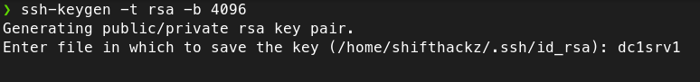
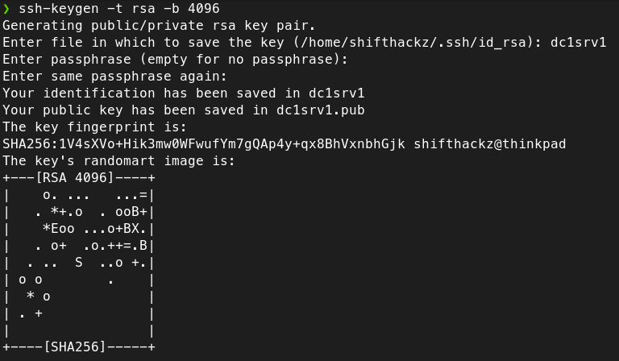

+++
title = "Configure SSH authorization based on RSA key"
date = "2024-03-10"
tags = [
    "Linux",
    "SSH",
    "RSA",
    "Authentication",
]
categories = [
    "Linux",
    "Networking",
    "Cybersecurity",
]
image = "header.jpg"
+++

## Introduction

SSH key-based authentication is a method of securely logging into a remote system or server using cryptographic keys instead of passwords. It works based on public-key cryptography, where a pair of keys is generated—a public key and a private key. The public key is stored on the server, and the private key is kept secure on the client side.

### How it works?

- Key Generation: The user generates a pair of cryptographic keys—a public key and a private key. The private key is kept securely on the user's computer, while the public key is placed on the server.

- Server Configuration: The public key is added to the server's list of authorized keys. This means the server will recognize the corresponding private key when presented during login attempts.

- Login Attempt: When the user attempts to log in to the server, the client software presents the private key. The server checks if this private key corresponds to any of the public keys it has on record for authorized users.

- Authentication: If the server finds a match, it allows the user to log in without the need for a password.

### Why using keys is more secure?

Key-based authentication is considered more secure than password-based authentication for several reasons:

- Resistance to brute-force attacks: Passwords can be guessed or cracked through brute-force attacks. However, with key-based authentication, an attacker would need to possess the private key, which ideally should be securely stored and not easily accessible.

- No transmission of passwords: In password-based authentication, the password is transmitted over the network, which can potentially be intercepted by attackers. With key-based authentication, the private key never leaves the client machine, so there's no risk of interception.

- Stronger encryption: SSH keys use strong cryptographic algorithms for authentication, making them resistant to various types of attacks.

- No reliance on human-generated passwords: Human-generated passwords can be weak and prone to being compromised. Keys, on the other hand, are randomly generated and typically much longer, making them harder to guess.

Overall, SSH key-based authentication offers a higher level of security and is recommended for remote access to servers and systems, especially in environments where security is paramount.

## Implementation example

Next let's talk how actually implement RSA key based authorizatoin to access the remote server via SSH protocol. This guide assumes you have local and remote (server) Linux systems, and you already have access to your server via password based ssh protocol.

### Generate the new ssh key

> 🟢 **Security Tip:** if you have multiple servers that you want to access via key based SSH it is strongly recommended to create different ssh key for every server. 

All the ssh keys are stored in the `.ssh` directory that is located at your user home directory, so we need to change the working dir in the terminal:


cd ~/.ssh


In my case there was no `.ssh` directory, so I created it manually:


mkdir ~/.ssh


Then to generate a new key type this: 


ssh-keygen -t rsa -b 4096 


The parameters in the generation command above mean:

- `-t rsa`: Specifies the type of key to create. In this case, it indicates that the RSA algorithm should be used. RSA (Rivest-Shamir-Adleman) is a widely used public-key cryptosystem for secure data transmission.

- `b 4096`: Specifies the number of bits in the key. In this case, it sets the key size to 4096 bits. Larger key sizes generally provide stronger security but may also require more computational resources for encryption and decryption.

The key creation wizard will ask you some parameters:

1. Enter a file in which save a key.

In case you have multiple keys for multimple servers it is recommended to name your key files in a way you can later understand what key is used to access some particular server.



2. Enter key passphraze (twice).

To actually unlock the ssh key you need to specify a secure password. It means that in case your key becomes stolen or compromised it will be still protected by password.

> 🟢 **Security Tip:** it is recommended to have different password for the ssh key and for the remote unix user. 

Finally, after key is created you will see the output in terminal like this:



### Copy public key to your server

There are many ways you can copy the public ssh key to your server, but the most secure way is to use `SCP` (secure copy).

> 🟡 **Note:** `scp` and `ssh` commands require to enter the password of the remote `user`.

To copy the public key use a command like this, but don't forget to replace the parameters with your actual ones:


scp dc1srv1.pub user@192.168.0.2:


The parameters of the scp command mean:

- `dc1srv1.pub` is a public key file that was created at previous step.
- `user` is the username on the remote machine.
- `192.168.0.2` - the IP or domain of the remote machine.
- `:` - the path where to copy `dc1srv1.pub` file (in this case home directory of the remote `user`).

### Allow the public key on sever

To do this we need to connect to a server shell via SSH protocol, in another terminal, connect to the remote shell:


ssh user@192.168.0.2


Then check that you also have `.ssh` directory in the home folder of the remote `user`, if you don't, create it:


mkdir ~/.ssh


Create an `authorized_keys` file in `.ssh` directory:


touch ~/.ssh/authorized_keys


Copy the contents of the public key to the `authorized_keys` file:


cat ~/dc1srv1.pub >> ~/.ssh/authorized_keys


After that the transferred at the previous step public key file is no longer needed, so it can be deleted:


rm ~/dc1srv1.pub


### Change SSH configuration

To change the ssh configuration edit the file `/etc/ssh/sshd_config`:


sudo nano /etc/ssh/sshd_config


In this file you should find some paramters, and set their values explicitly:

```bash
...
# Disallow connection as root user
PermitRootLogin no
# Enable public key authentication
PubkeyAuthentication yes
# Disable challenge response
ChallengeResponseAuthentication no
# Enable PAM
UsePAM yes
# Disable password based authentication
PasswordAuthentication no
...
```

After saving the file, restart the `sshd` service:


sudo systemctl restart sshd


> 🔴 **IMPORTANT:** After the `sshd` restart the new configuration will take effect. It is recommended to **NOT CLOSE** your currently opened ssh session and keep it until you test and ensure your new ssh key works in **ANOTHER terminal window**. In this case if something goes wrong you can still revert the changes back to `ssh_config` file and restart the `sshd` daemon to apply previous configuration.

### Check the SSH authentication

#### Verify password based authentication is not allowed

First, let's verify that we can not connect as root and as a generic user, so for the command:


ssh root@192.168.0.2


or:


ssh user@192.168.0.2


You should get an error `Permission denied (publickey)`.

#### Verify key based authentication works

The ssh command to connect to your remote server will be a bit different, as you should specify the ssh key that needs to be used for authentication:


ssh -i ~/.ssh/dc1srv1 user@192.168.0.2


After typing this command you will be promted to enter the password that was used during ssh key generation.

## Conclution

After you complete this tutorial your server is using secure key based ssh authentication. Keep in mind that you need to backup your ssh keys, because if you lose your ssh key there is no way you can connect to the remote machine via the ssh (in this case only bare metal access to the remote machine can help reset a key, or if you are using some VPS/hosting provider some admin web panels allow resetting ssh settings).
