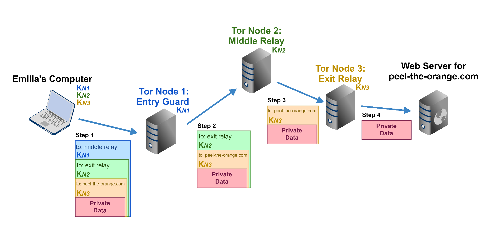

+++
title = "How the Tor network actually works"
date = "2016-10-07"
tags = [
    "Tor",
    "Dark Net",
    "Anonimity",
]
categories = [
    "Networking",
]
image = "header.jpg"
+++

## Introduction

Tor is an open source software complex that connects certain computers around the world into a system of proxy servers, the connections between which are made according to the bulb routing scheme. This allows users of this network to establish an anonymous connection that is protected from eavesdropping.

The main purpose of the Tor network today is to provide anonymity for Internet users, allowing you to hide your identity while browsing sites from ISPs, site owners, advertising robots, automated traffic analysis systems, etc. This is achieved due to a large distributed system of servers - nodes, traffic between which is routed at the network level according to the OSI model.

## Roles of Tor network subjects

Knowing that the network consists of server-nodes connected to the bulb network, let's consider which nodes are in the Tor network:

### Entry Node (Entry Node)

The input node is the first link in the connection chain. It initiates the establishment of a secure connection by accepting packets from a Tor user, encrypts them, and forwards them to the next node. Note that interception of data between the user and the input node is impossible, since each block is encrypted with a session key using hybrid encryption.

### Middle Node

The task of these nodes is reduced only to receiving data from the previous node, encrypting it and transmitting it to the next one. From such a site, it is impossible to go outside the Tor network to the Internet. From such a node, you can only get to the site of the intranet domain .onion, no more. But these nodes are very important to keep the network functioning: the more intermediaries in the chain, the higher the anonymity, and the probability of your connection being compromised decreases. In addition, it is impossible to establish through which intermediary nodes your chain passes, since the IP addresses of such nodes are not recorded in the log file.

### Exit Node

This is the last node in the Tor chain. It decodes the packets transmitted by the user along the entire chain and transmits the data to the requested remote server on the Internet. A connection from the IP address of the source node will be registered on the requested server. These types of nodes are the weakest point of the Tor network, as there are ways to intercept user data between the origin node and the remote server. Also, a volunteer who has launched an Exit Node exposes himself to the risk of problems, since it is his IP that is fixed by Internet resources.

### Bridge Relay

These are repeaters whose addresses are publicly available. They are used to initiate connections in places where Tor root server addresses are blocked. You can get the address of the bridge node by accepting an e-mail from TheTorProject with a special request. Thus, even a total blocking of all publicly known addresses of Tor network nodes will not give any result, since it will not affect the availability of classified relays.

### Exit Enclave

A relay used by site owners to create a mirror of their resource on the Tor network. This will allow users of some countries to bypass blocking, and the rest to maintain anonymity, protecting themselves again from interception of traffic from the source node.

What the chain between the user and the final Internet resource looks like is shown in the diagram below:

## Features of Tor

Also, Tor, since 2004, can provide anonymity for servers as well. Each network user can host any service, the so-called .onion internal domain, which consists of a random set of characters. Such a service will be available only from the Tor network, and neither users will be able to find out about the public IP of the hidden site, nor the site administrator will be able to know who its visitors are. Only the fact of visiting the site and the specific directory visited by the user will be available in the server logs.

But you need to be careful when using Tor, because it has the following features that should be kept in mind when using Tor:

- The input node knows the user's IP address;
- The message is fully decoded at the source node, but the sender is unknown;
- On the requested remote server, some technical data about the sender is transmitted along with the package, although the sender is essentially unknown;
- Packets with your message may pass through nodes that were launched by attackers in order to steal your data;
- The Internet resource can obtain data about the user's PC configuration and OS version, as well as his IP address by executing JavaScript, Flash, ActiveX scripts on the page;
- On the way from the source node to the final server, data can be changed due to a Man-In-The-Middle attack, so if, for example, you download a file through Tor, always check its hash sums;
- The owner of the source node can steal your session, cookies, and even logins and passwords by intercepting data using SSL Strip;
- Since the IP addresses of the outgoing nodes are publicly available, some Internet providers and sites block them (for example, Google, VK);

## Conclusions

We can conclude that the Tor network has great value for those who are subject to mass surveillance, for those who value freedom on the Internet, for those who do not want to put up with large-scale senseless blocking, for those who want at least a small island of anonymity .

Be careful on the internet, because it's possible that right now, as you read this, someone is watching your traffic 😱.
