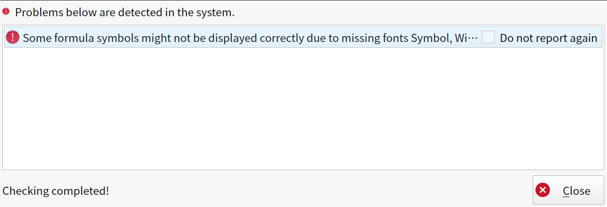

+++
title = "Fix missing formula fonts for WPS Office on Linux"
date = "2023-12-15"
tags = [
    "Linux",
    "Office",
    "Fonts",
    "WPS Office",
]
categories = [
    "Linux",
    "Software",
]
image = "header.png"
+++

## Introduction

Usually WPS Office offers one of the best compatibility on Linux with weird proprietary ms office document formats including document with some complex formatting and formulas. But in order for the formulas to display correctly some custom fonts required, and by default they are missing on most of the Linux system. In that case after launching the WPS Office you will see the error message saying: 

> Some formula symbols might not be displayed correctly due to missing fonts Symbol, Wingdings, Wingdings 2, Wingdings 3, Webdings, MT Extra.



## Fix the fonts issue

To fix the issue you just need to download the missing and install them in your Linux system. 

### Download fonts files

Download needed fonts and save them in some folder. You can just click on every file below to download it:

- [WEBDINGS.TTF](./WEBDINGS.TTF)
- [WINGDNG2.ttf](./WINGDNG2.ttf)
- [WINGDNG3.ttf](./WINGDNG3.ttf)
- [mtextra.ttf](./mtextra.ttf)
- [symbol.ttf](./symbol.ttf)
- [wingding.ttf](./wingding.ttf)

### Install downloaded fonts

Create a folder that is required for formula fonts, by typing this command in the terminal:


sudo mkdir -p /usr/share/fonts/kingsoft


Then copy downloaded files to destination folder:

```bash
sudo cp WEBDINGS.TTF /usr/share/fonts/kingsoft
sudo cp WINGDNG2.ttf /usr/share/fonts/kingsoft
sudo cp WINGDNG3.ttf /usr/share/fonts/kingsoft
sudo cp mtextra.ttf /usr/share/fonts/kingsoft
sudo cp symbol.ttf /usr/share/fonts/kingsoft
sudo cp wingding.ttf /usr/share/fonts/kingsoft
```

And make your user the owner of the folder:


sudo chown -R $USER:$USER /usr/share/fonts/kingsoft


### Invalidate the font cache

To invalidate your system font cache, run this command:


sudo fc-cache -vfs


## Conclution

After necessary fonts are installed close all the WPS office processes and try to launch it again, the error should not be shown after launch, and you should be able to use formula formatting.


