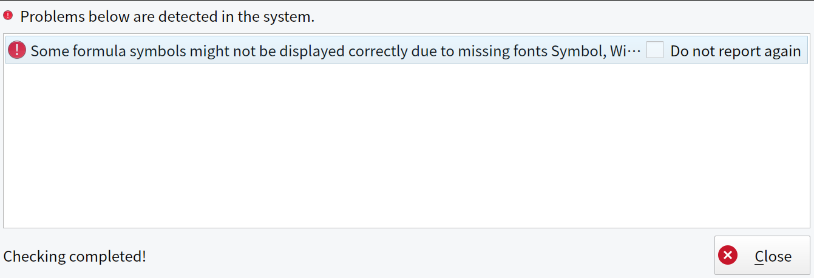
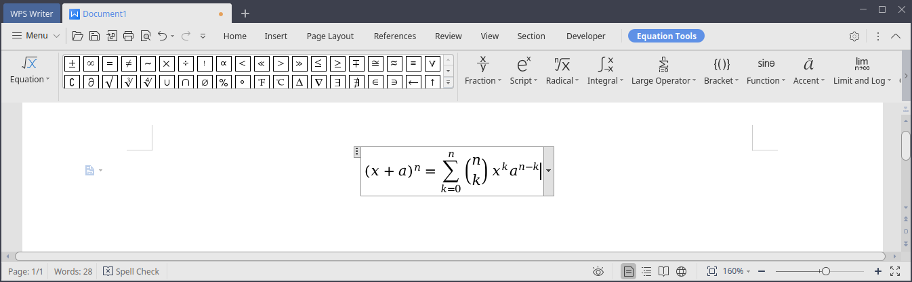

+++
title = "Як виправити помилку відсутності шрифтів формул для WPS Office на Linux"
date = "2023-12-15"
tags = [
    "Linux",
    "Офіс",
    "Шрифти",
    "WPS Office",
]
categories = [
    "Linux",
    "Офіс",
]
image = "header.png"
+++

## Вступ

Зазвичай WPS Office пропонує одну з найкращих сумісностей для систем на базі Linux, в особливості що стосується документів пропрієтарних форматів ms office, включаючи документи з складним форматуванням і формулами. Проте, для коректного відображення формул необхідні деякі шрифти, які за замовчуванням відсутні на більшості систем Linux. У такому випадку, після запуску WPS Office ви побачите повідомлення про помилку, яке говорить:

> Some formula symbols might not be displayed correctly due to missing fonts Symbol, Wingdings, Wingdings 2, Wingdings 3, Webdings, MT Extra.



## Виправлення проблеми з шрифтами

Для вирішення цієї проблеми достатньо завантажити відсутні шрифти та встановити їх у вашій системі Linux.

### Завантаження файлів шрифтів

Завантажте необхідні шрифти та збережіть їх у яку-небудь папку. Ви можете просто клацнути на кожен файл нижче для його завантаження:

- [WEBDINGS.TTF](./WEBDINGS.TTF)
- [WINGDNG2.ttf](./WINGDNG2.ttf)
- [WINGDNG3.ttf](./WINGDNG3.ttf)
- [mtextra.ttf](./mtextra.ttf)
- [symbol.ttf](./symbol.ttf)
- [wingding.ttf](./wingding.ttf)

### Встановлення завантажених шрифтів

Створіть папку, яка необхідна для шрифтів формул, найзручніше це зробити увівши команду в термінал:


sudo mkdir -p /usr/share/fonts/kingsoft


Потім скопіюйте завантажені файли до призначеної папки:

```bash
sudo cp WEBDINGS.TTF /usr/share/fonts/kingsoft
sudo cp WINGDNG2.ttf /usr/share/fonts/kingsoft
sudo cp WINGDNG3.ttf /usr/share/fonts/kingsoft
sudo cp mtextra.ttf /usr/share/fonts/kingsoft
sudo cp symbol.ttf /usr/share/fonts/kingsoft
sudo cp wingding.ttf /usr/share/fonts/kingsoft
```

І зробіть вашого користувача власником цієї папки:


sudo chown -R $USER:$USER /usr/share/fonts/kingsoft


### Скасування кешу шрифтів

Для скасування кешу шрифтів вашої системи виконайте цю команду:


sudo fc-cache -vfs


## Висновок

Після встановлення необхідних шрифтів закрийте всі процеси WPS Office та спробуйте запустити його знову. Після запуску помилка не повинна відображатися, і ви зможете використовувати форматування формул.


